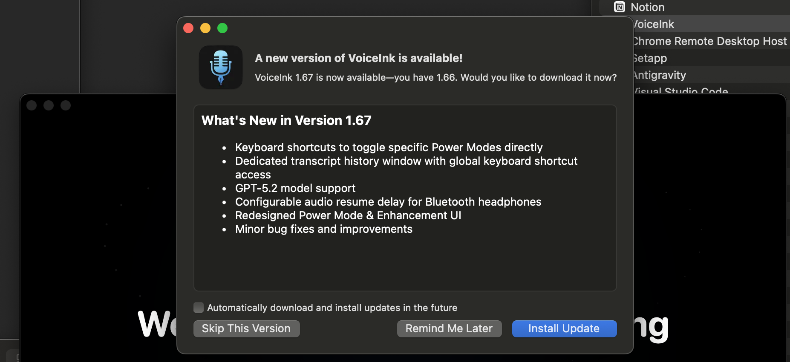
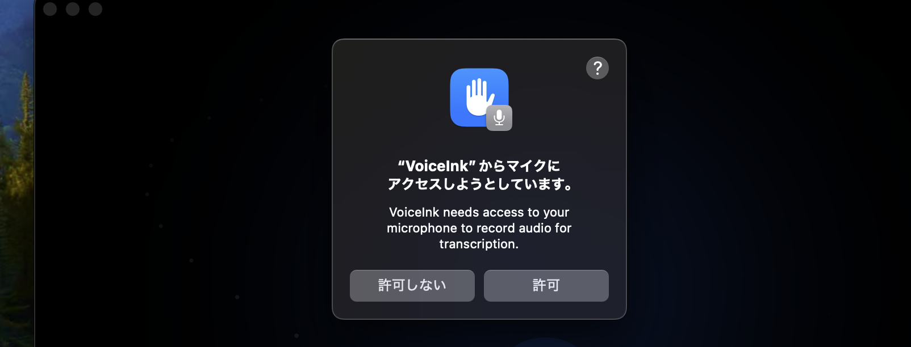
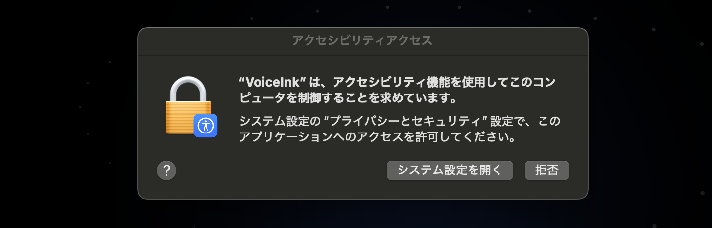
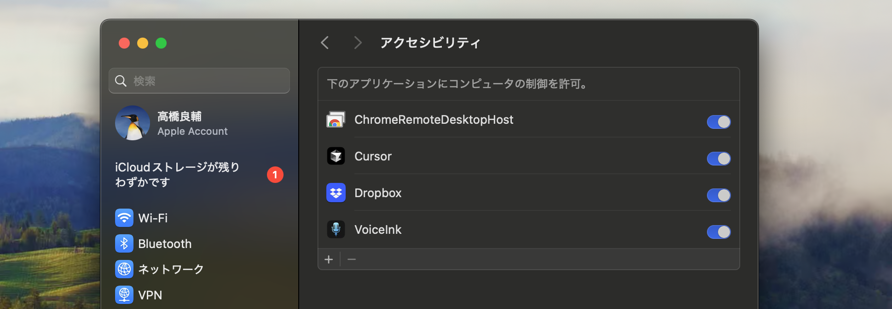
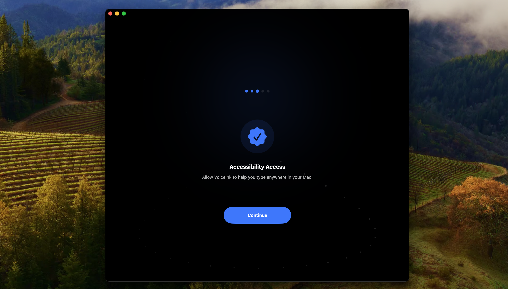
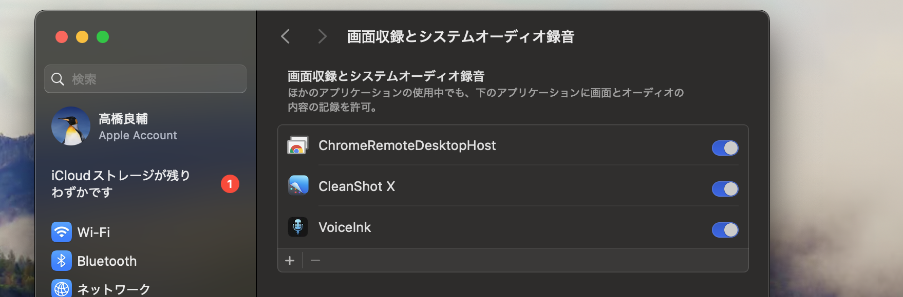

1. サイトにアクセス

次のURLにアクセスする。
https://tryvoiceink.com/

2. Trialとしてアプリダウンロード

3. メールアドレスを入力

メールアドレスを入力

4. インストール実行

インストールが完了したらApplicationフォルダからVoiceInkをダブルクリックして起動します。最初は次のようにアップデートの画面が出る場合があります。その場合は「Install Update」をクリックしてアップデートしてください。

「Get Started」をクリックします。

「Enable Access」ボタンをクリックします。

「許可」ボタンをクリックして許可しましょう。

「Continue」ボタンをクリックしましょう。

音声入力するマイクを選択して「Continue」ボタンをクリックします。

「Enable Access」ボタンをクリックします。

「システム設定を開く」ボタンをクリックします。

VoiceInkのトグルをクリックして有効にします。

「Continue」をクリックします。

次は画面録画の許可をします。「Enable Access」ボタンをクリックします。再起動したら

有効にするとVoiceInkの再起動を促されますので再起動してください。

クイックアクセスのショートカット設定を行います。とりあえずは右のコマンドキーを設定しておきます。

AI Modelをダウンロードします。「Download Model」をクリックしてダウンロードしてください。

ダウンロードが完了したら「Continue」をクリックします。

これで音声入力の準備が整いました。右エリアを選択して入力箇所を指定し、ショートカットを入力すると音声入力できる状態です。終了する場合は再度ショートカットキーを入力すれば音声内容がテキスト化されます。

最初は日本語で話しかけても、英語になってしまいます。とりあえずは

何度か繰り返し試したら日本語で文字が出力されるようになりました。

## 翻訳する言語を指定する

最初の設定では翻訳する言語は英語になっています。設定から「AI Models」を選び「Transcription Language」を「Japanese」に変更します。

