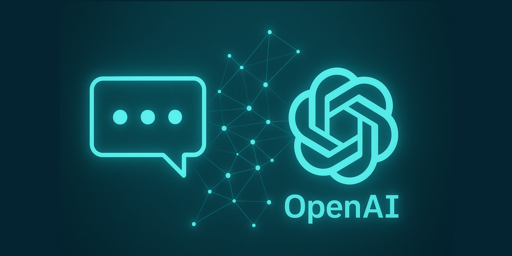

ChatGPTをはじめとした大規模言語モデル（LLM）のAPIを自社サービスに統合することで、テキスト生成、質問応答、要約、文書作成など、様々な機能を効率的に実装できるようになりました。しかし、APIの単純な接続だけでは、優れたユーザー体験や事業価値を生み出すことはできません。本記事では、ChatGPT APIを自社サービスに統合する際の重要なポイントと注意すべき点を解説します。技術的な実装方法から、ビジネス的な配慮まで、API連携の全体像を把握できる内容となっています。

## API連携の基本と選択肢

ChatGPT APIをサービスに統合する前に、基本的な理解と選択肢を押さえておく必要があります。

### OpenAIの提供するモデルと特徴

OpenAIは複数のモデルを提供しており、用途や要件に応じて選択することが重要です：

- **GPT-4o**: 最新世代の高性能マルチモーダルモデル。テキスト・画像理解と生成の両方に対応
- **GPT-4 Turbo**: コスト効率と高性能のバランスに優れたモデル
- **GPT-3.5 Turbo**: 経済的で高速、一般的なユースケースに十分な性能
- **Text Embedding Models**: テキストの特徴量を抽出し、検索や分類に利用

モデル選択のポイントは以下の観点から検討します：

1. **タスクの複雑性**: 単純な質問応答かクリエイティブな文章生成か
2. **応答速度の要件**: リアルタイム性が必要かバッチ処理でよいか
3. **コスト制約**: 予算に応じた適切なモデル選定
4. **マルチモーダル要件**: テキスト以外のメディア（画像など）の処理が必要か

### API接続方式の選択

OpenAIのAPIに接続する方法として、以下のオプションがあります：

1. **直接API接続**: OpenAIのエンドポイントに直接リクエスト
   ```python
   import openai
   
   openai.api_key = "your-api-key"
   response = openai.chat.completions.create(
       model="gpt-4o",
       messages=[
           {"role": "system", "content": "あなたは有能なアシスタントです。"},
           {"role": "user", "content": "AIについて簡潔に説明してください。"}
       ]
   )
   ```

2. **SDK利用**: 各種プログラミング言語向けの公式SDKを活用
   - Python, Node.js, Java, Ruby, PHP, .NETなど各言語対応
   - エラーハンドリングや型の安全性が向上

3. **プロキシサーバー経由**: 自社サーバーを中継してAPI呼び出し
   - キャッシュによるコスト削減
   - レート制限管理の一元化
   - ログ記録や監査の強化

### サードパーティプラットフォームの検討

直接OpenAI APIを利用する以外に、以下のようなサードパーティプラットフォームも選択肢となります：

- **LangChain/LlamaIndex**: 複雑なAIワークフローの構築を簡素化
- **Vercel AI SDK**: フロントエンドとの統合を容易にするフレームワーク
- **CloudFlare Workers AI**: エッジでの推論実行でレイテンシを低減
- **Azure OpenAI Service**: 大規模組織向けのエンタープライズグレードサービス

## 技術的実装のポイント

ChatGPT APIを効果的に実装するための技術的なポイントを解説します。

### プロンプト設計の重要性

APIの応答品質を左右する最も重要な要素はプロンプト設計です：

1. **システムメッセージの活用**
   - モデルの役割や制約を明確に定義
   - 一貫した応答形式やトーンを指定

   ```json
   {
     "role": "system",
     "content": "あなたは金融商品アドバイザーです。専門用語は極力避け、初心者にもわかりやすく説明してください。回答は必ず以下のフォーマットで提供してください：1. 概要説明、2. メリット、3. リスク、4. 次のステップ"
   }
   ```

2. **具体的な指示と例示**
   - 曖昧さを排除した明確な指示
   - Few-shot learning（例示学習）の活用

   ```json
   {
     "role": "user",
     "content": "以下のフォーマットで株式投資について説明してください。\n\n例：\n【概要】\n投資信託は複数の資産に分散投資できる金融商品です。\n【メリット】\n- 少額から始められる\n- プロが運用してくれる\n【リスク】\n- 元本保証がない\n\n同じ形式で株式投資について説明してください。"
   }
   ```

3. **コンテキストの適切な管理**
   - 会話履歴の適切な長さ維持
   - 重要情報の優先付けと不要情報の削除

### トークン管理と最適化

APIコストを管理し、パフォーマンスを最適化するためのトークン管理：

1. **トークン数の見積もり**
   - 事前にトークナイザーでトークン数を計算
   - 入力/出力の上限を適切に設定

2. **コンテキスト圧縮技術**
   - 長い会話履歴の要約による圧縮
   - 重要な情報のみを保持する選択的記憶

   ```python
   def compress_conversation(messages, max_tokens=2000):
       """長い会話履歴を圧縮するヘルパー関数"""
       current_tokens = estimate_tokens(messages)
       
       if current_tokens <= max_tokens:
           return messages
           
       # 最新のメッセージは保持
       recent_messages = messages[-3:]
       
       # 残りのメッセージを要約
       history_to_summarize = messages[:-3]
       summary = summarize_messages(history_to_summarize)
       
       # 圧縮された会話を構築
       compressed = [{"role": "system", "content": f"これまでの会話要約: {summary}"}] + recent_messages
       return compressed
   ```

3. **ストリーミングレスポンスの活用**
   - 体感的な応答速度の向上
   - 早期中断によるトークン節約

   ```javascript
   // フロントエンドでのストリーミング実装例
   const fetchChatResponse = async (messages) => {
     const response = await fetch('/api/chat', {
       method: 'POST',
       headers: { 'Content-Type': 'application/json' },
       body: JSON.stringify({ messages }),
     });
     
     const reader = response.body.getReader();
     const decoder = new TextDecoder();
     
     while (true) {
       const { done, value } = await reader.read();
       if (done) break;
       
       const chunk = decoder.decode(value);
       // UIに逐次追加表示
       appendToUI(chunk);
     }
   };
   ```

### エラーハンドリングとリトライ戦略

安定したサービス提供のためのエラー対策：

1. **エラー分類と対応**
   - レート制限エラー: 指数バックオフでリトライ
   - サーバーエラー: 適切な待機時間後にリトライ
   - コンテンツポリシー違反: フォールバックコンテンツの提供

2. **グレースフルデグラデーション**
   - APIが利用できない場合の代替機能
   - キャッシュされた応答の活用
   - 静的な応答へのフォールバック

   ```python
   def get_ai_response(prompt, retries=3, backoff_factor=2):
       """バックオフ戦略を用いたAPIリクエスト関数"""
       for attempt in range(retries):
           try:
               return call_openai_api(prompt)
           except RateLimitError:
               if attempt < retries - 1:
                   sleep_time = backoff_factor ** attempt
                   time.sleep(sleep_time)
               else:
                   return get_fallback_response(prompt)
           except ServerError:
               if attempt < retries - 1:
                   time.sleep(1)
               else:
                   return get_fallback_response(prompt)
           except ContentPolicyViolation:
               return get_policy_compliant_response()
   ```

## ビジネス的な配慮事項

技術的な実装だけでなく、ビジネス的な観点からの配慮も重要です。

### コスト管理と最適化

AIサービスを持続可能にするためのコスト管理：

1. **使用量モニタリング**
   - APIコールとトークン使用量の常時監視
   - 予算アラートの設定
   - 異常検知による過剰使用の早期発見

2. **キャッシュ戦略**
   - 同一クエリに対する応答のキャッシュ
   - 類似クエリの検出と既存回答の再利用
   - ユーザーごとの使用量制限設定

3. **段階的なモデル選択**
   - 初期フィルタリングに軽量モデル
   - 必要な場合のみ高性能モデルへエスカレーション

   ```python
   def tiered_response(query):
       """段階的モデル選択による効率化"""
       # 1. クエリ分類（軽量処理）
       category = classify_query(query)
       
       # 2. 簡単な質問は安価なモデルで対応
       if category == "simple":
           return call_gpt35(query)
       
       # 3. 複雑な質問は高性能モデルで対応
       elif category == "complex":
           return call_gpt4(query)
       
       # 4. 創造的な内容はトークン制限付きで処理
       elif category == "creative":
           return call_gpt4(query, max_tokens=300)
   ```

### セキュリティとプライバシー対策

ユーザーデータを扱う上での重要な配慮事項：

1. **データ送信前の前処理**
   - 個人情報の検出と匿名化
   - 機密情報のマスキング
   - 必要最小限のデータ送信

2. **プロンプトインジェクション対策**
   - ユーザー入力の検証とサニタイズ
   - システムプロンプトとユーザー入力の明確な分離
   - ロールとパーミッションの厳格な管理

3. **コンプライアンス対応**
   - GDPR、CCPA等の法規制への対応
   - 組織のデータポリシーとの整合性確保
   - 適切な利用規約とプライバシーポリシーの設定

### ユーザー体験設計

効果的なAI機能を提供するためのUX設計：

1. **フィードバックループの構築**
   - ユーザーからのフィードバックの収集
   - モデル出力の継続的な評価
   - フィードバックに基づくプロンプト改善

2. **適切な期待値設定**
   - AIの能力と限界の明示
   - 処理中の視覚的フィードバック
   - エラー時の明確な説明と代替手段

3. **ヒューマンインザループの実装**
   - 低信頼度回答の人間による確認
   - エスカレーションパスの提供
   - AI支援と人間対応のシームレスな連携

## 実装パターンと事例

実際のビジネスシーンでの実装パターンを紹介します。

### カスタマーサポート強化

問い合わせ対応の効率化と品質向上：

1. **自動応答システム**
   - FAQ自動回答とエスカレーション判断
   - ユーザー質問の意図理解と適切な回答生成
   - 会話履歴を考慮した文脈把握

   ```python
   def handle_customer_query(query, user_history):
       # システムプロンプト作成
       system_prompt = """
       あなたは{company_name}のカスタマーサポートアシスタントです。
       以下の制約条件に従ってください：
       1. 知識ベース内の情報のみを使用して回答する
       2. わからないことは正直に認め、必要に応じて人間のサポートへエスカレーションする
       3. 簡潔かつ丁寧な口調で回答する
       """
       
       # 知識ベースから関連情報を検索
       relevant_info = search_knowledge_base(query)
       
       # コンテキスト構築
       context = f"関連情報: {relevant_info}\n顧客履歴: {summarize_history(user_history)}"
       
       # API呼び出し
       response = openai.chat.completions.create(
           model="gpt-4-turbo",
           messages=[
               {"role": "system", "content": system_prompt},
               {"role": "user", "content": f"コンテキスト: {context}\n\n質問: {query}"}
           ],
           functions=[
               {
                   "name": "escalate_to_human",
                   "description": "人間のサポートスタッフにエスカレーションする",
                   "parameters": {
                       "type": "object",
                       "properties": {
                           "reason": {
                               "type": "string",
                               "description": "エスカレーションが必要な理由"
                           }
                       },
                       "required": ["reason"]
                   }
               }
           ]
       )
       
       return process_response(response)
   ```

2. **応答品質の最適化**
   - 企業知識ベースとの連携
   - トーンとスタイルの一貫性確保
   - 多言語対応の効率化

### 社内業務効率化

業務プロセスの自動化と意思決定支援：

1. **ドキュメント処理の自動化**
   - 契約書や報告書の要約・分析
   - 構造化データの抽出と整理
   - 複数文書の統合と比較

2. **データ分析支援**
   - 複雑なデータの自然言語解釈
   - ビジネスインサイトの抽出
   - データ可視化のための説明生成

### コンテンツ制作支援

マーケティングやコンテンツ制作の効率化：

1. **コンテンツ生成パイプライン**
   - アイデア出しから下書き作成
   - ターゲット層に合わせた文体調整
   - マルチフォーマット展開（記事→SNS投稿→メルマガ）

2. **パーソナライズドコンテンツ**
   - ユーザープロファイルに基づく内容調整
   - 興味・関心に合わせた推奨事項
   - 地域や文化に適応したローカライズ

## API連携の評価と継続的改善

ChatGPT API連携の効果を最大化するための評価と改善プロセス：

### 評価指標の設定

1. **技術的指標**
   - レスポンスタイム
   - エラー率
   - トークン使用効率

2. **ビジネス指標**
   - コスト対効果
   - タスク完了率
   - ユーザー満足度
   - 人的リソース削減量

3. **品質指標**
   - 回答の正確性
   - 一貫性
   - 有用性

### 改善サイクルの構築

1. **データ収集と分析**
   - ユーザーインタラクションログ
   - フィードバックデータ
   - エラーパターン

2. **プロンプトエンジニアリングの反復**
   - 失敗ケースの分析と修正
   - 成功パターンの強化
   - コンテキスト設計の最適化

3. **フォールバックメカニズムの改良**
   - 未対応ケースの特定
   - 代替応答の質向上
   - エスカレーションルートの最適化

## まとめ

ChatGPT APIを自社サービスに統合することは、単なる技術的な作業ではなく、ビジネス戦略と密接に関連した取り組みです。効果的な導入のためには、以下のポイントが重要となります：

1. **戦略的アプローチ**
   - 明確なビジネス目標の設定
   - 適切なモデル・接続方式の選択
   - 段階的な導入と拡張

2. **バランスの取れた実装**
   - 技術的な最適化とビジネス要件の調和
   - コストとパフォーマンスのトレードオフ管理
   - セキュリティとユーザビリティの両立

3. **継続的な進化**
   - ユーザーフィードバックに基づく改善
   - 最新モデル・機能への適応
   - 効果測定と投資対効果の検証

ChatGPT APIの適切な活用により、ビジネスプロセスの効率化、顧客体験の向上、新たな価値創出が可能になります。テクノロジーと人間の強みを組み合わせ、持続可能で効果的なAI活用を実現しましょう。 