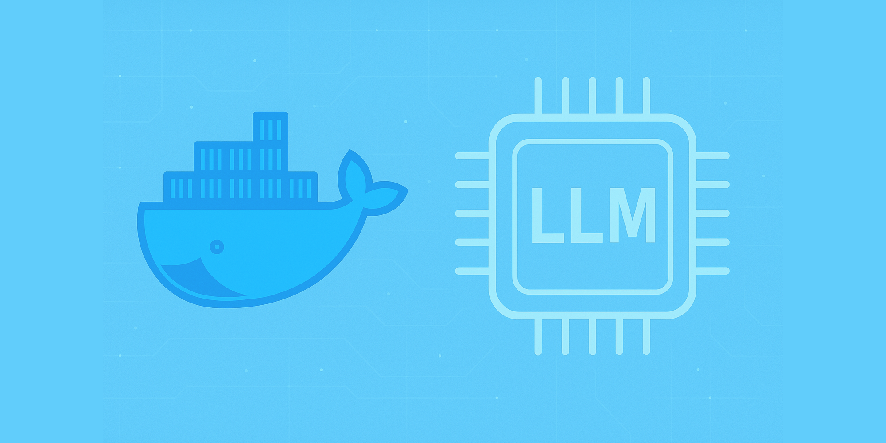

2025年4月、Dockerは開発者コミュニティに大きな朗報をもたらしました。Docker Desktop 4.40のリリースにおいて、「Docker Model Runner」が導入されたのです。このツールは、大規模言語モデル（LLM）をローカル環境で簡単に実行できるようにする画期的な機能です。

AIを活用したアプリケーション開発において、クラウドAPIへの依存からの脱却と、開発者の生産性向上を実現する可能性を秘めています。

本記事では、Docker Model Runnerの概要、主要機能、そして開発ワークフローにもたらす変革について詳しく解説します。AI開発がますます一般化する現代において、このツールがなぜ重要なのか、そしてどのように活用できるのかを探っていきましょう。

## Docker Model Runnerとは

Docker Model Runnerは、Docker Desktop 4.40以降に組み込まれた新機能で、大規模言語モデル（LLM）をローカル環境で実行するためのシンプルかつ効率的な方法を提供します。従来のAI開発では、モデルの実行にクラウドAPIを利用するか、複雑な環境構築が必要でしたが、Docker Model Runnerはこの問題を解決します。

重要なのは、**Docker Model Runnerでは、AIモデルはコンテナ内で実行されない**という点です。代わりに、ホストにインストールされた推論エンジン（現在はllama.cpp）を使用して、Macのネイティブ環境でモデルを直接実行します。これにより、GPUアクセラレーションを最大限に活用できます。

Docker Model Runnerは、以下の機能を提供します：

1. Docker Hubからモデルをプルする機能
2. コマンドラインから直接AIモデルを実行する機能
3. ローカルモデルの管理機能（追加、リスト表示、削除）
4. プロンプトの送信またはチャットモードでのモデルとの対話機能

## 主要機能と特徴

### 1. シンプルなコマンドライン操作

Docker Model Runnerは、Dockerの他のコマンドと同様のシンプルな構文を採用しています。例えば：

```bash
# モデルの状態確認
docker model status

# 利用可能なモデルの一覧表示
docker model list

# モデルのダウンロード
docker model pull ai/llama3.2:1B-Q8_0

# モデルの実行
docker model run ai/llama3.2:1B-Q8_0 "Hello"

# モデルの削除
docker model rm ai/llama3.2:1B-Q8_0
```

この直感的なインターフェースにより、AI開発の経験が少ない開発者でも、簡単にLLMを利用できるようになります。

### 2. OCIアーティファクトとしてのモデル管理

Docker Model Runnerでは、モデルはOCI（Open Container Initiative）アーティファクトとしてパッケージ化されています。これにより、モデルのバージョン管理、保存、配布が、既存のDockerレジストリとCI/CDワークフローを使って行えるようになります。

モデルは初回使用時にDocker Hubからプルされ、ローカルに保存されます。その後は、リクエストがあった時だけメモリにロードされ、使用されていない時はアンロードされるため、リソースが最適化されます。

### 3. GPU高速化とネイティブ実行

特にApple Silicon（M1/M2/M3/M4）搭載のMacでは、ホストベースの実行を使用してハードウェアに直接アクセスするため、追加の設定なしでパフォーマンスが向上します。これにより、開発者は複雑なGPU設定を気にすることなく、高速な推論を利用できます。

### 4. OpenAI互換API

Docker Model Runnerは、OpenAI互換のAPIを提供します。これにより、LangChainやLlamaIndexなどの既存のAIツールやライブラリをコード変更なしに統合することができます。

APIへのアクセスは以下の方法で可能です：
- コンテナ内からは `http://ml.docker.internal/` 
- ホストからUNIXソケット経由： `--unix-socket ~/.docker/run/docker.sock`
- ホストからTCP経由： TCP有効化設定を行い、ポート経由でアクセス

## 開発環境への影響

### 1. ローカルファースト開発の実現

Docker Model Runnerの最も重要な影響の一つは、「ローカルファースト」の開発アプローチを可能にすることです。開発者はインターネット接続やクラウドサービスに依存することなく、完全にローカル環境でAIアプリケーションの開発とテストができるようになります。これにより：

- ネットワークレイテンシの排除
- API使用量制限の心配が不要
- オフライン環境での開発が可能
- データプライバシーの完全なコントロール

こうした利点は、特に企業の機密データを扱う場合や、高いセキュリティ要件がある開発環境で重要となります。

### 2. 開発ワークフローの高速化

従来のAI開発では、モデルの実行環境構築、クラウドAPIとの連携設定、認証情報の管理などに時間がかかりました。Docker Model Runnerはこれらの複雑さを抽象化し、開発者が本質的な作業に集中できるようにします。

一般的なAIアプリケーション開発のワークフローは次のように変化します：

**従来のワークフロー：**
1. 環境構築（CUDA、機械学習フレームワークなど）
2. APIキーの取得と管理
3. クラウドAPIとの連携コード実装
4. レート制限を考慮した設計
5. 実装とテスト（ネットワーク遅延あり）

**Docker Model Runnerを使用したワークフロー：**
1. Docker Desktop 4.40+のインストール
2. Model Runnerの有効化
3. 必要なモデルのプル
4. ローカルでの実装とテスト（低レイテンシ）
5. 必要に応じてクラウドへの移行

このシンプル化されたワークフローにより、プロトタイプ開発から本番環境への移行まで、全体的な開発サイクルが加速します。

### 3. コラボレーションとモデル共有の標準化

OCIアーティファクトとしてのモデルパッケージングは、チーム間での再現性のある環境とモデル共有を可能にします。Docker Hubを通じて標準化されたモデル配布が行えるため、「私の環境では動作する」問題を大幅に軽減できます。

チームメンバー全員が同じバージョンのモデルに簡単にアクセスでき、一貫した開発経験が得られます。これは特に、複数のチームやプロジェクト間でAIモデルを共有する大規模組織にとって重要です。

### 4. プライバシーとセキュリティの向上

機密データや個人情報を処理するAIアプリケーションの開発においては、データのプライバシーが最重要課題です。Docker Model Runnerを使用すると、データがローカル環境内に留まり、外部サービスに送信されることがありません。

これにより：
- コンプライアンス要件への対応が容易に
- センシティブなデータの漏洩リスクを低減
- 規制の厳しい業界（医療、金融など）でのAI開発が促進

## 対応モデルと可用性

現在、Docker Model Runnerは以下のモデルを含むDocker Hubの「ai」名前空間で公開されているモデルをサポートしています：

- llama3.2:1B-Q8_0（軽量な汎用LLM）
- smollm135m（小型で高速なモデル）
- mxbai-embed-large-v1（埋め込みモデル）
- deepseek-r1-distill（蒸留モデル）

現在の可用性：
- Docker Desktop 4.40以降
- MacOS with Apple Silicon（M1/M2/M3/M4）
- Windows + NVIDIA GPUサポートは2025年4月末に予定

Docker Modelコマンドは、Docker CLIの第一級市民として扱われており、dockerコマンド体系に自然に統合されています。

## 実践例：簡単なチャットアプリケーション

Docker Model Runnerの実用性を理解するため、簡単なチャットアプリケーションの実装例を見ていきましょう。この例では、Python FastAPIを使用してウェブインターフェースからローカルで実行されるLLMと対話できるアプリケーションを構築します。

### 1. 環境設定

まず、必要な環境を整えます：

```bash
# プロジェクトディレクトリの作成
mkdir llm-chat-app && cd llm-chat-app

# 仮想環境の作成と有効化
python -m venv venv
source venv/bin/activate  # Windows: venv\Scripts\activate

# 必要なパッケージのインストール
pip install fastapi uvicorn python-dotenv openai
```

### 2. モデルのダウンロードと起動

Docker Model Runner経由でモデルをダウンロードし、準備します：

```bash
# モデルのダウンロード
docker model pull ai/llama3.2:1B-Q8_0

# モデル状態の確認
docker model status

# モデルをOpenAI互換APIモードで起動
docker model serve ai/llama3.2:1B-Q8_0
```

### 3. バックエンドの実装

`main.py`ファイルを作成し、FastAPIアプリケーションを実装します：

```python
from fastapi import FastAPI, Request, Form
from fastapi.templating import Jinja2Templates
from fastapi.staticfiles import StaticFiles
from pydantic import BaseModel
import openai
import os
from dotenv import load_dotenv

# 環境変数の読み込み
load_dotenv()

# OpenAI互換エンドポイントの設定
openai.api_base = "http://localhost:8080/v1"
openai.api_key = "dummy-key"  # ローカルモデルでは任意の値で可

app = FastAPI()
templates = Jinja2Templates(directory="templates")
app.mount("/static", StaticFiles(directory="static"), name="static")

class ChatMessage(BaseModel):
    message: str

# 会話履歴の保持
conversation_history = []

@app.get("/")
async def root(request: Request):
    return templates.TemplateResponse("index.html", {"request": request, "messages": conversation_history})

@app.post("/chat")
async def chat(message: ChatMessage):
    # ユーザーメッセージの保存
    conversation_history.append({"role": "user", "content": message.message})
    
    # チャット履歴からOpenAI互換のフォーマットを作成
    messages = [{"role": msg["role"], "content": msg["content"]} for msg in conversation_history]
    
    # モデルに送信
    response = openai.ChatCompletion.create(
        model="llama3.2",
        messages=messages,
        max_tokens=1024,
        temperature=0.7
    )
    
    # モデルの応答を保存
    assistant_message = response.choices[0].message.content
    conversation_history.append({"role": "assistant", "content": assistant_message})
    
    return {"response": assistant_message}
```

### 4. フロントエンドの実装

`templates`ディレクトリを作成し、`index.html`ファイルを追加します：

```html
<!DOCTYPE html>
<html>
<head>
    <title>ローカルLLMチャット</title>
    <link rel="stylesheet" href="{{ url_for('static', path='/styles.css') }}">
    <meta charset="UTF-8">
</head>
<body>
    <div class="chat-container">
        <h1>Docker Model Runnerローカルチャット</h1>
        <div class="chat-messages" id="chat-messages">
            
                <div class="message {{ message.role }}">
                    <div class="message-content">{{ message.content }}</div>
                </div>
            
        </div>
        <div class="chat-input">
            <input type="text" id="user-message" placeholder="メッセージを入力...">
            <button onclick="sendMessage()">送信</button>
        </div>
    </div>

    <script>
        async function sendMessage() {
            const messageInput = document.getElementById('user-message');
            const message = messageInput.value.trim();
            if (!message) return;
            
            // 入力欄をクリア
            messageInput.value = '';
            
            // UIに表示
            const chatMessages = document.getElementById('chat-messages');
            chatMessages.innerHTML += `
                <div class="message user">
                    <div class="message-content">${message}</div>
                </div>
            `;
            
            // APIにメッセージを送信
            try {
                const response = await fetch('/chat', {
                    method: 'POST',
                    headers: {
                        'Content-Type': 'application/json',
                    },
                    body: JSON.stringify({ message: message }),
                });
                
                const data = await response.json();
                
                // 応答をUIに表示
                chatMessages.innerHTML += `
                    <div class="message assistant">
                        <div class="message-content">${data.response}</div>
                    </div>
                `;
                
                // 自動スクロール
                chatMessages.scrollTop = chatMessages.scrollHeight;
            } catch (error) {
                console.error('Error:', error);
            }
        }
        
        // Enterキーで送信
        document.getElementById('user-message').addEventListener('keypress', function(e) {
            if (e.key === 'Enter') {
                sendMessage();
            }
        });
    </script>
</body>
</html>
```

`static`ディレクトリにスタイルシートを作成します：

```bash
mkdir static
touch static/styles.css
```

`styles.css`の内容：

```css
body {
    font-family: 'Helvetica Neue', Arial, sans-serif;
    margin: 0;
    padding: 0;
    background-color: #f5f5f5;
}

.chat-container {
    max-width: 800px;
    margin: 20px auto;
    background-color: white;
    border-radius: 10px;
    box-shadow: 0 2px 10px rgba(0, 0, 0, 0.1);
    overflow: hidden;
}

h1 {
    text-align: center;
    padding: 20px;
    margin: 0;
    background-color: #0db7ed;
    color: white;
    font-size: 24px;
}

.chat-messages {
    height: 500px;
    overflow-y: auto;
    padding: 20px;
}

.message {
    margin-bottom: 15px;
    display: flex;
    flex-direction: column;
}

.message.user {
    align-items: flex-end;
}

.message.assistant {
    align-items: flex-start;
}

.message-content {
    max-width: 80%;
    padding: 12px 15px;
    border-radius: 18px;
    font-size: 16px;
    line-height: 1.4;
}

.user .message-content {
    background-color: #0084ff;
    color: white;
    border-bottom-right-radius: 5px;
}

.assistant .message-content {
    background-color: #f1f0f0;
    color: #333;
    border-bottom-left-radius: 5px;
}

.chat-input {
    display: flex;
    padding: 15px;
    border-top: 1px solid #e6e6e6;
}

input[type="text"] {
    flex-grow: 1;
    padding: 12px 15px;
    border: 1px solid #ddd;
    border-radius: 20px;
    outline: none;
    font-size: 16px;
}

button {
    margin-left: 10px;
    padding: 12px 20px;
    background-color: #0db7ed;
    color: white;
    border: none;
    border-radius: 20px;
    cursor: pointer;
    font-size: 16px;
    transition: background-color 0.2s;
}

button:hover {
    background-color: #0a9bcc;
}
```

### 5. アプリケーションの実行

以下のコマンドでアプリケーションを起動します：

```bash
uvicorn main:app --reload
```

これで、ブラウザで `http://localhost:8000` にアクセスすると、ローカルで実行されるLLMと対話できるチャットインターフェースが表示されます。すべての処理はローカルで行われ、外部API呼び出しは発生しません。

## 現状の制限事項と注意点

Docker Model Runnerは強力な機能を提供しますが、いくつかの制限事項も存在します。実際の開発で利用する際には、これらを考慮する必要があります：

### 1. ハードウェア要件とパフォーマンス

- **メモリ使用量**: 大規模なモデルを使用する場合、16GB以上のRAMが推奨されます。例えば、以下のようなメモリ要件が目安になります：
  - 7B（70億パラメータ）モデル：約14GB
  - 13B（130億パラメータ）モデル：約26GB
  - 70B（700億パラメータ）モデル：約140GB

- **ディスク容量**: モデルのサイズは数GBから数十GBに及ぶため、十分なディスク容量が必要です。

- **推論速度**: ローカルでの推論速度はハードウェアに大きく依存します。特に初期トークン生成時の遅延（first token latency）は、大規模クラウドサービスと比較すると大きくなる場合があります。

### 2. モデルの選択と互換性

- 現時点では、llama.cppと互換性のあるモデル形式のみをサポートしています。
- Docker Hubの「ai」名前空間で配布されているモデルは限られています。
- 独自モデルを使用するためには、指定された形式に変換する必要があります。

### 3. プラットフォームの制限

- 現時点ではMacOS（特にApple Silicon搭載機）が最適化されています。
- Windows + NVIDIA GPUサポートは2025年4月末に予定されています。
- Linuxサポートは現時点では限定的です。

### 4. API互換性

- OpenAI互換APIは提供されていますが、すべての機能が完全に互換しているわけではありません。
- 一部の高度な機能（関数呼び出し、特殊な制約など）は現在サポートされていません。

## 今後の展望

Docker Model Runnerは今後も進化を続け、以下のような機能や改善が期待されます：

### 1. サポートモデルの拡大

現在のDockerのロードマップでは、サポートモデルの種類と数を大幅に増やす計画があります。特に：

- マルチモーダルモデル（テキスト、画像、音声など）のサポート
- 特化型モデル（コード生成、数学計算など）の追加
- 様々な言語に最適化されたモデルの提供

### 2. プラットフォームサポートの拡充

- Linux環境での完全サポート
- Windows環境でのGPU最適化
- コンテナオーケストレーションとの統合（Kubernetes、Docker Swarmなど）

### 3. エンタープライズ機能

将来的なリリースでは、企業利用に最適化された機能が追加される可能性があります：

- モデルのフェデレーション学習とプライバシー保護機能
- 複数モデルの自動切り替えとルーティング
- 企業内モデルリポジトリの管理とガバナンス
- MLOpsパイプラインとの統合

### 4. 開発ツールとの連携強化

- VSCodeなどのIDEとの直接統合
- CI/CDパイプラインでの自動モデルテスト
- ローカルRAGアプリケーションの開発支援

## まとめ

Docker Model Runnerは、AI開発の民主化とローカルファースト開発のパラダイムシフトをもたらす可能性を秘めています。クラウドAPIへの依存を減らし、開発者が自由にAIモデルを扱える環境を提供することで、より広範なAIアプリケーション開発が可能になるでしょう。

また、ローカル環境でAIモデルを実行するという選択肢を提供することで、プライバシーやセキュリティの懸念を軽減し、これまでAI統合を躊躇していた規制の厳しい業界でのAI活用も促進できます。

Docker Model Runnerは現在も積極的に開発が進められており、今後のアップデートでさらなる機能強化や利便性の向上が期待されます。AI開発者は、この新しいツールが提供する可能性を検討し、自身の開発プロセスにどのように取り入れるかを考えてみる価値があるでしょう。

ローカルでのAIモデル実行は、クラウドAPIの代替ではなく、補完的な選択肢として位置付けられます。開発、テスト、プロトタイピングはローカルで行い、本番環境や大規模なデプロイメントでは必要に応じてクラウドリソースを活用するというハイブリッドアプローチが、多くの場合に最適な選択となるでしょう。

Docker Model Runnerは、そのシンプルさと開発者体験の向上により、AIの開発プロセスに革命をもたらし、より多くの開発者がAI技術を自信を持って活用できるようになることが期待されます。