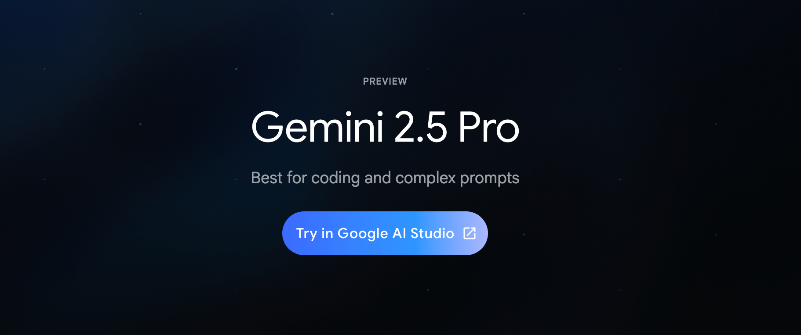

GoogleはGemini 2.5 Proの一般提供を開始しました。このモデルはAI StudioおよびVertex AIプラットフォームを通じて利用できるようになり、より高度なAI機能を開発者やビジネスユーザーに提供します。

Gemini 2.5 Proは、Googleの最新のマルチモーダルAIモデルで、テキスト、画像、音声、動画などの複数の入力形式を理解し処理できる能力を持っています。この一般提供により、限られたユーザーのみがアクセスできる段階から、幅広い開発者やビジネスユーザーが利用できる段階へと移行しました。

本記事では、Gemini 2.5 Proの主要機能、利用方法、そして企業のDX推進における活用可能性について解説します。

## Gemini 2.5 Proの主要機能と特徴

Gemini 2.5 Proは、Googleの生成AIモデルの最新バージョンとして、多くの改良点と新機能を備えています。

### 主要な機能一覧

1. **高度なマルチモーダル能力**
   - テキスト、画像、音声、動画の統合的な理解
   - 複数のメディア形式をまたいだコンテキスト理解

2. **長いコンテキストウィンドウ**
   - 最大2百万トークンのコンテキストウィンドウをサポート
   - 長文の文書や大量のデータを一度に処理可能

3. **高度な推論能力**
   - 複雑な問題解決と多段階推論
   - 数学や科学的推論の精度向上

4. **マルチターン会話の改善**
   - より自然で一貫性のある対話体験
   - 過去の対話履歴を踏まえた適切な応答生成

5. **多言語サポートの強化**
   - 日本語を含む多言語での理解と生成能力向上
   - 言語間翻訳の精度向上

これらの機能により、企業の様々なAIユースケースにおいて、より高度で複雑なタスクの自動化や支援が可能になります。

## 利用方法：AI StudioとVertex AI

Gemini 2.5 Proは、GoogleのAI開発プラットフォームであるAI StudioとVertex AIを通じて利用できます。

### AI Studioでの利用

AI Studioは、プロンプトエンジニアリングやプロトタイピングを迅速に行うためのウェブベースの環境です。以下の手順でGemini 2.5 Proを利用できます：

1. AI Studio（https://aistudio.google.com/）にアクセス
2. Googleアカウントでログイン
3. 新しいプロジェクトを作成
4. モデル選択からGemini 2.5 Proを選択
5. プロンプトの作成と実行

AI Studioでは、無料枠でも一定量までGemini 2.5 Proを試すことができ、APIキーの発行も可能です。

### Vertex AIでの利用

Vertex AIは、Google Cloudの機械学習プラットフォームであり、本番環境での大規模なAIソリューション展開に適しています：

1. Google Cloudコンソールにアクセス
2. Vertex AIサービスを選択
3. Gemini APIセクションからGemini 2.5 Proを選択
4. 必要なパラメータを設定してAPI呼び出しを行う

Vertex AIでは、企業のセキュリティやコンプライアンス要件に対応した設定が可能であり、大規模なデプロイメントに適しています。

## 企業DXにおけるGemini 2.5 Proの活用シナリオ

Gemini 2.5 Proは、企業のデジタルトランスフォーメーション（DX）において様々な形で活用できます。

### 1. ドキュメント処理の自動化

大量の社内文書、契約書、マニュアルなどの処理を自動化できます。Gemini 2.5 Proの長いコンテキストウィンドウにより、数百ページに及ぶ文書も一度に解析し、重要な情報を抽出したり、要約したりすることが可能です。

### 2. カスタマーサポートの強化

問い合わせ対応の自動化やサポートエージェントの支援に活用できます。複数のターンにわたる会話を理解し、過去のやり取りを踏まえた一貫性のある応答を生成できるため、顧客満足度の向上につながります。

### 3. マルチメディアコンテンツの分析と生成

画像、音声、テキストが混在するコンテンツの分析や生成を行えます。例えば、プレゼンテーション資料から重要な情報を抽出したり、複数の情報源から統合レポートを作成したりすることが可能です。

### 4. 製品開発とイノベーション

アイデア発想や概念検証を支援します。製品設計、市場分析、競合調査などの情報を統合的に処理し、新たな視点や解決策を提案することができます。

### 5. 業務プロセスの最適化

既存の業務フローを分析し、効率化のための提案を行えます。複雑なプロセスを理解し、ボトルネックや改善点を特定するのに役立ちます。

## 前世代モデルとの比較：何が進化したのか

Gemini 2.5 Proは、前世代のGemini 1.5 Proと比較して、いくつかの重要な進化を遂げています。

### コンテキスト理解の向上

Gemini 2.5 Proは、より長いコンテキストウィンドウと改善された記憶機能により、長文や複雑な内容の理解力が向上しています。これにより、例えば長い会話の流れや大量のドキュメントから一貫性のある情報抽出が可能になりました。

### マルチモーダル処理の精度向上

テキスト、画像、音声など異なる形式のデータを処理する精度が向上し、特に複数のモダリティ間の関連性の理解が強化されています。例えば、画像内のテキストとその周辺の視覚情報を一体的に理解できるようになりました。

### 推論能力の深化

複数のステップを要する論理的思考や推論において、より複雑な問題解決能力を獲得しています。特に数学や科学的な推論タスクでの正確性が向上しています。

### 微調整（ファインチューニング）のしやすさ

特定のタスクやドメインに合わせた微調整がより効率的に行えるようになり、企業固有のユースケースに適応させやすくなっています。

## セキュリティと責任あるAIの取り組み

Googleは、Gemini 2.5 Proの一般提供にあたり、セキュリティと責任あるAI利用についても重視しています。

### データプライバシーとセキュリティ

Vertex AI上でのGemini 2.5 Pro利用時には、データ保護のためのさまざまな機能が提供されています：

- 顧客データの暗号化
- リージョン選択によるデータ所在地の制御
- アクセス制御と監査ログ

### 責任あるAI利用のためのガードレール

有害なコンテンツの生成防止や、バイアスの軽減のためのフィルタリングメカニズムが実装されています。また、AIモデルの動作を監視し、評価するためのツールも提供されています。

### 透明性とコントロール

AI利用に関する透明性を確保するため、モデルの挙動に関する詳細な文書化や、特定のユースケースに合わせてモデルの出力をカスタマイズするためのコントロールが提供されています。

## 導入事例と成功例

すでにGemini 2.5 Proを活用している企業の事例を見てみましょう。

### 製造業A社：製品マニュアルの多言語化と検索性強化

大量の技術マニュアルをGemini 2.5 Proで解析し、複数言語への翻訳と内部検索システムの強化を実現。技術情報へのアクセス性が向上し、グローバルなサポート体制が強化されました。

### 金融サービスB社：リスク分析の高度化

投資リスク評価のため、市場データと企業情報の統合分析にGemini 2.5 Proを活用。複数の情報源から一貫した分析結果を導き出し、投資判断の精度向上につなげています。

### 医療機関C社：医療文献の解析と知識抽出

最新の医学研究論文を自動解析し、重要な知見を抽出するシステムを構築。医療従事者が最新の研究成果に迅速にアクセスできるようになり、治療方法の改善に貢献しています。

## まとめ：企業DXにおけるGemini 2.5 Proの意義

Google Gemini 2.5 Proの一般提供開始は、企業のAI活用とDX推進において重要なマイルストーンとなります。高度なマルチモーダル機能と拡張されたコンテキスト理解能力により、これまで困難だった複雑なAIタスクが実現可能になります。

特に日本企業にとっては、日本語での理解・生成能力が向上したことで、よりローカライズされたAIソリューションの開発が容易になります。また、AI StudioとVertex AIという2つの異なるアクセス方法を通じて、プロトタイピングから本番環境まで、シームレスなAI開発・展開が可能になりました。

今後、企業はGemini 2.5 Proを活用して、単なる業務効率化にとどまらない、顧客体験の革新や新たなビジネスモデルの創出など、より戦略的なDXを推進していくことが期待されます。

---

## 参考資料

Google AI Studio公式サイト
https://aistudio.google.com/

Google Cloud Vertex AI公式ドキュメント
https://cloud.google.com/vertex-ai/docs/generative-ai/model-reference/gemini

「Google、Gemini 2.5 Proの一般提供を開始　AI StudioとVertex AIで利用可能に」(CodeZine, 2025年4月)
https://codezine.jp/article/detail/21316

「Googleが生成AIモデル「Gemini 2.5 Pro」を一般提供、最大2Mトークンを処理可能」(ITMedia, 2025年4月)
https://www.itmedia.co.jp/news/articles/2504/xx/news000.html 