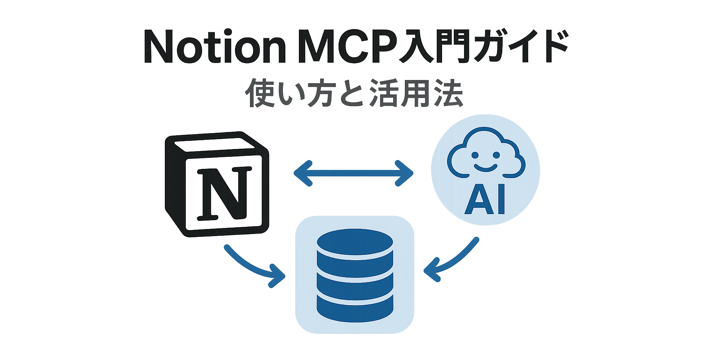

## はじめに

最近、AIアシスタントの能力を拡張する技術として注目を集めているのが「Model Context Protocol（MCP）」です。特にNotionとの連携機能は、ドキュメント管理と知識ベースをAIと直接つなぐ革新的な方法として注目されています。本記事では、Notion MCPの基本から実際の設定方法、活用例まで、初心者にもわかりやすく解説します。Notionユーザーの方々にとって、AIとの連携がどのように日常の生産性を高めるかを理解する一助となれば幸いです。

## 🔍 Notion MCPとは何か

Notion MCPは、大規模言語モデル（LLM）がNotion上のワークスペースと直接やり取りできるようにするサーバー実装です。これにより、AIアシスタント（主にClaude）がNotionのデータベース、ページ、ブロックなどに直接アクセスし、情報の取得や更新が可能になります。

### MCPの基本的な仕組み

MCPとは「Model Context Protocol」の略称で、AIモデルが外部ツールやサービスと連携するための標準プロトコルです。MCPの核心は次のようなものです：

*図1: MCPの基本的な仕組みと3つの核心要素*

- **外部メモリの活用**: LLMの内部コンテキストウィンドウの制限を超えて、外部で情報を管理・処理
- **ツール連携**: AIが外部サービスのAPIやデータベースにアクセスし操作する能力
- **コンテキスト管理**: ユーザーとの対話履歴や関連情報を効率的に保持・更新

Notion MCPは、このプロトコルを使ってNotionのAPIと連携し、AIがNotionワークスペース内のコンテンツにアクセスできるようにするものです。

### Notion MCPの主な機能

Notion MCPが提供する主な機能は以下の通りです：

- **データベースのクエリと操作**: Notionデータベースの検索、フィルタリング、内容取得
- **ページ情報の取得と更新**: ページ内容の読み取りや、ページプロパティの更新
- **ブロック操作**: 子ブロックの追加、取得、削除などの操作
- **検索機能**: ワークスペース内のページやデータベースを検索
- **コメント操作**: コメントの作成や取得
- **ユーザー情報の取得**: ワークスペース内のユーザー情報の取得

## 🛠 Notion MCPの設定方法

Notion MCPを利用するには、いくつかの手順を踏む必要があります。ここでは、Claude Desktopを使った例で説明します。

### 1. Notion統合の作成

まず、NotionのAPIにアクセスするための統合を作成します：

1. [Notion Integrations](https://www.notion.so/profile/integrations)ページにアクセス
2. 「New Integration」をクリック
3. 統合の名前を入力し、適切な権限（「Read content」「Update content」など）を選択
4. 作成した後、「Internal Integration Token」をコピー

### 2. ワークスペースへの統合追加

次に、作成した統合をアクセスさせたいページやデータベースに接続します：

1. Notionでアクセスを許可したいページを開く
2. 右上の「...」メニューをクリック
3. 「Connections」を選択し、先ほど作成した統合を選択

### 3. Claude Desktopの設定

Claude Desktopを使ってNotion MCPを利用するには、設定ファイルを編集します：

1. `claude_desktop_config.json`を以下のように編集：

```json
{
  "mcpServers": {
    "notion": {
      "command": "npx",
      "args": ["-y", "@suekou/mcp-notion-server"],
      "env": {
        "NOTION_API_TOKEN": "あなたの統合トークン"
      }
    }
  }
}
```

または、ローカルにビルドしたサーバーを使用する場合：

```json
{
  "mcpServers": {
    "notion": {
      "command": "node",
      "args": ["ビルドしたファイルへのパス"],
      "env": {
        "NOTION_API_TOKEN": "あなたの統合トークン"
      }
    }
  }
}
```

### 4. トラブルシューティング

設定後に問題が発生した場合は、以下を確認してください：

- 統合に必要な権限が付与されているか
- 統合が対象のページやデータベースに招待されているか
- トークンと設定が正しく`claude_desktop_config.json`に記載されているか

## 💡 Notion MCPの活用例

Notion MCPの具体的な活用例をいくつか紹介します。

### データベース情報の取得と分析

Notionデータベースから情報を取得し、AIに分析させることができます：

1. Notionでタスク管理データベースを作成
2. Claudeに「プロジェクトAに関連するタスクを教えて」と質問
3. AIがデータベースを検索し、関連タスクを抽出して回答

### 長文記事の保存と要約

AIが生成した長文コンテンツをNotionに直接保存できます：

1. Claudeに記事を書かせる
2. 「この記事をNotionのページIDに保存して」と指示
3. AIが記事内容をNotionページに保存

### データベース項目の自動作成

AIの支援を受けながらデータベースの新しいエントリを作成できます：

1. 「新しい映画データベースのエントリを作成して」と指示
2. 映画の詳細情報を会話で確認
3. AIが必要な情報をまとめてデータベースに追加

### ナレッジベースの検索と回答

社内ナレッジベースとしてNotionを使っている場合、AIがそこから情報を検索して回答できます：

1. 「営業マニュアルの返品手続きについて教えて」と質問
2. AIがNotion内のマニュアルを検索
3. 関連情報を見つけて、要約して回答

## 🔮 Notion MCPの将来性と可能性

Notion MCPは比較的新しい技術ですが、その可能性は非常に大きいと考えられます。

### 今後の発展が期待される領域

- **ワークフロー自動化**: タスクの作成から進捗管理、完了までを会話ベースで自動化
- **データの視覚化**: データベース情報をAIが分析し、適切なグラフや図表で表現
- **パーソナライズされた情報管理**: ユーザーの好みや使用パターンに合わせた情報整理
- **複数ツールとの連携**: NotionだけでなくSlackやGitHubなど他のツールとも連携した統合AI支援

### 他のMCPカテゴリとの比較

MCPサーバーは以下のカテゴリに分類されますが、Notion MCPはナレッジ検索系に分類されます：

- **データベース系**: Supabase、PostgreSQLなど
- **バージョン管理系**: GitHub、GitLabなど
- **プロジェクト管理系**: Linear、Jiraなど
- **コミュニケーション系**: Slack、Discordなど
- **ナレッジ検索系**: Notion、Perplexityなど
- **システム実行系**: Shell/CLI、FileSystemなど

ナレッジ検索系MCPの中でも、Notionはドキュメントとデータベースを組み合わせた柔軟な構造を持つため、AIとの相性が特に良いとされています。

## まとめ

Notion MCPは、Notionユーザーのワークフローをさらに強化する強力なツールです。AIアシスタントとNotionを直接連携させることで、情報の検索や整理、コンテンツの作成や管理が格段に効率化されます。

設定はやや技術的な知識を必要としますが、一度設定してしまえば、その恩恵は計り知れません。特に大量の情報を扱うチームや、ナレッジベースとしてNotionを活用している組織にとって、Notion MCPは生産性向上の鍵となるでしょう。

今後も進化を続けるAI技術と、柔軟性の高いNotionとの組み合わせが、私たちの働き方をどのように変えていくのか、非常に楽しみです。実際に試してみて、あなた自身のワークフローにどのように組み込めるか探ってみてはいかがでしょうか。

## 参考文献
- [suekou/mcp-notion-server GitHub リポジトリ](https://github.com/suekou/mcp-notion-server)
- [ccabanillas/notion-mcp GitHub リポジトリ](https://github.com/ccabanillas/notion-mcp)
- [Operating Notion via Claude Desktop Using MCP!](https://dev.to/suekou/operating-notion-via-claude-desktop-using-mcp-c0h)
- [【徹底解説】MCPサーバーを6つの主要カテゴリに分類（2025年版）](https://qiita.com/syukan3/items/5c3c9321d713bc1d8ecf)
- [Model Context Protocol (MCP) とは？仕組みやRAGとの違いを解説](https://www.ai-souken.com/article/what-is-mcp) 