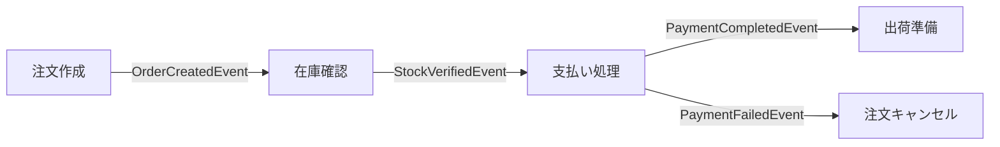

## はじめに：DX時代の新たなシステム連携パラダイム

デジタルトランスフォーメーション（DX）の時代において、ビジネスにおけるリアルタイム性の要求は日増しに高まっています。顧客行動への即時対応、市場の変化への迅速な適応、複数システム間でのシームレスな連携など、従来の同期型・密結合システムでは対応が難しい課題が増えています。

イベント駆動アーキテクチャ（Event-Driven Architecture: EDA）は、こうした課題に対する有効なアプローチとして注目を集めています。本記事では、EDAの基本概念から実装パターン、DXにおける活用方法まで、実践的な知識を体系的に解説します。

## イベント駆動アーキテクチャとは

イベント駆動アーキテクチャとは、システム内で発生する「イベント」の生成・検知・消費を中心に設計される分散システムアーキテクチャです。ここでの「イベント」とは、「システム内で発生した何らかの状態変化」を表します。

### 主要コンセプト

1. **イベント（Event）**: システム内で発生した状態変化を表すデータ。例えば「注文が作成された」「支払いが完了した」「在庫が更新された」など
2. **イベントプロデューサー**: イベントを生成するコンポーネント
3. **イベントコンシューマー**: イベントを受信し処理するコンポーネント
4. **イベントチャネル**: イベントの伝達経路（メッセージキュー、イベントバスなど）

### 従来アーキテクチャとの違い

| 特性 | 従来の同期型アーキテクチャ | イベント駆動アーキテクチャ |
|------|----------------------|-------------------|
| 通信方式 | 同期（リクエスト/レスポンス） | 非同期（パブリッシュ/サブスクライブ） |
| 結合度 | 密結合 | 疎結合 |
| スケーラビリティ | 限定的 | 高い |
| フォールトトレランス | 低い（連鎖障害リスク） | 高い（障害分離） |
| 複雑性 | 比較的低い | 比較的高い |

## イベント駆動アーキテクチャの主要パターン

イベント駆動アーキテクチャには、いくつかの実装パターンがあります。用途や要件に応じて適切なパターンを選択することが重要です。

### 1. イベント通知（Event Notification）

最もシンプルなパターンで、システムが特定のイベントを通知し、関心のあるサービスがそれに反応するモデルです。

```java
// イベント通知の例（Java）
public class OrderService {
    private EventBus eventBus;
    
    public void createOrder(Order order) {
        // 注文処理のビジネスロジック
        orderRepository.save(order);
        
        // イベント通知
        OrderCreatedEvent event = new OrderCreatedEvent(order.getId(), order.getCustomerId(), order.getAmount());
        eventBus.publish(event);
    }
}

// 別サービスでのイベント購読
public class NotificationService implements EventSubscriber<OrderCreatedEvent> {
    @Override
    public void onEvent(OrderCreatedEvent event) {
        // 注文作成イベントに反応して顧客に通知を送信
        Customer customer = customerRepository.findById(event.getCustomerId());
        emailService.sendOrderConfirmation(customer.getEmail(), event.getOrderId());
    }
}
```

### 2. イベントによる状態転送（Event-Carried State Transfer）

イベント自体に必要なデータを含めることで、コンシューマがデータベースへの問い合わせなしで処理できるようにするパターンです。

```json
// イベント内に必要な状態データを含める例
{
  "eventType": "OrderCreated",
  "eventId": "12345",
  "timestamp": "2023-07-15T10:30:45Z",
  "data": {
    "orderId": "ORD-98765",
    "customerInfo": {
      "id": "CUST-123",
      "name": "田中太郎",
      "email": "tanaka@dx-media.example"
    },
    "items": [
      {
        "productId": "PROD-001",
        "productName": "ワイヤレスイヤホン",
        "quantity": 1,
        "price": 15000
      }
    ],
    "totalAmount": 15000,
    "shippingAddress": "東京都渋谷区..."
  }
}
```

### 3. イベントソーシング（Event Sourcing）

システムの状態変化をすべてイベントとして記録し、現在の状態はこれらイベントの累積として再構築するパターンです。

```csharp
// イベントソーシングの概念例（C#）
public class Order
{
    private List<OrderEvent> _events = new List<OrderEvent>();
    private OrderState _state;
    
    public Guid Id { get; private set; }
    
    public Order(Guid id)
    {
        Id = id;
        _state = new OrderState();
    }
    
    public void CreateOrder(List<OrderItem> items, Customer customer)
    {
        var @event = new OrderCreatedEvent(Id, items, customer, DateTime.Now);
        ApplyEvent(@event);
    }
    
    public void AddItem(OrderItem item)
    {
        var @event = new OrderItemAddedEvent(Id, item, DateTime.Now);
        ApplyEvent(@event);
    }
    
    public void SubmitOrder()
    {
        if (_state.Items.Count == 0)
        {
            throw new InvalidOperationException("注文にはアイテムが必要です");
        }
        
        var @event = new OrderSubmittedEvent(Id, DateTime.Now);
        ApplyEvent(@event);
    }
    
    private void ApplyEvent(OrderEvent @event)
    {
        _state = _state.Apply(@event);
        _events.Add(@event);
    }
}
```

### 4. CQRS（Command Query Responsibility Segregation）

コマンド（データ更新）とクエリ（データ読み取り）の責務を分離するパターンで、イベント駆動アーキテクチャと組み合わせることで高いパフォーマンスと柔軟性を実現します。

```typescript
// CQRSとEDAの組み合わせ例（TypeScript）

// コマンド側
class ProductCommandService {
  constructor(private eventBus: EventBus) {}
  
  async createProduct(productData: ProductCreateCommand): Promise<void> {
    // バリデーション
    validateProductData(productData);
    
    // 一意のIDを生成
    const productId = generateUniqueId();
    
    // イベントの発行
    const event = new ProductCreatedEvent(productId, productData);
    await this.eventBus.publish(event);
  }
}

// イベントハンドラ（ステート更新）
class ProductEventHandler {
  constructor(private productWriteRepository: ProductWriteRepository) {}
  
  async handleProductCreated(event: ProductCreatedEvent): Promise<void> {
    const { productId, productData } = event;
    
    // 書き込みモデルに永続化
    await this.productWriteRepository.create({
      id: productId,
      name: productData.name,
      price: productData.price,
      description: productData.description,
      stockLevel: productData.initialStock,
      createdAt: new Date()
    });
  }
}

// クエリ側（読み取り最適化モデル）
class ProductQueryService {
  constructor(private productReadRepository: ProductReadRepository) {}
  
  async getProductDetails(productId: string): Promise<ProductDetailsDTO> {
    const product = await this.productReadRepository.findById(productId);
    return mapToProductDetailsDTO(product);
  }
  
  async searchProducts(criteria: ProductSearchCriteria): Promise<ProductSummaryDTO[]> {
    const products = await this.productReadRepository.search(criteria);
    return products.map(mapToProductSummaryDTO);
  }
}
```

## イベント駆動アーキテクチャを支える技術

イベント駆動アーキテクチャの実装には、さまざまな技術が使われます。

### メッセージブローカー

イベントの配信を担当するミドルウェアです。主なものには以下があります：

- **Apache Kafka**: 高スループット・分散ストリーミングプラットフォーム
- **RabbitMQ**: 軽量で使いやすいメッセージングシステム
- **Amazon SNS/SQS**: AWSのマネージドメッセージングサービス
- **Google Pub/Sub**: Googleのフルマネージドメッセージングサービス
- **Azure Event Grid/Service Bus**: Microsoftのイベント配信サービス

### API Gateway

イベント駆動システムのエントリポイントとして機能し、認証・認可・ルーティング・変換などを担当します。

```yaml
# AWS API Gateway + Lambdaによるイベント駆動APIの例
AWSTemplateFormatVersion: '2010-09-09'
Resources:
  OrdersAPI:
    Type: 'AWS::ApiGateway::RestApi'
    Properties:
      Name: OrdersAPI
      
  OrdersFunction:
    Type: 'AWS::Lambda::Function'
    Properties:
      Handler: index.handler
      Runtime: nodejs14.x
      Code:
        ZipFile: |
          exports.handler = async (event) => {
            // イベントを解析
            const body = JSON.parse(event.body);
            
            // SNSでイベントをパブリッシュ
            const AWS = require('aws-sdk');
            const sns = new AWS.SNS();
            
            await sns.publish({
              TopicArn: process.env.ORDER_EVENTS_TOPIC,
              Message: JSON.stringify({
                eventType: 'OrderCreated',
                data: body
              })
            }).promise();
            
            return {
              statusCode: 202,
              body: JSON.stringify({ message: '注文を受け付けました' })
            };
          }
      
  OrderCreatedTopic:
    Type: 'AWS::SNS::Topic'
    Properties:
      TopicName: OrderEvents
```

### ストリーム処理エンジン

リアルタイムでイベントを処理するためのエンジンです。

- **Apache Flink**: 分散ストリーム処理フレームワーク
- **Apache Spark Streaming**: バッチ処理とストリーム処理の両方をサポート
- **Kafka Streams**: Kafkaに統合されたストリーム処理ライブラリ

```java
// Kafka Streamsによるリアルタイム処理の例
public class OrderAnalyticsProcessor {
    public static void main(String[] args) {
        Properties props = new Properties();
        props.put(StreamsConfig.APPLICATION_ID_CONFIG, "order-analytics");
        props.put(StreamsConfig.BOOTSTRAP_SERVERS_CONFIG, "localhost:9092");
        
        StreamsBuilder builder = new StreamsBuilder();
        
        // オーダーイベントのストリームを作成
        KStream<String, OrderEvent> orders = builder.stream("order-events");
        
        // 地域別の売上分析
        KTable<String, Double> regionSales = orders
            .filter((key, order) -> "OrderCreated".equals(order.getEventType()))
            .groupBy((key, order) -> order.getCustomerRegion())
            .aggregate(
                () -> 0.0,
                (region, order, total) -> total + order.getAmount(),
                Materialized.with(Serdes.String(), Serdes.Double())
            );
        
        // 結果をトピックに書き出し
        regionSales.toStream().to("region-sales-analytics");
        
        KafkaStreams streams = new KafkaStreams(builder.build(), props);
        streams.start();
    }
}
```

## DXにおけるイベント駆動アーキテクチャの活用事例

### 1. オムニチャネル小売業

小売業のDXにおいて、イベント駆動アーキテクチャは以下のようなメリットをもたらします：

- **リアルタイム在庫管理**: 店舗とECサイトで在庫情報をリアルタイム共有
- **シームレスな顧客体験**: オンライン注文のオフライン受け取り（BOPIS）など
- **パーソナライズ**: 顧客行動イベントをリアルタイムで分析し、最適なレコメンデーションを提供

```python
# 顧客行動イベント処理の疑似コード（Python）
def process_customer_event(event):
    # イベントを処理
    if event['type'] == 'ProductViewed':
        # 製品閲覧イベントを処理
        product_id = event['productId']
        customer_id = event['customerId']
        
        # 顧客プロファイルを更新
        update_customer_profile(customer_id, {'viewed_product': product_id})
        
        # リコメンデーションエンジンに通知
        recommendation_engine.notify(customer_id, 'view', product_id)
        
        # 類似製品を取得
        similar_products = product_service.get_similar_products(product_id)
        
        # レコメンデーションを顧客に送信（プッシュ通知やWebSocketなど）
        send_realtime_recommendation(customer_id, similar_products)
```

### 2. フィンテック

金融サービスにおけるDXでは、イベント駆動アーキテクチャにより以下が実現します：

- **リアルタイム詐欺検知**: 取引イベントをリアルタイムで分析し、不正を検知
- **マイクロサービス連携**: 口座管理、支払い処理、レポーティングなど複数サービス間の疎結合連携
- **規制対応**: 監査証跡としてイベントを記録し、コンプライアンス要件に対応

### 3. 製造業（Industry 4.0）

製造業のDXにおいては、以下のような活用が考えられます：

- **予知保全**: センサーからのイベントを分析し、設備故障を予測
- **サプライチェーン最適化**: 需要変動などのイベントにリアルタイムで対応
- **製品のカスタマイズ**: 顧客要求に応じた柔軟な製造プロセス制御

## イベント駆動アーキテクチャの設計原則

効果的なイベント駆動アーキテクチャを設計するには、以下の原則が重要です：

### 1. ドメイン駆動設計の活用

イベントはビジネスドメインの言語で定義し、イベントストーミングなどの手法を活用します。



### 2. べき等性の確保

同じイベントが複数回処理されても問題ないよう、イベントハンドラをべき等にします。

```java
// べき等性を確保したイベントハンドラの例
public class OrderProcessingHandler {
    private final ProcessedEventRepository processedEvents;
    
    public void handleOrderCreated(OrderCreatedEvent event) {
        // イベントIDですでに処理済みかチェック
        if (processedEvents.hasBeenProcessed(event.getEventId())) {
            log.info("Event {} already processed, skipping", event.getEventId());
            return;
        }
        
        try {
            // 実際の処理
            processOrder(event);
            
            // 処理済みとしてマーク
            processedEvents.markAsProcessed(event.getEventId());
        } catch (Exception e) {
            log.error("Failed to process event {}", event.getEventId(), e);
            // エラー処理（再試行戦略など）
        }
    }
}
```

### 3. 非同期通信パターンの適切な選択

- **パブリッシュ/サブスクライブ**: 1つのイベントに対して複数のコンシューマーが存在
- **ポイントツーポイント**: 1つのイベントに対して1つのコンシューマーが存在
- **リクエスト/レスポンス**: 同期的な応答が必要な場合に使用

### 4. スキーマ管理と互換性

イベントのスキーマを管理し、前方/後方互換性を確保します。Schema Registryなどのツールを活用しましょう。

```java
// Avroスキーマ定義の例
{
  "type": "record",
  "name": "OrderCreatedEvent",
  "namespace": "com.example.events",
  "fields": [
    {"name": "eventId", "type": "string"},
    {"name": "orderId", "type": "string"},
    {"name": "customerId", "type": "string"},
    {"name": "orderItems", "type": {"type": "array", "items": {
      "type": "record",
      "name": "OrderItem",
      "fields": [
        {"name": "productId", "type": "string"},
        {"name": "quantity", "type": "int"},
        {"name": "unitPrice", "type": "double"}
      ]
    }}},
    {"name": "totalAmount", "type": "double"},
    {"name": "timestamp", "type": "long"}
  ]
}
```

## イベント駆動アーキテクチャの実装における課題と対策

### 1. 複雑性の管理

**課題**: イベントベースのシステムは追跡が難しく、全体像の把握が困難になりがち

**対策**:
- イベントのカタログを作成し、各イベントの生産者と消費者を文書化
- 分散トレーシング（Jaeger、Zipkinなど）を導入
- システム可視化ツールを活用

### 2. 整合性の確保

**課題**: 分散システムでの結果整合性モデルに関連する問題

**対策**:
- サガパターンを使用したトランザクション管理
- べき等性とアイデンポテントコンシューマーパターン
- イベント順序付けメカニズム

```kotlin
// サガパターンによる分散トランザクション管理（Kotlin）
class OrderSaga(
    private val eventBus: EventBus,
    private val orderRepository: OrderRepository,
    private val paymentService: PaymentService,
    private val inventoryService: InventoryService,
    private val shippingService: ShippingService
) {
    fun startOrderProcess(createOrderCommand: CreateOrderCommand) {
        // 注文作成ステップ
        val orderId = UUID.randomUUID().toString()
        val order = Order(
            id = orderId,
            customerId = createOrderCommand.customerId,
            items = createOrderCommand.items,
            status = OrderStatus.PENDING
        )
        orderRepository.save(order)
        
        // 支払い処理ステップ
        try {
            val paymentResult = paymentService.processPayment(
                orderId, 
                createOrderCommand.paymentDetails,
                order.calculateTotal()
            )
            
            if (paymentResult.isSuccessful) {
                // 在庫引当ステップ
                try {
                    val allocationResult = inventoryService.allocateInventory(orderId, order.items)
                    
                    if (allocationResult.isSuccessful) {
                        // 配送ステップ
                        try {
                            shippingService.scheduleDelivery(
                                orderId,
                                createOrderCommand.shippingAddress
                            )
                            
                            // 注文完了
                            orderRepository.updateStatus(orderId, OrderStatus.COMPLETED)
                            eventBus.publish(OrderCompletedEvent(orderId))
                        } catch (e: Exception) {
                            // 配送失敗 - 補償トランザクション
                            inventoryService.releaseInventory(orderId)
                            orderRepository.updateStatus(orderId, OrderStatus.DELIVERY_FAILED)
                            eventBus.publish(OrderFailedEvent(orderId, "配送手配に失敗しました"))
                        }
                    } else {
                        // 在庫引当失敗 - 補償トランザクション
                        paymentService.refundPayment(orderId)
                        orderRepository.updateStatus(orderId, OrderStatus.INVENTORY_FAILED)
                        eventBus.publish(OrderFailedEvent(orderId, "在庫不足"))
                    }
                } catch (e: Exception) {
                    // 在庫引当失敗 - 補償トランザクション
                    paymentService.refundPayment(orderId)
                    orderRepository.updateStatus(orderId, OrderStatus.INVENTORY_FAILED)
                    eventBus.publish(OrderFailedEvent(orderId, "在庫処理中にエラーが発生しました"))
                }
            } else {
                // 支払い失敗
                orderRepository.updateStatus(orderId, OrderStatus.PAYMENT_FAILED)
                eventBus.publish(OrderFailedEvent(orderId, "支払い処理に失敗しました"))
            }
        } catch (e: Exception) {
            // 支払い処理中の例外
            orderRepository.updateStatus(orderId, OrderStatus.PAYMENT_FAILED)
            eventBus.publish(OrderFailedEvent(orderId, "支払い処理中にエラーが発生しました"))
        }
    }
}
```

### 3. 適切なタイミングとスケーリング

**課題**: メッセージの遅延、スループット、バックプレッシャーの管理

**対策**:
- キャパシティプランニングとパフォーマンステスト
- 自動スケーリングの導入（Kubernetes HPA、AWS Auto Scalingなど）
- バックプレッシャー処理メカニズムの実装

## イベント駆動アーキテクチャへの段階的移行戦略

既存のシステムからイベント駆動アーキテクチャへの移行は、段階的に行うことが重要です。

### フェーズ1: イベント通知の導入

既存システムのキー機能に対して、変更検知を追加しイベントを発行します。

```java
// 既存サービスにイベント通知を追加
public class LegacyOrderService {
    private OrderRepository orderRepository;
    private EventPublisher eventPublisher; // 新たに追加
    
    // 既存メソッド
    public void createOrder(OrderRequest request) {
        // 既存のビジネスロジック
        Order order = mapRequestToOrder(request);
        orderRepository.save(order);
        
        // イベント通知を追加
        eventPublisher.publish(
            new OrderCreatedEvent(order.getId(), order.getCustomerId(), order.getAmount())
        );
    }
}
```

### フェーズ2: 読み取り分離の実装

読み取り用のモデルを分離し、イベントサブスクライバーを使用して維持します。

### フェーズ3: コア機能のイベント化

重要なビジネス機能をイベント中心の実装に移行します。

### フェーズ4: イベントソーシングの導入

適切なドメインについて、状態の保存からイベントの保存への移行を検討します。

## 結論：DX時代におけるイベント駆動アーキテクチャの意義

イベント駆動アーキテクチャは、DX時代に求められるリアルタイム性、疎結合性、スケーラビリティを実現する強力なアプローチです。適切に設計・実装することで、以下のようなメリットが得られます：

1. **ビジネス俊敏性の向上**: 新機能の追加や変更が容易
2. **リアルタイムデータ処理**: 顧客体験向上と迅速な意思決定
3. **システム回復力の強化**: 障害分離と堅牢性の向上
4. **スケーラビリティ**: 需要変動への柔軟な対応
5. **将来への拡張性**: 新たなサービスや技術との統合が容易

ただし、増加する複雑性や分散システム特有の課題に対応するためには、適切な設計原則の適用、監視・運用体制の整備、段階的な導入戦略が不可欠です。

イベント駆動アーキテクチャは「銀の弾丸」ではありませんが、適切なユースケースに対しては、DX推進において強力な武器となります。
