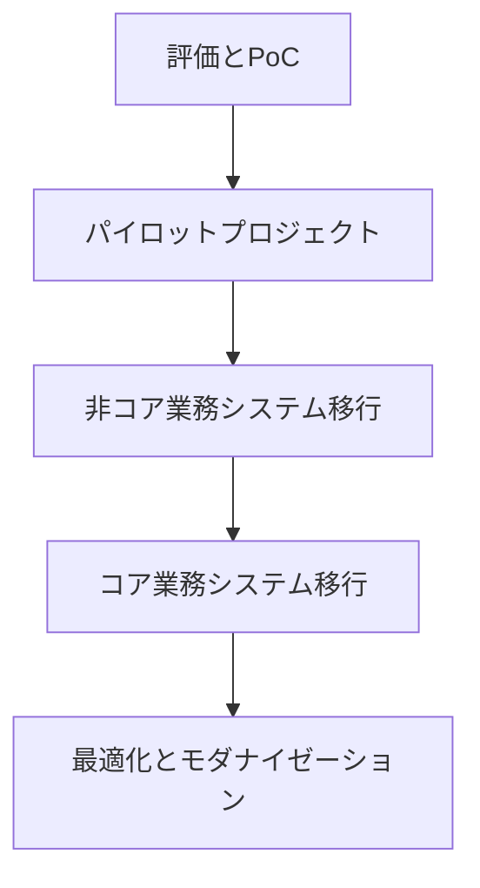

## はじめに：DX時代におけるクラウド選定の重要性

デジタルトランスフォーメーション（DX）の推進において、クラウドプラットフォームの選択は企業の競争力に直結する重要な戦略的決断です。

市場シェアトップの Amazon Web Services（AWS）、Microsoft Azure、Google Cloud Platform（GCP）の3大クラウドプロバイダーは、それぞれに特徴と強みを持ち、企業のニーズに応じた選択が求められます。

しかし、「単にシェアや知名度だけで選択していませんか？」「自社のDX戦略に本当に適したプロバイダーを選んでいますか？」という問いかけが重要です。本記事では、主要プロバイダー間の技術的な違いだけでなく、DX戦略に基づく選定基準や、各プロバイダーの差別化要素を詳細に解説します。

## クラウド市場の現状と各プロバイダーの位置づけ

### 市場シェアと成長率

2025年現在の世界のパブリッククラウド市場シェアは以下のように分布しています（Gartner調査データに基づく推定）：

```
AWS: 32%
Azure: 28%
GCP: 12%
Alibaba Cloud: 6%
Oracle Cloud: 4%
IBM Cloud: 3%
その他: 15%
```

特筆すべきは、AWS・Azureが二強体制を維持しつつも、GCPが特にAI/ML領域で急速に成長している点です。また、日本市場では、特にエンタープライズ向けにAzureの採用が他国より高い傾向があります。

### 各プロバイダーの歴史的背景と強み

各プロバイダーの成り立ちは、そのサービス特性と強みに影響しています：

**AWS**：
- クラウドの先駆者として2006年にサービス開始
- Amazonの電子商取引インフラとして進化
- 最も幅広いサービス群と成熟度
- スタートアップからエンタープライズまで幅広い顧客層

**Azure**：
- 2010年にサービス開始、MicrosoftのエンタープライズDNAを継承
- Windows、Office、Active Directoryとの緊密な統合
- ハイブリッドクラウド機能の充実
- エンタープライズ向けのサポートと契約体系

**GCP**：
- Googleの膨大なインフラ上に構築（2011年サービス開始）
- データ分析、AI/ML、コンテナ技術の強み
- グローバルネットワークインフラの品質
- オープンソース・テクノロジーへの貢献と統合

## DX推進に基づくクラウド選定のフレームワーク

クラウド選定は、単なる技術比較ではなく、企業のDX戦略に基づく戦略的決断です。以下に体系的な選定フレームワークを提案します。

### 1. 自社DX戦略の明確化

クラウド選定の前に、以下のDX戦略上の要素を明確にすることが重要です：

- **DX推進の主な目的**：コスト削減、スピード向上、新規事業創出、顧客体験向上など
- **アプリケーションポートフォリオの現状**：レガシーシステムの割合、現行技術スタック
- **デジタル成熟度**：組織のクラウド/DevOps経験、技術スキル、変革への準備状況
- **規制・コンプライアンス要件**：業界固有の規制、データローカライゼーション要件など

### 2. 主要評価基準の設定

DX戦略に基づき、以下の評価基準を重み付けします：

| 評価基準 | 検討ポイント |
|---------|------------|
| 技術的適合性 | 必要サービスの有無、既存システムとの統合性 |
| 拡張性と俊敏性 | スケーラビリティ、新技術の取り込み速度 |
| セキュリティとコンプライアンス | セキュリティ機能、認証取得状況 |
| パフォーマンスと信頼性 | SLA、グローバル展開、障害対応 |
| コストと投資対効果 | 初期コスト、運用コスト、予測可能性 |
| エコシステムと人材 | パートナー網、人材の獲得容易性 |
| ベンダーロックインリスク | 標準技術の採用度、データ移行の容易さ |
| サポートとサービス | サポート体制、トレーニング、コンサルティング |

### 3. PoC（実証実験）の設計と実施

概念検証（PoC）を通じて実際の使用感を確認することが重要です：

```python
# PoCの設計例（擬似コード）
def design_cloud_poc(dx_strategy, providers):
    test_scenarios = []
    
    # DX戦略から主要テストシナリオを特定
    if dx_strategy.includes("customer_experience"):
        test_scenarios.append("app_performance_under_load")
        test_scenarios.append("global_content_delivery")
    
    if dx_strategy.includes("data_driven_decision"):
        test_scenarios.append("big_data_processing")
        test_scenarios.append("ml_model_training")
    
    # 各プロバイダーでテストシナリオを実行し評価
    results = {}
    for provider in providers:
        results[provider] = execute_test_scenarios(provider, test_scenarios)
    
    return analyze_results(results, dx_strategy.priorities)
```

## 各プロバイダーの詳細比較

### 1. サービスポートフォリオと差別化要素

**AWS**:
- 200以上のサービスを提供し、カバレッジが最も広い
- **差別化サービス**: Amazon SageMaker（ML）、AWS Lambda（サーバーレス）、Amazon RDS
- **弱点**: サービスの多さによる複雑性、管理コンソールのUXに課題

**Azure**:
- 100以上のサービスを提供し、エンタープライズ統合に強み
- **差別化サービス**: Azure Active Directory、Azure DevOps、Microsoft 365連携
- **弱点**: サービスの成熟度にばらつき、一部サービスの安定性に課題

**GCP**:
- 90以上のサービスを提供し、データと分析に強み
- **差別化サービス**: BigQuery、Vertex AI、Google Kubernetes Engine(GKE)
- **弱点**: エンタープライズサービスの範囲がやや狭い、日本市場でのプレゼンス

**具体的な差別化事例**:
- **データベース**: AWSのAurora vs AzureのCosmosDB vs GCPのSpanner
- **コンテナ管理**: AWS EKS vs Azure AKS vs Google GKE
- **AIサービス**: Amazon Bedrock vs Azure OpenAI Service vs Vertex AI

### 2. グローバル展開とリージョン戦略

各プロバイダーのリージョン展開と特徴：

**AWS**:
- 31リージョン、99アベイラビリティゾーン（2025年4月現在）
- 日本には東京・大阪の2リージョン
- 新興国市場へも積極展開

**Azure**:
- 65リージョン（2025年4月現在）
- 日本には東日本・西日本・中日本の3リージョン
- 政府機関向けクラウド（Azure Government）の強み

**GCP**:
- 36リージョン（2025年4月現在）
- 日本には東京・大阪の2リージョン
- 海底ケーブルなど独自のネットワークインフラ投資

```
// 日本リージョンのレイテンシ比較（東京-大阪間、ミリ秒）
AWS: 12.4ms
Azure: 9.8ms
GCP: 11.2ms
```

### 3. コストモデルと価格戦略

コスト比較は単純ではありませんが、一般的な傾向を示します：

**AWS**:
- 従量課金と複数の予約モデル（RI、Savings Plans）
- 細かなサービス別課金体系
- スポットインスタンスによる大幅割引オプション

**Azure**:
- 既存Microsoft契約（EA）との統合によるメリット
- ハイブリッドユースベネフィット（オンプレミスライセンスの流用）
- 開発/テスト環境向け特別料金

**GCP**:
- 自動継続利用割引（Sustained Use Discounts）
- プリエンプティブルVMの柔軟な価格設定
- BigQuery無料枠の寛大さ

**TCO（総所有コスト）比較例**:
```
// 仮想的なEコマースシステム3年間運用のTCO比較（百万円）
AWS: 124.5
Azure: 136.8（Microsoft既存契約なし）/ 118.2（既存契約あり）
GCP: 129.3
```

注：実際のコストは、ワークロード特性、最適化レベル、契約条件により大きく異なります。

### 4. エンタープライズレディネスと日本市場対応

企業利用における重要な要素を比較します：

**AWS**:
- 最も成熟したエンタープライズガバナンス機能
- AWS Control Tower、Organizations、Configなどの豊富な管理ツール
- 日本法人の規模とパートナーエコシステムの広さ

**Azure**:
- エンタープライズDNAとActive Directory統合の強み
- Azure Policy、Blueprintsなどの組織管理機能
- マイクロソフトの日本での長年のプレゼンスと信頼関係

**GCP**:
- エンタープライズ機能の急速な強化
- Resource Manager、Organization Policyなどの整備
- Google Japan主導の独自のソリューション開発

**日本市場特有の対応**:
- **AWS**: 金融庁要件への対応、ISMAP認証、日本語ドキュメント/サポートの充実
- **Azure**: 金融機関・公共機関での採用実績、日本マイクロソフトの手厚いサポート
- **GCP**: 日本独自の規制対応（PマークなどJPIAAサティフィケーション）

### 5. 技術的特徴と親和性

各プロバイダーの技術的な特徴と相性がよい領域：

**AWS**:
- 広範なワークロードに対応できる汎用性
- スタートアップ向けの俊敏な機能開発
- DevOpsとサーバーレスの豊富なツールセット

**Azure**:
- Windowsワークロード、.NET、SQL Serverとの親和性
- ハイブリッドクラウド（Azure Arc、Azure Stack）の強さ
- Microsoft 365、Dynamics 365などとのエコシステム

**GCP**:
- コンテナ技術とクラウドネイティブ開発との親和性
- データ分析、機械学習パイプラインの統合性
- Anthos、Cloud RunなどのハイブリッドクラウドアプローチとOSSへの寄与

### 6. イノベーション速度と最新テクノロジー

各プロバイダーのイノベーションの特徴：

**AWS**:
- 年間1000以上の新機能をリリース
- AWS re:Inventでの大規模な新サービス発表
- ユースケースに基づく実用的な機能追加

**Azure**:
- Microsoftの研究部門との連携による先進技術の取り込み
- OpenAIとの戦略的提携によるAIサービスの強化
- セキュリティ機能への重点投資

**GCP**:
- Googleの先端研究（特にAI/ML）の素早い商用化
- オープンソースへの貢献と取り込み（Kubernetes、TensorFlow等）
- データ処理とネットワーク技術における革新

## DX戦略に基づくクラウド選定事例

### ケーススタディ1：金融機関のデジタル変革

```
【企業プロファイル】
- 大手地方銀行
- レガシーシステム多数、Windows環境中心
- 規制遵守要件が厳格、データセキュリティが最優先

【DX戦略の主要目標】
- デジタルバンキングの強化
- データ分析による顧客理解の深化
- 内部業務プロセスの効率化

【選定結果】：Microsoft Azure
【主な選定理由】
- 金融庁要件への対応とコンプライアンス実績
- 既存Windows/Active Directory環境との親和性
- Power Platform活用による内部業務効率化
```

### ケーススタディ2：Eコマース企業のグローバル展開

```
【企業プロファイル】
- 中堅ECプラットフォーム企業
- トラフィック変動が大きく、特に季節性の高いビジネス
- グローバル展開を計画中、コスト効率が重要

【DX戦略の主要目標】
- グローバルスケーラビリティの確保
- 顧客体験のパーソナライズ強化
- 効率的な在庫管理とサプライチェーン最適化

【選定結果】：AWS（主）+ GCP（データ分析）
【主な選定理由】
- AWSのグローバル展開力とCDNサービス
- 弾力的なスケーリングとスポットインスタンスによるコスト最適化
- GCPのBigQueryとAI機能による顧客分析の強化
```

### ケーススタディ3：製造業のスマートファクトリー

```
【企業プロファイル】
- 大手製造業
- 工場のIoT化とデータ駆動型製造への移行
- オンプレミスシステムと工場設備制御システムの共存

【DX戦略の主要目標】
- 製造プロセスのデジタル化と予知保全の導入
- サプライチェーンの可視化と最適化
- 製品開発サイクルの短縮

【選定結果】：マルチクラウド（GCP + Azure）
【主な選定理由】
- GCPのIoTプラットフォームと分析機能
- Azureの産業向けIoTソリューションとデジタルツイン機能
- ハイブリッド接続による既存工場制御システムとの安全な統合
```

## クラウド戦略の実装と変化管理

選定後の実装フェーズでは、以下の点に注意が必要です。

### 1. 段階的移行アプローチ

単一クラウドであっても、段階的アプローチが成功への鍵です：



### 2. クラウドCoE（Center of Excellence）の設立

クラウド移行と活用の成功には、社内のCoE設立が効果的です：

- **役割**: ベストプラクティス策定、ガバナンス確立、スキル育成
- **構成**: IT部門、事業部門、財務部門からの代表者
- **活動**: 標準化、自動化、ナレッジ共有、アーキテクチャレビュー

### 3. クラウドネイティブスキルの育成

クラウド活用の成熟度向上には、チームのスキルアップが不可欠です：

- AWS: ソリューションアーキテクト、DevOps、セキュリティ資格
- Azure: Azure Fundamentals、Administrator、DevOps Engineer資格
- GCP: Associate Cloud Engineer、Professional Cloud Architect資格

### 4. クラウドガバナンスの確立

ガバナンスフレームワークの例：

```yaml
# クラウドガバナンスフレームワークの構成要素
governance_framework:
  - pillars:
      - cost_management:
          - budget_controls
          - chargeback_mechanisms
          - optimization_practices
      - security_compliance:
          - identity_management
          - network_security
          - compliance_monitoring
      - operational_excellence:
          - service_management
          - monitoring_strategy
          - incident_response
      - resource_standardization:
          - naming_conventions
          - tagging_policies
          - deployment_standards
```

## マルチクラウド・ハイブリッドクラウド戦略

### 1. マルチクラウドのメリットとデメリット

**メリット**:
- ベンダーロックイン回避とリスク分散
- 各クラウドの強みを組み合わせた最適化
- 地理的・規制的要件への柔軟な対応

**デメリット**:
- 管理複雑性の増大とスキル要件の拡大
- 統合的な可視性とガバナンスの課題
- 重複コストのリスク

### 2. 効果的なマルチクラウド実装戦略

```
【主要戦略】
1. 分散型 - ワークロード別に最適なクラウドを選択
   例: 分析ワークロードはGCP、エンタープライズアプリはAzure

2. コンテナベース - Kubernetesによる抽象化で移植性向上
   例: GKE、EKS、AKSでの一貫したデプロイメント

3. API主導 - クラウド間のAPI統合による相互運用性確保
   例: 共通イベントバスを介したサービス連携

4. 統合管理ツール - マルチクラウド管理プラットフォームの活用
   例: HashiCorp製品群、Anthos、Azure Arc
```

### 3. マルチクラウド実装の例

```yaml
# Terraformによるマルチクラウドインフラ定義の例
provider "aws" {
  region = "ap-northeast-1"
}

provider "google" {
  project = "my-dx-project"
  region  = "asia-northeast1"
}

provider "azurerm" {
  features {}
}

# AWS上のフロントエンドインフラ
module "aws_frontend" {
  source = "./modules/aws_frontend"
  # 設定パラメータ
}

# GCP上のデータ処理インフラ 
module "gcp_data_platform" {
  source = "./modules/gcp_data_platform"
  # 設定パラメータ
}

# Azure上のバックオフィスアプリケーション
module "azure_backend" {
  source = "./modules/azure_backend"
  # 設定パラメータ
}
```

## 日本企業のためのクラウド選定チェックリスト

最後に、日本企業特有の考慮点を含むクラウド選定チェックリストを提供します：

### 基本要件の評価

- [ ] 日本リージョンのサービス提供範囲と品質
- [ ] 日本語サポートと技術情報の充実度
- [ ] 国内パートナーエコシステムの成熟度
- [ ] 日本の法規制対応状況（個人情報保護法、ISMAP等）

### DX戦略との整合性

- [ ] 自社DX戦略の優先事項との適合性
- [ ] 既存システム・ワークロードとの技術的親和性
- [ ] 将来のデジタル戦略に必要な技術の提供状況
- [ ] 社内スキルセットとの整合性

### コストと管理の考慮

- [ ] 日本円での価格体系の透明性と予測可能性
- [ ] 長期契約オプションと割引体系
- [ ] クラウド支出の可視化と管理ツール
- [ ] ガバナンスとコンプライアンス管理機能

## 結論：戦略的クラウド選定のポイント

クラウド選定は単なる技術比較ではなく、DX戦略の実現を左右する重要な経営判断です。以下のポイントを重視して選定プロセスを進めることをお勧めします：

1. **DX戦略中心の視点**: クラウドは手段であり、目的ではありません。DX戦略から逆算した選定を。

2. **単一指標によらない多面的評価**: コストだけ、知名度だけの判断は避け、総合的な評価を。

3. **未来志向の判断**: 現在のニーズだけでなく、3-5年先のビジネス展開を見据えた選択を。

4. **実証ベースの決定**: 概念的比較だけでなく、自社の実際のワークロードでのPoCを重視。

5. **継続的な再評価**: クラウド選定は一度限りではなく、定期的な再評価と最適化の姿勢を持つこと。

最も重要なのは、クラウド選定をDX推進の文脈で捉え、経営陣を巻き込んだ意思決定プロセスとして進めることです。適切なクラウド戦略は、単なるITコスト削減を超えて、事業競争力の源泉となります。

## 参考文献

1. Gartner (2025). "Magic Quadrant for Cloud Infrastructure and Platform Services"
2. IDC Japan (2024). "国内パブリッククラウドサービス市場動向調査"
3. Forrester Research (2025). "The Forrester Wave: Public Cloud Development and Infrastructure Platforms"
4. 総務省 (2024). "クラウドサービスの安全・信頼性に係る情報開示指針"
5. AWS, Microsoft Azure, Google Cloud 公式ドキュメント (2025)
6. 経済産業省 (2024). "DX推進指標 2.0"
7. Flexera (2025). "State of the Cloud Report"
8. McKinsey & Company (2024). "Cloud's Next Frontier: Powering Digital Transformation"
