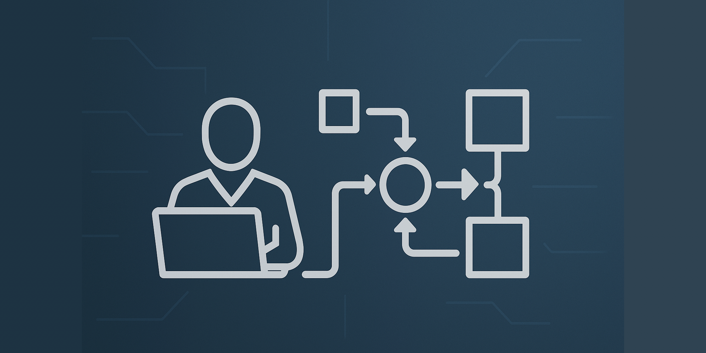

デジタルトランスフォーメーション（DX）時代において、ビジネス価値を迅速に顧客に届けることが企業の競争力を左右します。継続的インテグレーション（CI）によってコードの品質を保証した後、それをいかに安全かつ迅速に本番環境へデリバリーするかが、DX成功の鍵となります。この「継続的デリバリー（CD）」のプロセスを効果的に設計することで、組織は以下のメリットを得ることができます：

- 市場投入までの時間（Time to Market）の短縮
- リリースリスクの低減
- フィードバックループの高速化
- 運用担当者の負担軽減
- 変更の可視性と監査性の向上

しかし、多くの組織はCDパイプラインの設計と実装において、以下のような課題に直面しています：

- 複数の環境（開発・テスト・ステージング・本番）間の一貫性の確保
- 手動承認と自動化のバランス
- インフラストラクチャの変更とアプリケーションのデプロイの連携
- デプロイ失敗時の迅速なロールバック
- 大規模な分散システムにおける段階的なリリース

本記事では、これらの課題を解決し、DX時代に適した効率的で安全なCDパイプライン設計のベストプラクティスを解説します。CI/CDの「CD」部分に焦点を当て、コードがリポジトリにコミットされてから本番環境にデプロイされるまでの一連のプロセスを最適化する方法を提案します。

## 継続的デリバリーと継続的デプロイメントの違い

CDは一般的に「継続的デリバリー（Continuous Delivery）」と「継続的デプロイメント（Continuous Deployment）」の2つの概念を包含しています。これらの違いを理解することが、適切なパイプライン設計の第一歩です。

### 継続的デリバリー（Continuous Delivery）

継続的デリバリーは、ソフトウェアがいつでもリリース可能な状態を維持する手法です。主な特徴は：

- コードの変更が自動的にビルド、テスト、パッケージング、ステージング環境へのデプロイまで行われる
- 本番環境へのデプロイは手動による承認・実行が必要
- リリース判断は技術的な準備が整った上でのビジネス判断となる

### 継続的デプロイメント（Continuous Deployment）

継続的デプロイメントは、継続的デリバリーをさらに進め、本番環境へのリリースも自動化する手法です：

- コードの変更からテスト、本番環境へのデプロイまで全て自動化
- 人間の介入なしに、品質基準を満たしたコードが自動的に本番環境へリリースされる
- Webサービスなど、頻繁な小さな変更が好ましい領域で採用されることが多い

以下の図は、CIからCDへの流れと両者の違いを示しています：

```
コード変更 → ビルド → テスト → 承認 → デプロイ
     ↑_________|_________|        ↑
         CI プロセス        |        |
                 |________|
                   継続的デリバリー
                 |______________|
                   継続的デプロイメント
```

組織のニーズ、製品の性質、規制要件などに応じて、適切なCDアプローチを選択することが重要です。

## 効果的なCDパイプラインの構成要素

優れたCDパイプラインは以下の要素で構成されます：

### 1. 環境管理

アプリケーションが通過する各環境（開発、テスト、ステージング、本番など）は以下の条件を満たすべきです：

- **環境の一貫性**: 全ての環境がインフラストラクチャ・アズ・コード（IaC）で定義され、同一の構成を持つ
- **自動プロビジョニング**: 必要に応じて環境を自動的に作成・更新できる
- **分離と制御**: 環境間のアクセス制御と分離が適切に実装されている

### 2. アーティファクト管理

デプロイされるアーティファクト（コンテナイメージ、バイナリなど）は：

- **一度ビルド、どこでも実行**: 環境ごとに再ビルドせず、同一のアーティファクトを全環境にデプロイ
- **バージョン管理**: 全てのアーティファクトに一意のバージョンを付与
- **イミュータブル**: 一度作成されたアーティファクトは変更不可
- **アーティファクトリポジトリ**: Docker Registry、Nexus、Artifactoryなどでの一元管理

### 3. 段階的検証プロセス

コードが本番環境に到達する前に、様々なレベルの検証を通過する必要があります：

- **自動テスト**: 単体テスト、統合テスト、エンドツーエンドテスト
- **セキュリティ検証**: 脆弱性スキャン、SASt（静的アプリケーションセキュリティテスト）
- **性能検証**: 負荷テスト、パフォーマンステスト
- **ユーザー受け入れテスト（UAT）**: 実際のユーザーシナリオでの検証

### 4. 承認ゲート

必要に応じてパイプラインに承認ポイントを設定します：

- **環境移行承認**: 例えばステージングから本番への移行時
- **役割ベースの承認**: 技術チーム、品質保証チーム、ビジネス責任者など適切な権限者による承認
- **自動承認ポリシー**: 特定の条件下での自動承認ルールの設定（例：小規模変更、緊急修正）

### 5. デプロイメント戦略

安全で効率的なデプロイを実現するための戦略：

- **無停止デプロイ**: ユーザーへのサービスを中断せずにデプロイを実行
- **ロールバック機能**: 問題発生時に迅速に前バージョンに戻す仕組み
- **段階的デプロイ**: カナリアリリース、ブルーグリーンデプロイなどの手法
- **機能フラグ**: コード内でリリース制御を行うための仕組み

### 6. 監視とフィードバック

デプロイ後のシステム状態を継続的に評価するための仕組み：

- **自動ヘルスチェック**: デプロイ直後のシステム健全性確認
- **メトリクス収集**: パフォーマンス、エラー率、ビジネス指標の監視
- **アラート**: 異常検知と適切な通知
- **フィードバックループ**: 得られた知見を次のリリースに活かす仕組み

## デプロイメント戦略の選択

安全かつ信頼性の高いデプロイを実現するために、以下の戦略から適切なものを選択または組み合わせることが重要です。

### 1. ブルーグリーンデプロイメント

2つの同一の本番環境（ブルーとグリーン）を用意し、切り替えを行う手法です。

**仕組み**:
1. 現在のアクティブ環境（例：ブルー）でアプリケーションが稼働
2. 新バージョンを非アクティブ環境（例：グリーン）にデプロイ
3. グリーン環境でテストと検証を実施
4. トラフィックをブルーからグリーンに切り替え
5. 問題が発生した場合、ブルーに即座に戻すことが可能

**利点**:
- ダウンタイムなしのデプロイが可能
- 迅速なロールバック
- 新旧バージョンの完全分離

**課題**:
- 環境の二重維持によるコスト増
- ステートフルアプリケーションでのデータ同期問題
- 切り替え時の接続維持の課題

**実装例（AWS環境）**:
```yaml
# AWS CodeDeploy AppSpec.yml の例
version: 0.0
os: linux
files:
  - source: /
    destination: /var/www/html/
hooks:
  BeforeInstall:
    - location: scripts/before_install.sh
      timeout: 300
      runas: root
  AfterInstall:
    - location: scripts/after_install.sh
      timeout: 300
      runas: root
  ApplicationStart:
    - location: scripts/start_application.sh
      timeout: 300
      runas: root
  ValidateService:
    - location: scripts/validate_service.sh
      timeout: 300
      runas: root
```

### 2. カナリアリリース

一部のユーザーまたはサーバーに対してのみ新バージョンをリリースし、段階的に展開する手法です。

**仕組み**:
1. 本番環境の一部（例：5%のトラフィック）に新バージョンをデプロイ
2. パフォーマンスや障害を監視
3. 問題がなければ段階的に展開範囲を拡大（10%→25%→50%→100%）
4. 問題が発生した場合、影響を受ける割合が少ないうちに元に戻す

**利点**:
- リスクを最小限に抑えた実環境での検証
- 実ユーザーからのフィードバック獲得
- 段階的なスケーリングによる安全性

**課題**:
- 複数バージョンの同時運用
- トラフィック制御の複雑さ
- 長期間のロールアウトによる管理負担

**実装例（Kubernetes）**:
```yaml
# Kubernetes マニフェストの例
apiVersion: apps/v1
kind: Deployment
metadata:
  name: myapp-canary
spec:
  replicas: 1  # 本番の10%程度の規模
  selector:
    matchLabels:
      app: myapp
      track: canary
  template:
    metadata:
      labels:
        app: myapp
        track: canary
    spec:
      containers:
      - name: myapp
        image: myapp:v2
        ports:
        - containerPort: 8080
---
# サービスでトラフィックを分配
apiVersion: v1
kind: Service
metadata:
  name: myapp
spec:
  selector:
    app: myapp  # trackラベルを指定しないことで両方のDeploymentにトラフィックを分配
  ports:
  - port: 80
    targetPort: 8080
```

### 3. フィーチャーフラグ / フィーチャートグル

コードデプロイとフィーチャー有効化を分離し、アプリケーションの動作を実行時に制御する手法です。

**仕組み**:
1. 新機能のコードは無効化された状態でデプロイ
2. 条件（ユーザーグループ、地域、A/Bテストなど）に基づいて機能を有効化
3. 問題があれば機能のみを無効化（コードロールバック不要）
4. 段階的に有効化対象を拡大

**利点**:
- デプロイとリリースの分離
- きめ細かい制御（特定ユーザー向け、地域限定など）
- コードロールバックなしでの機能無効化
- A/Bテストとの親和性

**課題**:
- 実装の複雑化
- 技術的負債のリスク（一時的コードの残存）
- フラグ管理のオーバーヘッド

**実装例（Java）**:
```java
// LaunchDarkly等のフィーチャーフラグサービスを使用した例
import com.launchdarkly.sdk.LDUser;
import com.launchdarkly.sdk.server.LDClient;

public class MyService {
    private final LDClient ldClient;
    
    public MyService(LDClient ldClient) {
        this.ldClient = ldClient;
    }
    
    public void processRequest(String userId) {
        LDUser user = new LDUser.Builder(userId).build();
        
        if (ldClient.boolVariation("new-payment-process", user, false)) {
            // 新しい決済処理を実行
            processPaymentNewWay();
        } else {
            // 従来の決済処理を実行
            processPaymentOldWay();
        }
    }
}
```

### 4. シャドウデプロイメント

実トラフィックのコピーを新バージョンに送り、結果を比較する手法です（ミラーリングとも呼ばれます）。

**仕組み**:
1. 現行システムと並行して新バージョンをデプロイ
2. 実際のユーザートラフィックを複製して新システムに送信
3. 新システムの結果は破棄され、ユーザーには影響しない
4. 両システムの結果を比較・検証
5. 問題がなければ本番切り替え

**利点**:
- 実トラフィックでの検証（ユーザーに影響なし）
- 本番環境の完全再現
- パフォーマンスと正確性の詳細な比較

**課題**:
- 重複処理によるリソース消費
- 副作用の管理（決済などの外部連携）
- 実装の複雑さ

**実装例（nginx構成）**:
```nginx
# Nginxでのシャドウトラフィック設定例
server {
    listen 80;
    server_name dx-media.example;
    
    location / {
        # プライマリバックエンド
        proxy_pass http://production-backend;
        
        # シャドウトラフィックの設定
        mirror /mirror;
        mirror_request_body on;
    }
    
    # シャドウバックエンドへのルーティング
    location = /mirror {
        internal;
        proxy_pass http://new-version-backend$request_uri;
        proxy_pass_request_body on;
        proxy_set_header X-Shadow-Request "true";
    }
}
```

### 戦略選択のガイドライン

適切なデプロイ戦略を選択するためのフレームワークを以下に示します：

| 基準 | ブルーグリーン | カナリア | フィーチャーフラグ | シャドウ |
|-----|-------------|--------|--------------|--------|
| リスク耐性 | 中 | 高 | 非常に高 | 非常に高 |
| 実装複雑性 | 中 | 高 | 中～高 | 非常に高 |
| フィードバック速度 | 速い | 中程度 | 速い | 速い |
| コスト | 高 | 中 | 低～中 | 高 |
| ステートフルアプリ対応 | 難しい | 可能 | 容易 | 複雑 |
| ユースケース | 全面リリース | 段階的ロールアウト | 特定機能のテスト | 高リスク変更の検証 |

## CDパイプラインの実装パターン

効果的なCDパイプラインを構築するためのいくつかの実装パターンを紹介します。

### 1. GitOpsアプローチ

GitOpsは、Gitリポジトリを「真実の唯一の源泉（Single Source of Truth）」として利用し、宣言的なインフラストラクチャとアプリケーション設定を管理するアプローチです。

**主要原則**:
- システムの望ましい状態をGitで宣言的に定義
- 承認されたコードのみが本番環境に反映される
- 自動化エージェントがGitの状態と実際のシステム状態の差分を検出・修正
- 変更はPull Requestを通じてレビュー・承認

**実装例（ArgoCD / Flux）**:
```yaml
# ArgoCD Application マニフェスト例
apiVersion: argoproj.io/v1alpha1
kind: Application
metadata:
  name: myapp
  namespace: argocd
spec:
  project: default
  source:
    repoURL: https://github.com/myorg/myapp-config.git
    targetRevision: HEAD
    path: overlays/production
  destination:
    server: https://kubernetes.default.svc
    namespace: myapp-prod
  syncPolicy:
    automated:
      prune: true
      selfHeal: true
    syncOptions:
    - CreateNamespace=true
```

**メリット**:
- 変更の可視性と監査性の向上
- インフラストラクチャのバージョン管理
- 宣言的アプローチによる一貫性
- ドリフト（構成の乖離）の自動検出と修正

### 2. パイプラインアズコード（Pipeline as Code）

CD/CIパイプライン自体を設定ファイルとしてコード化し、バージョン管理する手法です。

**実装例（Jenkins Declarative Pipeline）**:
```groovy
// Jenkinsfile
pipeline {
    agent {
        kubernetes {
            yaml """
apiVersion: v1
kind: Pod
spec:
  containers:
  - name: maven
    image: maven:3.8.4-openjdk-11
    command:
    - cat
    tty: true
  - name: docker
    image: docker:20.10.12-dind
    command:
    - cat
    tty: true
    volumeMounts:
    - name: docker-socket
      mountPath: /var/run/docker.sock
  volumes:
  - name: docker-socket
    hostPath:
      path: /var/run/docker.sock
"""
        }
    }
    
    environment {
        DOCKER_REGISTRY = 'registry.dx-media.example'
    }
    
    stages {
        stage('ビルド') {
            steps {
                container('maven') {
                    sh 'mvn clean package'
                }
            }
        }
        
        stage('テスト') {
            steps {
                container('maven') {
                    sh 'mvn test'
                    junit '**/target/surefire-reports/TEST-*.xml'
                }
            }
        }
        
        stage('コンテナ作成') {
            steps {
                container('docker') {
                    sh 'docker build -t ${DOCKER_REGISTRY}/myapp:${BUILD_NUMBER} .'
                }
            }
        }
        
        stage('ステージング環境デプロイ') {
            steps {
                container('docker') {
                    sh 'docker push ${DOCKER_REGISTRY}/myapp:${BUILD_NUMBER}'
                    sh 'kubectl apply -f kubernetes/staging/'
                }
            }
        }
        
        stage('承認') {
            steps {
                input message: '本番環境へのデプロイを承認しますか？'
            }
        }
        
        stage('本番環境デプロイ') {
            steps {
                container('docker') {
                    sh 'kubectl apply -f kubernetes/production/'
                }
            }
        }
    }
    
    post {
        success {
            slackSend channel: '#deployments', color: 'good', message: "デプロイ成功: ${env.JOB_NAME} #${env.BUILD_NUMBER}"
        }
        failure {
            slackSend channel: '#deployments', color: 'danger', message: "デプロイ失敗: ${env.JOB_NAME} #${env.BUILD_NUMBER}"
        }
    }
}
```

**メリット**:
- パイプライン自体のバージョン管理と変更追跡
- コードレビュープロセスを通じた品質管理
- パイプラインの再利用と標準化
- パイプラインのテスト可能性

### 3. イミュータブルインフラストラクチャ

サーバーや環境を更新せず、新しい構成で置き換える手法です。

**実装例（Terraform）**:
```hcl
# main.tf
provider "aws" {
  region = "ap-northeast-1"
}

resource "aws_launch_configuration" "app_server" {
  name_prefix     = "app-server-"
  image_id        = "ami-0c3fd0f5d33134a76" # 最新のアプリケーションAMI
  instance_type   = "t3.medium"
  security_groups = [aws_security_group.app_server.id]
  
  lifecycle {
    create_before_destroy = true
  }
}

resource "aws_autoscaling_group" "app_server" {
  name                 = "app-server-${aws_launch_configuration.app_server.name}"
  launch_configuration = aws_launch_configuration.app_server.name
  min_size             = 2
  max_size             = 10
  desired_capacity     = 4
  vpc_zone_identifier  = [aws_subnet.private_a.id, aws_subnet.private_c.id]
  
  lifecycle {
    create_before_destroy = true
  }
  
  tag {
    key                 = "Name"
    value               = "app-server"
    propagate_at_launch = true
  }
}

resource "aws_lb_target_group" "app_server" {
  name     = "app-server-tg"
  port     = 80
  protocol = "HTTP"
  vpc_id   = aws_vpc.main.id
  
  health_check {
    path                = "/health"
    interval            = 30
    timeout             = 5
    healthy_threshold   = 2
    unhealthy_threshold = 2
  }
}

resource "aws_autoscaling_attachment" "app_server" {
  autoscaling_group_name = aws_autoscaling_group.app_server.name
  alb_target_group_arn   = aws_lb_target_group.app_server.arn
}
```

**メリット**:
- 環境の一貫性保証
- ロールバックの簡素化
- デプロイの再現性
- 「構成ドリフト」問題の解消

## CD成熟度モデルと進化ステップ

組織がCDの採用を進める際、段階的に成熟度を高めていくアプローチが効果的です。以下の成熟度モデルを参考に、自組織の現状を評価し、次のステップを計画しましょう。

### レベル1: 基本的な自動化

**特徴**:
- 手動デプロイが主だが、一部の単純なデプロイスクリプトが存在
- テスト環境と本番環境の構成に差異がある
- デプロイ手順書が存在するが、人に依存する部分が多い

**次のステップ**:
- すべてのデプロイ手順のスクリプト化
- 環境構成の文書化と一貫性向上
- 基本的なデプロイパイプラインの導入

### レベル2: パイプライン構築

**特徴**:
- ビルドから開発環境デプロイまでの基本的なパイプラインが存在
- テスト自動化が部分的に導入されている
- 本番デプロイは手動または半自動

**次のステップ**:
- テスト自動化の拡充
- 環境間の一貫性向上
- インフラストラクチャのコード化
- ステージング環境までのパイプライン拡張

### レベル3: 環境の一貫性と制御

**特徴**:
- 全環境でInfrastructure as Codeを採用
- ステージングまでの完全な自動パイプライン
- 環境間の構成差異が最小限
- 本番デプロイは承認ゲート付きで自動化

**次のステップ**:
- 高度なデプロイ戦略の導入（ブルーグリーン、カナリア）
- フィーチャートグルの導入
- 自動ロールバック機能の実装
- フィードバックループの強化

### レベル4: 高度な最適化とフィードバック

**特徴**:
- 複数のデプロイ戦略をユースケースに応じて使い分け
- フィーチャートグルによる機能の段階的リリース
- 自動監視とアラート、自動ロールバックの実装
- デプロイメトリクスの収集と継続的改善

**次のステップ**:
- カオスエンジニアリングの導入
- 高度な自動化（AIによる異常検知など）
- 完全な継続的デプロイメントへの移行（適切な場合）
- DevOps文化の組織全体への浸透

### レベル5: エリート（継続的デプロイメント）

**特徴**:
- ほぼすべての変更が自動的に本番環境へデプロイされる
- 堅牢な自動テストと監視
- フィーチャーフラグによるリスク管理
- 高頻度なデプロイ（1日に複数回）と短いリードタイム

## CDパイプライン実装の実践的テクニック

### 1. 環境固有設定の管理

アプリケーションの環境固有設定を管理するための効果的なアプローチ：

**環境変数の活用**:
```yaml
# docker-compose.yml
version: '3'
services:
  webapp:
    image: myapp:${APP_VERSION}
    environment:
      - DATABASE_URL=${DATABASE_URL}
      - API_KEY=${API_KEY}
      - LOG_LEVEL=${LOG_LEVEL}
```

**Kubernetesでの設定管理**:
```yaml
# ConfigMap
apiVersion: v1
kind: ConfigMap
metadata:
  name: app-config
data:
  app.properties: |
    app.cache.size=1024
    app.thread.count=10
    app.feature.new-ui=false
---
# Secret
apiVersion: v1
kind: Secret
metadata:
  name: app-secrets
type: Opaque
data:
  db-password: cGFzc3dvcmQxMjM=  # base64エンコードされたパスワード
  api-key: c2VjcmV0a2V5MTIz
```

**ベストプラクティス**:
- 設定とコードの分離
- 機密情報のセキュアな管理（シークレット管理システムの利用）
- 環境固有設定の最小化（環境間の差異を減らす）
- 設定変更履歴の管理

### 2. データベース移行の自動化

CDパイプラインにおけるデータベース変更の取り扱い：

**マイグレーションツールの活用**:
```java
// Flyway マイグレーション例（Java）
@Component
public class DatabaseMigrator {
    private final Flyway flyway;
    
    public DatabaseMigrator(DataSource dataSource) {
        this.flyway = Flyway.configure()
            .dataSource(dataSource)
            .locations("classpath:db/migration")
            .load();
    }
    
    @PostConstruct
    public void migrate() {
        flyway.migrate();
    }
}
```

```sql
-- V1__Create_users_table.sql
CREATE TABLE users (
    id BIGINT PRIMARY KEY,
    username VARCHAR(100) NOT NULL UNIQUE,
    email VARCHAR(255) NOT NULL,
    created_at TIMESTAMP NOT NULL DEFAULT CURRENT_TIMESTAMP
);

-- V2__Add_user_status.sql
ALTER TABLE users ADD COLUMN status VARCHAR(20) NOT NULL DEFAULT 'ACTIVE';
```

**ベストプラクティス**:
- マイグレーションの冪等性確保（同じマイグレーションを複数回適用しても安全）
- ロールバック戦略の検討（マイグレーションの取り消し方法）
- 大規模データ変更の段階的実施（長時間トランザクション回避）
- 本番適用前のテスト環境での十分な検証

### 3. パフォーマンス監視と自動ロールバックの実装

デプロイ後のシステム状態を監視し、問題があれば自動的に対応するメカニズム：

**Prometheusによるメトリクス監視**:
```yaml
# Prometheus アラートルール
groups:
- name: app_alerts
  rules:
  - alert: HighErrorRate
    expr: sum(rate(http_requests_total{status=~"5.."}[5m])) / sum(rate(http_requests_total[5m])) > 0.05
    for: 2m
    labels:
      severity: critical
    annotations:
      summary: "高エラー率検出"
      description: "直近5分間のHTTPエラー率が5%を超えています"
```

**自動ロールバックスクリプト**:
```bash
#!/bin/bash
# auto-rollback.sh

# エラー率をPrometheusから取得
ERROR_RATE=$(curl -s "http://prometheus:9090/api/v1/query?query=sum(rate(http_requests_total{status=~\"5..\"}[5m]))/sum(rate(http_requests_total[5m]))" | jq '.data.result[0].value[1]')

# しきい値チェック
if (( $(echo "$ERROR_RATE > 0.05" | bc -l) )); then
    echo "エラー率が高すぎます: $ERROR_RATE - ロールバックを開始します"
    kubectl rollout undo deployment/myapp
    
    # 通知
    curl -X POST -H 'Content-type: application/json' --data "{\"text\":\"⚠️ 高エラー率を検出したため、自動ロールバックを実行しました。エラー率: $ERROR_RATE\"}" $SLACK_WEBHOOK_URL
    
    exit 1
else
    echo "エラー率は許容範囲内です: $ERROR_RATE"
fi
```

**ベストプラクティス**:
- ビジネス影響ベースのアラート設定（技術的指標だけでなく）
- 段階的なアクション（アラート→自動スケーリング→部分ロールバック→完全ロールバック）
- フォールスポジティブの最小化（ロールバック判断の精度向上）
- ポストモーテム分析のための詳細ログ記録

## 組織文化とCD

技術的な実装だけでなく、CDを成功させるための組織文化と実践も重要です。

### 1. デプロイ責任の共有モデル

"You build it, you run it"（作った人が運用する）の原則に基づくアプローチ：

- 開発チームがデプロイとその結果に責任を持つ
- 運用チームは基盤とツールを提供する
- 両チームが協力してCDパイプラインを設計・改善

**実施ステップ**:
1. 運用知識の開発者への移転（トレーニング）
2. 監視とアラートへのアクセス権付与
3. オンコール体制の共有
4. デプロイに関する意思決定権限の委譲

### 2. インシデント対応と学習文化

デプロイ失敗を学びの機会として捉える文化の醸成：

- ポストモーテム分析（非難なしの振り返り）
- 再発防止のための仕組み化
- 知識の共有と文書化
- チーム間でのインシデント対応演習

**効果的なポストモーテムテンプレート**:
```markdown
# インシデントポストモーテム

## 概要
- **日時**: YYYY-MM-DD HH:MM 〜 HH:MM
- **影響**: [影響を受けたシステム/ユーザー/機能]
- **重大度**: [Critical/High/Medium/Low]

## タイムライン
- HH:MM - デプロイ開始
- HH:MM - 異常検知
- HH:MM - 緩和策実施
- HH:MM - 解決

## 根本原因
[技術的および組織的要因を記述]

## 再発防止策
1. [短期的対策]
2. [中期的対策]
3. [長期的対策]

## 学び
[今回のインシデントから得られた重要な教訓]
```

### 3. メトリクスと継続的改善

CDプロセスの効果を測定し、継続的に改善するための指標：

**主要なデプロイメトリクス**:
- デプロイ頻度（1日/週/月あたり）
- 変更のリードタイム（コミットから本番デプロイまで）
- 変更失敗率（ロールバックやホットフィックスが必要になった割合）
- 復旧時間（MTTR：障害発生から復旧までの平均時間）

**データ収集と可視化**:
```python
# デプロイメトリクス収集スクリプト例
import datetime
import requests
import pandas as pd
from datetime import timedelta

# GitHubからコミット情報を取得
def get_commits(repo, since):
    url = f"https://api.github.com/repos/{repo}/commits"
    params = {"since": since.isoformat()}
    response = requests.get(url, params=params)
    return response.json()

# CIシステムからビルド情報を取得
def get_builds(project, since):
    url = f"https://jenkins.dx-media.example/job/{project}/api/json"
    params = {"tree": "builds[number,timestamp,result,duration]"}
    response = requests.get(url, params=params)
    builds = response.json()["builds"]
    return [b for b in builds if datetime.datetime.fromtimestamp(b["timestamp"]/1000) > since]

# デプロイ情報を取得
def get_deployments(app, since):
    url = f"https://deploy.dx-media.example/api/apps/{app}/deployments"
    params = {"since": since.isoformat()}
    response = requests.get(url, params=params)
    return response.json()

# 30日前から現在までのデータを取得
since = datetime.datetime.now() - timedelta(days=30)
commits = get_commits("myorg/myapp", since)
builds = get_builds("myapp", since)
deployments = get_deployments("myapp", since)

# リードタイム計算
# ...（省略）...

# メトリクスの保存と可視化
# ...（省略）...
```

**改善サイクルの確立**:
1. 現状のメトリクス測定
2. 目標設定（例：デプロイ頻度を週2回から毎日へ）
3. ボトルネックの特定（例：手動テストに時間がかかっている）
4. 改善施策の実施（例：テスト自動化の拡充）
5. 効果測定
6. サイクルの繰り返し

## 事例研究: DX成功企業のCDパイプライン

### 事例1: フィンテックスタートアップのマイクロサービス化とCD

**企業プロファイル**:
- モバイル決済サービス提供
- 10名のエンジニアチーム
- モノリシックアーキテクチャからマイクロサービスへの移行中

**課題**:
- 頻繁な機能追加要望に対応できない
- デプロイ失敗率の高さ（約15%）
- 平均デプロイ所要時間：2日

**対策**:
1. マイクロサービスごとの独立したCDパイプライン構築
2. GitOpsアプローチの採用（FluxCD）
3. カナリアリリースの実装
4. 自動テストの大幅拡充（80%以上のカバレッジ）

**結果**:
- デプロイ頻度：月2回 → 1日複数回
- デプロイ失敗率：15% → 2%未満
- デプロイ所要時間：2日 → 45分
- 顧客満足度20%向上

**鍵となった施策**:
- 自動リグレッションテストの充実
- マイクロサービスごとの独立したバージョン管理
- インフラストラクチャのフルコード化

### 事例2: 大手ECサイトのフィーチャーフラグ導入

**企業プロファイル**:
- 大規模オンラインショッピングプラットフォーム
- 年間売上100億円以上
- ピーク時のトラフィック：1秒間に数千リクエスト

**課題**:
- 季節イベント前にリリースが凍結される
- 新機能のフィードバックサイクルが長い
- リリース計画が複雑で調整が困難

**対策**:
1. フィーチャートグルサービス（LaunchDarkly）の導入
2. トランクベース開発への移行
3. 1日2回の定期デプロイスケジュール確立
4. リリースとデプロイの分離

**結果**:
- リリース凍結期間の撤廃
- 機能のフィードバックサイクル：数週間 → 数日
- デプロイ安定性の向上（99.5%成功率）
- コード品質の向上（レビュー可能なサイズのPR）

**鍵となった施策**:
- 段階的ロールアウト（内部ユーザー→ベータテスター→一般ユーザー）
- リアルタイムでのメトリクス監視
- クロスファンクショナルなリリース判断チーム

### 事例3: 製造業システムのブルーグリーンデプロイ

**企業プロファイル**:
- 自動車部品製造会社
- 生産管理システムの現代化プロジェクト
- ダウンタイムに非常に敏感なシステム

**課題**:
- システム更新時の長時間ダウンタイムが業務に影響
- 障害発生時の復旧が複雑で時間がかかる
- リリースの頻度が低く（年に数回）、変更が大規模になりがち

**対策**:
1. AWSでのブルーグリーンデプロイ実装
2. インフラストラクチャのTerraformによるコード化
3. 自動化されたデータベース移行スクリプト
4. 詳細なヘルスチェックとロールバックトリガー

**結果**:
- デプロイのダウンタイム：数時間 → 数分
- リリース頻度：四半期に1回 → 月に2-3回
- 障害復旧時間：平均4時間 → 15分以内
- 変更の粒度が小さくなりリスク低減

**鍵となった施策**:
- データベース変更の無停止移行手法の確立
- 詳細なデプロイ前後のシステムヘルスチェック
- トラフィック移行の段階的アプローチ

## まとめ：CD成功のための10の原則

DX時代における効果的なCDパイプライン設計には、以下の原則が重要です：

1. **変更を小さく保つ**: 小さな変更は理解しやすく、テストしやすく、リスクが低い
2. **デプロイと機能リリースを分離する**: フィーチャーフラグを活用して柔軟性を高める
3. **テスト自動化に投資する**: 手動テストは拡張性がなく、CDの障壁となる
4. **一貫した環境を維持する**: 「開発では動くのに本番では動かない」問題を排除
5. **イミュータブルアプローチを採用する**: 変更ではなく置換により一貫性を確保
6. **フィードバックループを最適化する**: 問題の早期発見と解決を可能にする
7. **リスクに応じたデプロイ戦略を選択する**: 変更の性質に合わせて最適な手法を適用
8. **監視とアラートを強化する**: デプロイ後の状況を詳細に把握し迅速に対応
9. **CDをDevOps文化の一部として育む**: 技術だけでなく人とプロセスも重視
10. **継続的に改善する**: メトリクスを測定し、常にプロセスを最適化

これらの原則を実践に移すことで、組織はDX時代に求められる迅速かつ安全なソフトウェアデリバリーを実現し、ビジネス価値の継続的な提供を可能にします。

CDパイプラインは単なる技術的なツールではなく、組織が市場の変化に迅速に対応するための戦略的資産です。適切に設計・実装されたCDは、開発者の生産性向上、製品品質の向上、そして最終的には顧客満足度の向上につながります。

## 参考資料

- [Accelerate: The Science of Lean Software and DevOps](https://itrevolution.com/book/accelerate/)
- [CD Foundation](https://cd.foundation/)
- [GitOps Working Group](https://gitops-working-group.github.io/)
- [AWS Whitepaper: Practicing Continuous Integration and Continuous Delivery](https://docs.aws.amazon.com/whitepapers/latest/practicing-continuous-integration-continuous-delivery/practicing-continuous-integration-continuous-delivery.pdf)
- [Google Cloud Architecture Center: CI/CD Pipeline](https://cloud.google.com/architecture/devops/devops-tech-continuous-delivery)
