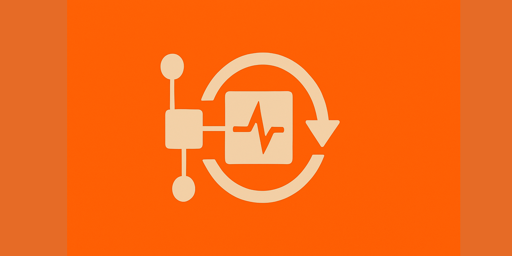

現代のデジタルビジネスにおいて、システムの可用性と信頼性は競争力の源泉となっています。しかし、分散システムが複雑化するにつれて、障害は避けられない現実となりつつあります。多くの組織では「障害が発生したら対応する」という事後対応型のアプローチを取っていますが、DXの加速とともにこの考え方は時代遅れになりつつあります。

カオスエンジニアリングは、この課題に対する革新的なアプローチです。意図的に制御された環境で障害を引き起こし、システムの弱点を発見することで、障害に強いシステムを構築することを目指します。本記事では、カオスエンジニアリングの基本原則から実装方法、そして組織文化への組み込みまでを解説します。

## カオスエンジニアリングとは

カオスエンジニアリングは、2010年頃にNetflixが提唱した概念で「本番環境と同様の条件下で実験を行い、システムが乱れた状態でも耐えうる信頼性を確認するための規律」と定義されています。

従来のテスト手法との最大の違いは、**予測可能な障害ではなく、予測不可能な状況下での振る舞いを確認する**という点です。つまり、「知っている弱点」ではなく「知らない弱点」を積極的に探し出すアプローチです。

### 背景：なぜカオスエンジニアリングが必要なのか

1. **システムの複雑化**: マイクロサービスアーキテクチャ、クラウドネイティブアプリケーションの普及により、システム間の依存関係とデータフローが複雑化
2. **障害の不可避性**: 大規模分散システムにおいて、ハードウェア障害、ネットワーク障害、外部サービス障害などは必ず発生する
3. **部分障害の難しさ**: 一部のコンポーネントが機能しない場合の全体への影響を理解することが困難
4. **DX加速の中での信頼性確保**: ビジネスのデジタル化が進む中、システムダウンが及ぼすビジネスへの影響は甚大

## カオスエンジニアリングの原則

カオスエンジニアリングを実践するうえで、以下の5つの原則が重要です。

### 1. 定常状態の定義

システムが正常に動作している状態を測定可能な出力として定義します。ユーザーエクスペリエンスを反映した指標（例：レスポンス時間、スループット、エラー率など）を使用すべきです。

### 2. 仮説の構築

「このコンポーネントが失敗しても、システムの定常状態は維持される」といった仮説を立てます。仮説は必ず検証可能なものである必要があります。

### 3. 実世界の事象をシミュレート

実際に起こりうる障害イベントを再現します：
- サーバー障害
- ネットワーク遅延や切断
- ディスク容量の逼迫
- 依存サービスの障害
- 予期せぬトラフィック増加

### 4. 本番環境に近い環境での実験

可能な限り本番環境、または本番に近い環境で実験を行います。理想的には本番環境自体で実施することが最も価値が高いですが、リスクとのバランスを考慮する必要があります。

### 5. 影響の最小化

実験の範囲を限定し、潜在的な影響を最小限に抑えるための仕組みを用意します。自動的に実験を中止できる安全装置を組み込むことが重要です。

## ケーススタディ：Netflixのカオスエンジニアリング

カオスエンジニアリングの先駆者であるNetflixは、2010年に「Chaos Monkey」というツールを開発しました。これは、本番環境で動作するインスタンスをランダムに停止させるツールです。この取り組みから始まり、今ではSimian Army（猿の軍隊）と呼ばれる一連のツールに進化しています：

- **Chaos Monkey**: インスタンスをランダムに終了
- **Latency Monkey**: ネットワーク遅延をシミュレート
- **Conformity Monkey**: ベストプラクティスに準拠していないインスタンスを検出、終了
- **Chaos Kong**: AWSリージョン全体の障害をシミュレート

Netflixは「金曜日の午後に障害が発生するよりも、月曜日の朝に意図的に障害を起こす方が良い」という思想のもと、カオスエンジニアリングを日常的に実践しています。

## カオスエンジニアリングのツールと実装方法

### 主要なカオスエンジニアリングツール

1. **Chaos Monkey (Netflix)**: AWSインスタンスをランダムに終了させる最初のカオスエンジニアリングツール
2. **Gremlin**: 商用のカオスエンジニアリングサービス。CPU、メモリ、ディスク、ネットワークへの攻撃などを実行可能
3. **Chaos Toolkit**: オープンソースのカオスエンジニアリングフレームワーク。様々なプラットフォームに対応
4. **kube-monkey**: Kubernetesクラスターでポッドをランダムに削除
5. **Chaos Mesh**: Kubernetesネイティブなカオスエンジニアリングプラットフォーム

### 実装例：Kubernetes環境でのカオスエンジニアリング

Kubernetes環境にChaos Meshを導入する例を見てみましょう：

```yaml
# Chaos Meshのインストール
apiVersion: v1
kind: Namespace
metadata:
  name: chaos-testing
---
# Helm使用した場合のインストールコマンド
# helm repo add chaos-mesh https://charts.chaos-mesh.org
# helm install chaos-mesh chaos-mesh/chaos-mesh --namespace=chaos-testing

# CPUストレステストの例
apiVersion: chaos-mesh.org/v1alpha1
kind: StressChaos
metadata:
  name: cpu-stress
  namespace: chaos-testing
spec:
  mode: one
  selector:
    namespaces:
      - app
    labelSelectors:
      'app': 'web-service'  # 対象のアプリケーション
  stressors:
    cpu:
      workers: 2
      load: 100
  duration: '5m'
```

### 段階的な実装アプローチ

カオスエンジニアリングを組織に導入する際は、段階的なアプローチが効果的です：

1. **準備フェーズ**
   - システムの定常状態を定義・計測
   - モニタリング・可観測性の確保
   - 実験の安全停止メカニズムの構築

2. **小規模実験の開始**
   - 非本番環境での単一サービス障害テスト
   - ネットワーク遅延の導入
   - 限定的なリソース制約（CPU/メモリ）テスト

3. **実験範囲の拡大**
   - 複数のマイクロサービス間の依存関係テスト
   - より複雑なシナリオのシミュレーション
   - ゲームデー（Game Day）の実施：計画的な大規模実験

4. **本番環境への導入**
   - 影響範囲を制限した本番実験
   - 自動化されたカオス実験の定期実行
   - 結果のフィードバックループ確立

## モニタリングと可観測性の重要性

カオスエンジニアリングを効果的に実施するためには、強固なモニタリングと可観測性の仕組みが不可欠です。以下の3つの柱が重要となります：

1. **メトリクス収集**
   - サービスレベル指標（SLI）の定義と測定
   - インフラ、アプリケーション、ビジネスメトリクスの包括的収集

2. **ログ集約**
   - 分散システム全体からのログの中央集約
   - 効率的な検索と分析機能

3. **分散トレーシング**
   - サービス間の依存関係とリクエストフローの可視化
   - ボトルネックと障害伝播経路の特定

典型的なモニタリングスタックの例：
- Prometheus + Grafana（メトリクス）
- ELK/EFK（ログ）
- Jaeger/Zipkin（トレーシング）

```yaml
# Prometheusによるアラート設定例
groups:
- name: example
  rules:
  - alert: HighLatency
    expr: histogram_quantile(0.95, http_request_duration_seconds) > 1
    for: 5m
    labels:
      severity: critical
    annotations:
      summary: "High latency detected"
      description: "95th percentile latency is above 1 second for 5 minutes"
```

## 組織文化としてのカオスエンジニアリング

カオスエンジニアリングはただのツールや技術ではなく、組織文化として定着させることが重要です。以下のポイントに注目して組織に浸透させていきましょう。

### 1. 心理的安全性の確保

カオスエンジニアリングを成功させる最も重要な要素は、「失敗から学ぶ」文化の醸成です。障害が発生した際に責任者を追及するのではなく、システム自体の改善に焦点を当てる「非難のない振り返り（Blameless Postmortem）」を実践しましょう。

### 2. 経営層の理解と支援

カオスエンジニアリングは短期的には「わざと障害を起こす」行為のため、経営層の理解と支援が不可欠です。長期的な信頼性向上とビジネスリスク低減の視点から説得することが重要です。

### 3. 継続的な学習と改善

実験結果を基にシステムを継続的に改善するフィードバックループを確立します。また、技術の進化とともにカオスエンジニアリングの手法も進化させていくことが重要です。

### 4. ゲームデー（Game Day）の実施

計画的な大規模障害シミュレーション「ゲームデー」を定期的に実施することで、技術面だけでなく、組織の対応力も強化できます。参加者には開発者だけでなく、運用、カスタマーサポート、ビジネス部門も含めるとより効果的です。

## カオスエンジニアリングの成功事例

### Amazon

Amazonは2000年代前半からAvailability Zoneやリージョン間の障害に対する耐性を強化するための実験を行ってきました。特に年末のホリデーシーズン前に大規模な障害テストを実施することで、ピーク時のシステム安定性を確保しています。

### Capital One

金融業界でDevOpsとクラウド活用のリーダーであるCapital Oneは、セキュリティとコンプライアンスが厳しい環境でもカオスエンジニアリングを採用しています。特に決済システムの回復力向上において大きな成果を出しています。

### LinkedIn

LinkedInは「LinkedOut」と呼ばれるツールを開発し、データセンター全体の障害をシミュレートしています。これにより、サービスのマルチリージョン障害耐性を定期的に検証しています。

```markdown
| 企業 | 主な実践内容 | 得られた効果 |
|------|------------|------------|
| Netflix | 本番環境での日常的なインスタンス障害実験 | 99.99%以上の可用性達成 |
| Amazon | サービス間の依存関係テスト、AZ障害シミュレーション | ホリデーシーズンでの安定運用 |
| Capital One | 決済システムのフェイルオーバーテスト | MTTRの60%削減 |
| LinkedIn | データセンター障害シミュレーション | リージョン間フェイルオーバー時間の短縮 |
```

## 日本企業におけるカオスエンジニアリング導入事例

日本企業においても、DX推進とともにカオスエンジニアリングへの関心が高まっています。

### メルカリ

フリマアプリ「メルカリ」を運営するメルカリでは、マイクロサービスアーキテクチャへの移行に伴い、サービス間の依存関係テストやデータベース障害シミュレーションを実施しています。特にプロダクト開発チームと共同で「カオスゲームデー」を定期的に実施し、エンジニア全体の障害対応能力向上に取り組んでいます。

### 楽天

楽天では、グローバルに展開する多様なサービスの信頼性向上のため、カオスエンジニアリングの導入を進めています。特にクラウド環境での大規模障害に対する耐性強化に注力しており、自社開発のカオスエンジニアリングプラットフォームを構築しています。

## カオスエンジニアリング実装時の注意点

### 1. リスク管理

カオスエンジニアリングは制御された方法で実施する必要があります。以下の点に注意しましょう：

- 実験の対象範囲を明確に定義する
- 実験中止の条件（abort条件）を事前に設定する
- 本番環境実験の時間帯に注意（トラフィックが少ない時間を選ぶ）
- 段階的な規模拡大（非本番→影響限定→本番）

### 2. 法規制とコンプライアンス

特に金融、医療、公共サービスなどの規制産業では、カオスエンジニアリングの実施前に法規制やコンプライアンス要件を確認する必要があります。必要に応じて、規制当局や法務部門との相談も重要です。

### 3. 過度な楽観主義に注意

カオスエンジニアリングの成功実験だけに注目すると、「システムは十分に堅牢」という過度な楽観主義につながる危険があります。実験で発見されなかった問題もあることを認識し、継続的な改善を続けることが重要です。

### 4. 適切なモニタリングとロギング

効果的なカオスエンジニアリングには、詳細なモニタリングとロギングが不可欠です。以下の点に注意しましょう：

```python
# 実験前のチェックリスト例
def pre_experiment_checklist():
    checks = [
        "モニタリングシステムが正常に動作しているか",
        "ログ収集が適切に設定されているか",
        "アラートが適切に設定されているか",
        "実験対象システムの通常パフォーマンスのベースラインがあるか",
        "実験の中止条件が明確か",
        "関係者への通知が完了しているか"
    ]
    return all(check() for check in checks)

# 中止条件の例
def should_abort_experiment():
    return (
        error_rate > THRESHOLD_ERROR_RATE or
        latency_p95 > THRESHOLD_LATENCY or
        business_metric_impact > ACCEPTABLE_IMPACT
    )
```

## カオスエンジニアリングの将来展望

カオスエンジニアリングは、今後さらに進化していくと考えられます。特に以下の方向性に注目が集まっています：

### 1. AIとの融合

機械学習を活用して、より効果的な障害シナリオを自動生成したり、実験結果から自動的に改善提案を行うAI支援型カオスエンジニアリングが発展しています。

### 2. セキュリティカオスエンジニアリング

セキュリティ脆弱性をプロアクティブに発見するための「セキュリティカオスエンジニアリング」が注目されています。実際のサイバー攻撃パターンを模倣し、システムのセキュリティ耐性を検証します。

### 3. 組織間カオスエンジニアリング

単一組織内だけでなく、サプライチェーン全体やビジネスパートナーを含めた「組織間カオスエンジニアリング」の取り組みも始まっています。これにより、より広範なビジネスエコシステムの回復力を高めることができます。

## まとめ

カオスエンジニアリングは「障害は起こりうる」という前提に立ち、積極的に弱点を発見・改善するアプローチです。DXが加速する現代において、ビジネスの継続性とユーザー体験を守るために不可欠な実践となっています。

導入にあたっては技術的な側面だけでなく、組織文化や心理的安全性の確保、経営層の理解など、多面的なアプローチが必要です。段階的に取り組みを始め、継続的に改善していくことで、システムだけでなく組織全体の回復力を高めることができるでしょう。

## 参考文献

1. Casey Rosenthal, Nora Jones著「Chaos Engineering: System Resiliency in Practice」O'Reilly Media (2020)
2. Principles of Chaos Engineering: https://principlesofchaos.org/
3. NetflixのSimian Armyについての技術ブログ: https://netflixtechblog.com/the-netflix-simian-army-16e57fbab116
4. Gremlin「カオスエンジニアリング入門ガイド」: https://www.gremlin.com/chaos-engineering/
5. SRE Workbook (Google): https://sre.google/workbook/introducing-non-abstract-large-system-design/
