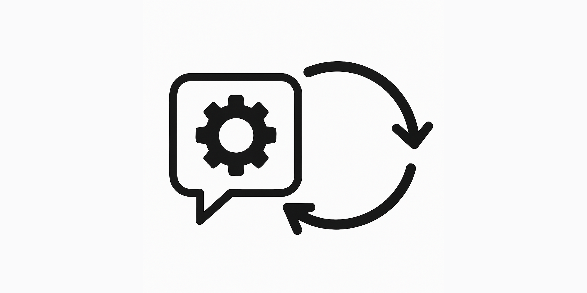

## はじめに：DX時代の運用課題

デジタルトランスフォーメーション（DX）の加速により、システム運用の複雑さは増す一方です。開発と運用の連携（DevOps）が標準となった現在でも、チーム間のコミュニケーションの断絶、コンテキストの分散、ツールの乱立による非効率は多くの組織が抱える課題です。特に以下の問題が顕著です：

- 複数のツールやダッシュボードを行き来する運用担当者の認知負荷の増大
- インシデント発生時の情報共有の遅延とコミュニケーションの分断
- 運用タスクの自動化と人間による判断のバランス確保の難しさ
- リモートワーク環境下でのチームコラボレーションの効率低下

これらの課題に対応するアプローチとして注目されているのが「ChatOps」です。本記事では、ChatOpsの概念から実装方法、ツール選定、導入事例までを詳しく解説します。

## ChatOpsとは：チャットを中心とした運用モデル

ChatOpsとは、チャットプラットフォームを中心にして開発・運用業務のワークフローを統合するアプローチです。GitHub社によって広まったこの概念は、「チャットルームをコマンドセンターにする」というシンプルな考え方に基づいています。

### ChatOpsの基本原則

1. **一元的なコミュニケーション**: すべてのチーム会話を単一のチャット環境に集約
2. **自動化の統合**: チャットインターフェースからボットを通じて自動化タスクを実行
3. **透明性の最大化**: 運用アクションと結果を全員が可視化できる環境の構築
4. **コンテキストの共有**: 関連情報とアクションを同じ場所で共有・実行


## ChatOpsの主要メリット

### 1. コミュニケーション効率の向上

チャット上ですべての会話が完結するため、メール、対面会議、電話など複数のチャネルを切り替える必要がなくなります。特にリモートワーク環境下では、この一元化の効果が顕著です。

### 2. 知識共有の加速

```
インシデント対応者A: @devopsボット サーバー状態確認
DevOpsボット: サーバーステータス：
  - web-01: 正常稼働（CPU 23%, メモリ 45%）
  - web-02: 高負荷（CPU 89%, メモリ 78%）
  - db-01: 正常稼働（CPU 34%, メモリ 56%）

インシデント対応者B: 過去の同様のパターンを確認します
インシデント対応者B: @devopsボット 先週のweb-02負荷グラフ表示
```

このようなやり取りがチーム全体に共有されることで、暗黙知の形式知化が進み、チームの学習速度が向上します。

### 3. 即時的なフィードバックループ

コマンド実行とその結果が同じチャットスレッドに表示されるため、アクションとフィードバックのサイクルが短縮されます。

### 4. 意思決定の透明性確保

```
開発者A: @devopsボット デプロイ準備 app-v1.2.3
DevOpsボット: デプロイ準備完了：
  - 変更内容: 7件のバグ修正、2件の新機能
  - テスト結果: 自動テスト100%成功
  - パフォーマンス: 前回比+5%高速化
デプロイ承認者は「@devopsボット デプロイ承認」とコメントしてください

運用責任者: 内容を確認しました。@devopsボット デプロイ承認
```

上記のような承認プロセスが透明化され、誰がいつどのような判断をしたかの記録が自動的に残ります。

### 5. 自動化と人間判断のバランス

ChatOpsは完全な自動化ではなく、人間の判断とボットによる自動化処理を適切に組み合わせるモデルです。複雑な意思決定は人間が行い、定型作業はボットに任せるというバランスを実現します。

## ChatOpsの実装パターン

### 1. 基本アーキテクチャ

ChatOpsの実装は、一般的に以下の3つの要素で構成されます：

1. **チャットプラットフォーム**: Slack、Microsoft Teams、Discordなど
2. **ChatOpsボット**: Hubot、Errbot、Microsoft Bot Frameworkなどで構築
3. **インテグレーション**: 監視ツール、CI/CDシステム、インフラ管理ツールなどとの連携


### 2. コマンド設計のベストプラクティス

効果的なChatOpsコマンドを設計するためのガイドラインは以下の通りです：

- **シンプルな構文**: `@bot 動詞 対象 [オプション]`の形式が理解しやすい
- **一貫性**: 類似機能には類似コマンド名を使用する
- **フィードバック**: コマンド実行状態を明示的に返す
- **ヘルプ機能**: `@bot help`で利用可能なコマンド一覧を表示
- **権限管理**: コマンドの実行権限を適切に設定

```
# 良い例
@devopsボット デプロイ start app-service staging
@devopsボット スケール up web-service 5

# 避けるべき例（一貫性がない）
@devopsボット deployStart app-service staging
@devopsボット scale-web-up 5
```

### 3. 通知設計のポイント

システムからのアラートや通知も重要なChatOps要素です。以下のポイントを考慮して設計します：

- **優先度の視覚化**: 重要度に応じた色分けやアイコン表示
- **アクショナブルな通知**: 通知に対して直接アクションできるボタン等の提供
- **ノイズ削減**: 類似通知のグループ化、繰り返し通知の抑制
- **コンテキスト提供**: 関連情報へのリンクや背景情報の添付

```
🔴 [重大] データベース接続エラー（db-01）
発生時刻: 2023-12-22 13:45:32
影響サービス: 顧客管理システム、受注システム
エラー詳細: タイムアウト（30秒以上応答なし）
推奨アクション: [ DB再起動 ] [ 障害レポート作成 ] [ エスカレーション ]
```

## 主要ChatOpsツールと選定ガイド

### チャットプラットフォーム比較

| プラットフォーム | 特徴 | 適したチーム |
|-------------|------|------------|
| **Slack** | 豊富な統合機能、柔軟なAPI、多機能無料枠 | スタートアップ、中小規模チーム |
| **Microsoft Teams** | Microsoft製品との統合、エンタープライズセキュリティ | Microsoft環境の企業 |
| **Mattermost** | オンプレミス導入可能、高いカスタマイズ性 | セキュリティ要件の厳しい組織 |
| **Discord** | 音声チャネル、コミュニティ機能が充実 | オープンソースプロジェクト |

### ChatOpsボット比較

| ボットフレームワーク | 言語 | 特徴 |
|-----------------|-----|------|
| **Hubot** | CoffeeScript/JavaScript | GitHubによる開発、豊富なプラグイン |
| **Errbot** | Python | シンプルなAPI、プラグイン開発が容易 |
| **Lita** | Ruby | モジュラー設計、豊富なハンドラー |
| **BotKit** | JavaScript | 柔軟なイベント処理、複数プラットフォーム対応 |

### 選定のためのチェックリスト

- 既存のDevOpsツールスタックとの統合容易性
- セキュリティ要件（認証、監査、アクセス制御）
- カスタマイズ性と拡張性
- 学習曲線と社内の技術スタック
- コミュニティサポートとドキュメント充実度

## 導入ステップと成功のポイント

### 段階的アプローチ

ChatOpsを成功させるためには、段階的な導入が効果的です：

1. **基盤構築（1-2週間）**:
   - チャットプラットフォームの選定と導入
   - 基本的なボットのセットアップ
   - 運用チャネル構造の設計

2. **基本インテグレーション（2-4週間）**:
   - 監視システムからのアラート統合
   - 基本的なインフラ操作コマンドの実装
   - ドキュメントとヘルプコマンドの整備

3. **ワークフロー最適化（1-2ヶ月）**:
   - CI/CDパイプラインとの統合
   - 承認フローの実装
   - カスタムレポートとダッシュボード

4. **文化と習慣の定着（継続的）**:
   - チーム教育とベストプラクティス共有
   - 定期的なフィードバックと改善
   - 成功事例の記録と共有

### 導入時の注意点

- **セキュリティの確保**: 特権コマンドの実行権限管理、認証メカニズムの実装
- **過剰な自動化を避ける**: すべてを自動化するのではなく、高価値なタスクに焦点
- **ノイズと情報過多の管理**: 適切な通知フィルタリングメカニズムの実装
- **チーム文化への配慮**: 既存の業務フローを尊重しながらの段階的移行

## 実装事例

### 1. インシデント管理の効率化

**課題**: インシデント発生時の情報散在と対応の遅延

**ChatOps実装**:
- インシデント検知時に自動的に専用チャンネルを作成
- 関連するモニタリング情報の自動集約
- タイムラインと対応アクションの記録
- レスポンスプレイブックとの連携

**効果**:
- インシデント平均解決時間を42%短縮
- 関係者への通知時間を85%削減
- ポストモーテム（事後分析）の質向上

### 2. デプロイプロセスの最適化

**課題**: 複数環境へのデプロイにおける調整とコミュニケーションコスト

**ChatOps実装**:
- デプロイステータスの可視化
- 承認フローのチャット上での完結
- デプロイ前チェックリストの自動実行と結果表示
- ロールバックの簡易化

**効果**:
- デプロイ頻度が3倍に増加
- デプロイ関連のヒューマンエラーが75%減少
- 新規メンバーのオンボーディング時間が短縮

### 3. 日常的な運用タスクの効率化

**課題**: 繰り返し行われる定型タスクによるエンジニアの時間浪費

**ChatOps実装**:
- サーバーリソース状態確認コマンド
- データベースバックアップと復元操作
- ログ検索と分析の簡易化
- アクセス権管理タスクの自動化

**コード例（Hubotスクリプト）**:

```javascript
// サーバーリソース確認コマンド
module.exports = (robot) => {
  robot.respond(/サーバー状態( (.*))?/i, (res) => {
    const serverName = res.match[2] || 'all';
    
    res.send(`${serverName}のリソース情報を取得中...`);
    
    // 実際のサーバー監視APIを呼び出す処理
    checkServerStatus(serverName)
      .then((status) => {
        res.send({
          attachments: [{
            color: status.health === 'ok' ? 'good' : 'danger',
            title: `${serverName}のリソース状態`,
            fields: [
              { title: 'CPU使用率', value: `${status.cpu}%`, short: true },
              { title: 'メモリ使用率', value: `${status.memory}%`, short: true },
              { title: 'ディスク使用率', value: `${status.disk}%`, short: true },
              { title: '稼働時間', value: status.uptime, short: true }
            ],
            footer: '最終更新: ' + new Date().toLocaleString('ja-JP')
          }]
        });
      })
      .catch((error) => {
        res.send(`エラー: ${error.message}`);
      });
  });
};
```

**効果**:
- 運用タスクの実行時間が平均65%短縮
- クラウドリソースコストの最適化（15%削減）
- 運用ドキュメントへの依存度低下

## まとめと今後の展望

ChatOpsは単なるツール導入ではなく、運用文化の変革です。チーム間のコミュニケーションを効率化し、自動化と人間の判断を適切に組み合わせることで、DevOpsの理念をさらに進化させます。

実装にあたっては、技術的側面だけでなく、組織文化や既存のワークフローとの調和を重視することが成功の鍵となります。段階的な導入と継続的な改善を通じて、真の価値を引き出していきましょう。

今後のChatOps発展の方向性としては、以下のトレンドが注目されます：

- **AI/MLとの統合**: 自然言語処理を活用したインテリジェントな会話型インターフェース
- **データ可視化の高度化**: リアルタイムメトリクスのインタラクティブな表示
- **ローコード/ノーコードChatOps**: 専門知識不要でのワークフロー構築
- **DevSecOpsとの融合**: セキュリティ対応の自動化とチャット上での完結

ChatOpsを導入することで、単なるツールの集合体だったDevOps環境が、チームの共同作業を促進する生きたプラットフォームへと進化します。DX時代の俊敏な運用体制の構築に向けて、ChatOpsの可能性を最大限に活用しましょう。

## 参考資料

- [ChatOps: Technology and Philosophy](https://www.atlassian.com/blog/software-teams/what-is-chatops-adoption-guide)
- [GitHub's ChatOps](https://github.blog/2014-10-08-introducing-hubot/)
- [Slack API Documentation](https://api.slack.com/)
- [Microsoft Teams Bot Framework](https://docs.microsoft.com/en-us/microsoftteams/platform/bots/what-are-bots)
