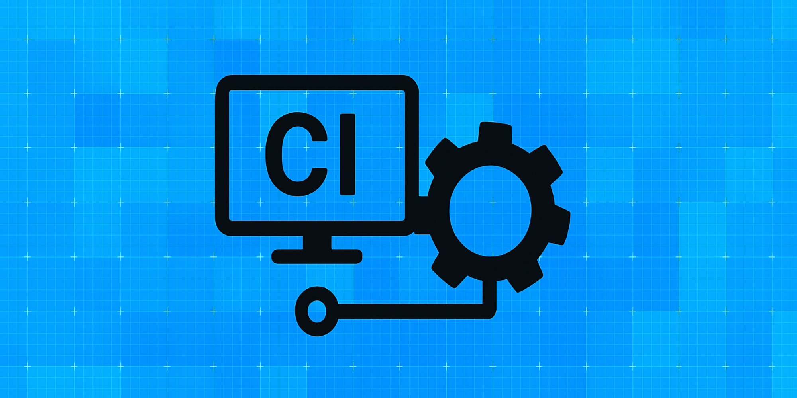

ビジネス環境の急速な変化に対応するため、企業はより迅速かつ頻繁にソフトウェアをリリースする必要がありますが、同時に品質を犠牲にすることはできません。この課題に対応するための鍵となるのが「継続的インテグレーション（CI）」です。

CIは開発者が定期的にコードを共有リポジトリにマージし、自動的にビルドとテストを実行するプラクティスです。しかし、多くの組織では以下のような課題に直面しています：

- どのCIツールが自社の開発環境や要件に最適なのか判断できない
- CI導入による効果を適切に測定・評価できていない
- 開発スピードと品質保証のバランスをどう取るべきか明確でない
- CIパイプラインの最適な設計・実装方法がわからない

本記事では、主要なCIツールの詳細な比較、導入効果の測定方法、そして開発生産性と品質保証を両立させるためのベストプラクティスを解説します。

## 継続的インテグレーションの基本原則

継続的インテグレーションは以下の原則に基づいています：

1. **頻繁なコード統合**: 少なくとも1日に複数回のコード統合
2. **自動化されたビルドとテスト**: 統合後に自動的にビルドとテストを実行
3. **迅速なフィードバック**: 問題が発生した場合、開発者に即座に通知
4. **修正の優先度**: 統合の失敗は最優先で修正

これらの原則を実現するために、適切なCIツールの選定が不可欠です。

## 主要CIツールの比較分析

### 1. Jenkins

**概要**: オープンソースの自動化サーバー。最も古くから存在し、幅広い拡張性を持つCIツール。

**特徴**:
- **カスタマイズ性**: 2000以上のプラグインによる高い拡張性
- **対応環境**: オンプレミス、クラウド双方で利用可能
- **コミュニティ**: 大規模で成熟したコミュニティとサポート
- **パイプライン定義**: Jenkinsfileによる宣言的・スクリプト的定義

**長所**:
- ほぼあらゆる開発環境・言語に対応可能
- 完全なカスタマイズと制御が可能
- エンタープライズレベルの複雑なワークフローに対応

**短所**:
- 初期設定と維持管理の複雑さ
- UIが直感的でない場合がある
- クラウドネイティブ環境との統合において他のツールに比べ煩雑

**コスト**: 
- 基本的に無料（サーバー・インフラ運用コストが必要）

```groovy
// Jenkinsfileの例
pipeline {
    agent any
    
    stages {
        stage('ビルド') {
            steps {
                sh 'npm install'
                sh 'npm run build'
            }
        }
        stage('テスト') {
            steps {
                sh 'npm test'
            }
            post {
                always {
                    junit 'test-results/*.xml'
                }
            }
        }
        stage('デプロイ') {
            when {
                branch 'main'
            }
            steps {
                sh './deploy.sh'
            }
        }
    }
}
```

### 2. GitHub Actions

**概要**: GitHubに統合されたCI/CDサービス。リポジトリ内でワークフローを定義し実行。

**特徴**:
- **統合性**: GitHub環境との完全な統合
- **マーケットプレイス**: 豊富なアクションライブラリ
- **パイプライン定義**: YAMLベースの簡潔な構文
- **実行環境**: GitHub提供のクラウド環境または自己ホストランナー

**長所**:
- GitHubリポジトリとシームレスに統合
- 設定が比較的容易
- 公開リポジトリでの利用が無料
- マトリックスビルドに優れる

**短所**:
- GitHub以外のリポジトリ管理とは統合困難
- 実行時間に制限がある（パブリックリポジトリ：6時間、プライベート：最大35分）
- エンタープライズ向けの高度な機能は有料

**コスト**:
- 公開リポジトリ: 無料
- プライベートリポジトリ: 無料枠あり（月2000分）、超過分は従量課金

```yaml
# GitHub Actionsワークフローの例
name: Node.js CI

on:
  push:
    branches: [ main ]
  pull_request:
    branches: [ main ]

jobs:
  build:
    runs-on: ubuntu-latest
    
    strategy:
      matrix:
        node-version: [14.x, 16.x, 18.x]
    
    steps:
    - uses: actions/checkout@v3
    - name: Node.js ${{ matrix.node-version }} セットアップ
      uses: actions/setup-node@v3
      with:
        node-version: ${{ matrix.node-version }}
    - run: npm ci
    - run: npm run build --if-present
    - run: npm test
```

### 3. GitLab CI/CD

**概要**: GitLabに組み込まれたCI/CDソリューション。リポジトリと緊密に統合。

**特徴**:
- **統合性**: GitLabプラットフォームとの完全な統合
- **パイプライン定義**: YAMLベースの設定
- **実行環境**: GitLab.comまたは自己ホストのランナー
- **Docker対応**: ネイティブなDockerサポート

**長所**:
- GitLabと完全統合されたエンドツーエンドのDevOpsプラットフォーム
- 包括的なCI/CDパイプラインとセキュリティスキャン
- コードレビュー、イシュートラッキングとの統合

**短所**:
- GitLab外のツールとの統合は他のCIツールに比べて限定的
- 高度な機能は有料プランが必要
- パイプライン設定の学習曲線がやや急

**コスト**:
- 基本機能: 無料
- Premium/Ultimate: 月額ユーザーあたり$19/$99

```yaml
# .gitlab-ci.ymlの例
stages:
  - build
  - test
  - deploy

build_job:
  stage: build
  script:
    - echo "Building the application..."
    - npm install
    - npm run build
  artifacts:
    paths:
      - dist/

test_job:
  stage: test
  script:
    - echo "Running tests..."
    - npm test
  artifacts:
    reports:
      junit: junit.xml

deploy_job:
  stage: deploy
  script:
    - echo "Deploying application..."
    - ./deploy.sh
  only:
    - main
```

### 4. CircleCI

**概要**: クラウドベースのCI/CDプラットフォーム。高度な並列処理に強み。

**特徴**:
- **スケーラビリティ**: 高度な並列実行と分散ビルド
- **パイプライン定義**: YAMLベースの設定
- **キャッシング**: インテリジェントなキャッシュ機能
- **Orbs**: 再利用可能な設定パッケージ

**長所**:
- ビルド高速化のための優れたキャッシング機能
- 直感的なUIとデバッグツール
- 詳細なリソース使用状況の可視化
- Docker Layer Cachingによる効率的なコンテナビルド

**短所**:
- 高度な利用では比較的コストが高い
- 一部の複雑なユースケースではカスタマイズが限定的
- 自己ホスト型の実装が他のツールに比べて制限的

**コスト**:
- Free: 月間6,000ビルド分まで無料
- Performance: プロジェクトあたり月額$15〜

```yaml
# .circleci/config.ymlの例
version: 2.1

orbs:
  node: circleci/node@4.7

jobs:
  build-and-test:
    docker:
      - image: cimg/node:16.13
    steps:
      - checkout
      - node/install-packages:
          pkg-manager: npm
      - run:
          name: アプリケーションのビルド
          command: npm run build
      - run:
          name: テストの実行
          command: npm test
      - store_test_results:
          path: test-results

workflows:
  sample:
    jobs:
      - build-and-test
```

### 5. Azure DevOps Pipelines

**概要**: Microsoftが提供するCI/CDパイプラインサービス。Azure統合とクロスプラットフォーム対応が特徴。

**特徴**:
- **マルチプラットフォーム**: Windows, Linux, macOSをサポート
- **クラウド統合**: Azure環境との緊密な統合
- **パイプライン定義**: YAMLまたはビジュアルエディター
- **テンプレート**: 再利用可能なパイプラインテンプレート

**長所**:
- Microsoftエコシステムとの優れた統合
- 包括的なDevOpsツールスイートの一部
- スケーラブルなクラウドビルド容量
- 企業向けセキュリティとコンプライアンス機能

**短所**:
- Azure以外の環境との統合で追加設定が必要
- 一部の高度な機能は追加コストが発生
- UIナビゲーションがやや複雑

**コスト**:
- 基本: パブリックプロジェクト無料、プライベートプロジェクト: 月間1,800分無料
- 追加ランタイム: $40/月/パイプライン

```yaml
# azure-pipelines.ymlの例
trigger:
- main

pool:
  vmImage: 'ubuntu-latest'

steps:
- task: NodeTool@0
  inputs:
    versionSpec: '16.x'
  displayName: 'Node.jsのインストール'

- script: |
    npm install
    npm run build
  displayName: 'npm install および build'

- script: |
    npm test
  displayName: 'テストの実行'

- task: PublishTestResults@2
  inputs:
    testResultsFormat: 'JUnit'
    testResultsFiles: '**/test-results.xml'
    mergeTestResults: true
```

### CIツール選定マトリックス

以下の表は、異なる組織の要件に基づいたCIツール選定の目安を提供します：

| 組織のニーズ/特性 | 推奨CIツール | 理由 |
|-----------------|------------|------|
| スタートアップ/小規模チーム | GitHub Actions, CircleCI | 設定の容易さ、無料枠の充実、管理オーバーヘッドの少なさ |
| 大企業/エンタープライズ | Jenkins, Azure DevOps | 高度なカスタマイズ、セキュリティ、コンプライアンス対応 |
| GitHubベースの開発 | GitHub Actions | ネイティブ統合、シンプルなワークフロー |
| GitLabベースの開発 | GitLab CI | 統合DevOpsプラットフォーム体験 |
| 複雑なビルド要件 | Jenkins, CircleCI | 高度なパイプラインカスタマイズ、並列処理 |
| クラウドネイティブ開発 | GitLab CI, CircleCI | コンテナ対応、クラウドサービス統合 |
| Microsoft環境 | Azure DevOps | .NET、Azure、Windowsとの緊密な統合 |

## CI導入効果の測定指標とアプローチ

### 主要な効果測定指標

CIツール導入の効果を適切に測定するためには、定量的・定性的両面からの評価が重要です。以下は重要な測定指標です：

#### 1. 時間効率指標

- **コミットからフィードバックまでの時間 (Lead Time)**
  - 測定: `コードコミット時刻 → ビルド/テスト完了時刻`
  - 目標: CI前と比較して50%以上の短縮

- **ビルド時間**
  - 測定: `ビルド開始から完了までの時間`
  - 目標: 定期的な最適化により継続的に短縮

- **デプロイ頻度**
  - 測定: `一定期間内のデプロイ回数`
  - 目標: 高成熟度組織では1日複数回のデプロイ

#### 2. 品質指標

- **ビルド成功率**
  - 測定: `成功したビルド数 ÷ 総ビルド数`
  - 目標: 95%以上

- **テストカバレッジ**
  - 測定: `テストされたコード行数 ÷ 総コード行数`
  - 目標: 最低80%（領域により異なる）

- **欠陥検出率**
  - 測定: `CIで検出された欠陥数 ÷ 全体の欠陥数`
  - 目標: 本番環境での欠陥発見が20%以下

#### 3. プロセス指標

- **平均修復時間 (MTTR)**
  - 測定: `問題検出から修正までの平均時間`
  - 目標: CI前と比較して60%以上の短縮

- **手動テスト時間削減**
  - 測定: `自動化前の手動テスト時間 - 自動化後の手動テスト時間`
  - 目標: 70%以上の削減

#### 4. ビジネス影響指標

- **開発者生産性**
  - 測定: `機能実装に費やす時間 ÷ (機能実装+統合問題解決時間)`
  - 目標: 20%以上向上

- **リリースまでの時間**
  - 測定: `要件定義からプロダクション環境リリースまでの時間`
  - 目標: CI前と比較して30%以上の短縮

### 測定方法とツール

効果測定には以下のツールとアプローチが有効です：

1. **CIツール内蔵の分析機能**
   - Jenkins: [Performance Plugin](https://plugins.jenkins.io/performance/)
   - GitHub Actions: [Workflow Insights](https://docs.github.com/en/actions/monitoring-and-troubleshooting-workflows/using-workflow-run-visualizations)
   - GitLab: [CI/CD Analytics](https://docs.gitlab.com/ee/user/analytics/ci_cd_analytics.html)

2. **専用のDevOps測定ツール**
   - [Sleuth](https://sleuth.io/) - デプロイ追跡と分析
   - [LinearB](https://linearb.io/) - エンジニアリング効率性指標
   - [Athenian](https://athenian.com/) - エンジニアリングパフォーマンス分析

3. **カスタムダッシュボード構築**
   ```python
   # CIデータ分析スクリプト例（Python）
   import pandas as pd
   import matplotlib.pyplot as plt
   from datetime import datetime

   # CIツールからエクスポートしたデータを読み込み
   ci_data = pd.read_csv('ci_builds.csv')
   
   # ビルド時間の計算
   ci_data['build_duration'] = (pd.to_datetime(ci_data['end_time']) - 
                               pd.to_datetime(ci_data['start_time'])).dt.total_seconds() / 60
   
   # 週ごとの平均ビルド時間トレンド
   weekly_avg = ci_data.groupby(pd.Grouper(key='start_time', freq='W'))['build_duration'].mean()
   
   # 可視化
   plt.figure(figsize=(10, 6))
   weekly_avg.plot()
   plt.title('週次平均ビルド時間 (分)')
   plt.ylabel('分')
   plt.savefig('build_time_trend.png')
   ```

4. **デベロッパーサーベイ**
   - 四半期ごとに開発者満足度と生産性に関するアンケートを実施
   - 「CI導入前後で、1日の作業時間のうち何%がビルド/統合問題の解決に費やされていますか？」など

## 開発生産性と品質確保を両立するベストプラクティス

### 1. 効率的なパイプライン設計

#### 段階的テスト戦略
高速なフィードバックループを実現するため、テストをいくつかの段階に分割します：

```yaml
# GitLab CIでの段階的テスト例
stages:
  - lint          # 静的解析（数秒〜数分）
  - unit-test     # 単体テスト（数分）
  - integration   # 統合テスト（5分〜15分）
  - e2e           # E2Eテスト（15分〜）
  - security      # セキュリティスキャン
  - deploy        # デプロイ

lint:
  stage: lint
  script: npm run lint
  # 早期失敗により後続ステージを実行しない

unit-test:
  stage: unit-test
  script: npm test
  # カバレッジレポート生成
```

#### 並列処理とマトリックスビルド
テストを並列実行することで、全体的なビルド時間を短縮します：

```yaml
# GitHub Actionsでのマトリックスビルド例
jobs:
  test:
    runs-on: ubuntu-latest
    strategy:
      matrix:
        node-version: [14.x, 16.x, 18.x]
        test-group: [unit, api, ui]
    steps:
      - uses: actions/checkout@v3
      - name: Test with Node.js ${{ matrix.node-version }}
        run: npm run test:${{ matrix.test-group }}
```

#### キャッシング最適化
依存関係のインストールなど、時間のかかる処理の結果をキャッシュすることで、ビルド時間を短縮します：

```yaml
# CircleCIでのキャッシュ例
steps:
  - checkout
  - restore_cache:
      keys:
        - v1-npm-deps-{{ checksum "package-lock.json" }}
        - v1-npm-deps-
  - run: npm install
  - save_cache:
      key: v1-npm-deps-{{ checksum "package-lock.json" }}
      paths:
        - node_modules
```

### 2. 品質ゲート設定

ビルドパイプラインに以下の品質チェックを組み込みます：

#### コードスタイルとリンティング
```json
// .eslintrc.json
{
  "extends": ["eslint:recommended", "plugin:react/recommended"],
  "rules": {
    "complexity": ["error", 10],
    "max-lines-per-function": ["warn", 50],
    "no-unused-vars": "error"
  }
}
```

#### テストカバレッジ閾値
```javascript
// jest.config.js
module.exports = {
  coverageThreshold: {
    global: {
      branches: 80,
      functions: 80,
      lines: 80,
      statements: 80
    }
  }
}
```

#### 脆弱性スキャン
```yaml
# GitHub Actionsでの依存関係スキャン
security:
  runs-on: ubuntu-latest
  steps:
    - uses: actions/checkout@v3
    - name: セキュリティ脆弱性スキャン
      uses: snyk/actions/node@master
      with:
        args: --severity-threshold=high
```

#### コードレビュー自動化
```yaml
# GitLab CIでのコード品質チェック
code_quality:
  stage: test
  script:
    - code_quality
  artifacts:
    reports:
      codequality: gl-code-quality-report.json
```

### 3. 開発者体験の最適化

#### フィードバックの可視化
開発者が問題を迅速に特定できるよう、テスト結果やエラーレポートを視覚的に表示します：

```yaml
# Azure DevOpsでのテスト結果公開
- task: PublishTestResults@2
  inputs:
    testResultsFormat: 'JUnit'
    testResultsFiles: '**/TEST-*.xml'
    failTaskOnFailedTests: true  # テスト失敗時にビルド失敗とする
```

#### インクリメンタルテスト実行
変更されたコードに関連するテストのみを実行することで、フィードバックを高速化します：

```javascript
// Jest での変更ファイルのみテスト（package.json）
{
  "scripts": {
    "test:changed": "jest --onlyChanged"
  }
}
```

#### ローカルCI環境
開発者がローカルで事前にCIを実行できるツールを提供します：

```bash
# CI環境のローカル実行スクリプト例
#!/bin/bash
# ci-local.sh

echo "ローカルCI実行を開始します..."
npm run lint &&
npm test &&
npm run build &&
echo "すべてのチェックが完了しました！"
```

### 4. 継続的最適化

#### パイプライン分析と改善
定期的にビルドパイプラインを分析し、最適化する習慣を確立します：

```python
# ビルドパイプライン分析スクリプト例
import pandas as pd
from datetime import datetime

# CIログ解析
def analyze_ci_pipeline(log_file):
    stages = []
    with open(log_file, 'r') as f:
        for line in f:
            if 'Stage:' in line:
                stage = line.split('Stage:')[1].strip()
                timestamp = datetime.now().strftime('%Y-%m-%d %H:%M:%S')
                stages.append({'stage': stage, 'timestamp': timestamp})
    
    df = pd.DataFrame(stages)
    if len(df) > 1:
        # 各ステージの所要時間を計算
        df['next_timestamp'] = df['timestamp'].shift(-1)
        df['duration'] = (pd.to_datetime(df['next_timestamp']) - 
                          pd.to_datetime(df['timestamp'])).dt.total_seconds()
        df = df.drop('next_timestamp', axis=1)
        
        # 最も時間のかかるステージを特定
        slowest_stage = df.loc[df['duration'].idxmax()]
        print(f"最も時間のかかるステージ: {slowest_stage['stage']} ({slowest_stage['duration']}秒)")
    
    return df

# 使用例
analyze_ci_pipeline('ci_log.txt')
```

#### 定期的な設定見直し
技術スタックの変化に合わせてCI設定を定期的に見直します：

```bash
# 四半期ごとのCI設定レビュースクリプト
#!/bin/bash
# ci-review.sh

echo "CI設定レビューを開始します..."

# 依存関係の更新チェック
npm outdated

# ビルド時間統計
echo "直近100ビルドの平均時間："
grep "Total time:" logs/ci-*.log | awk '{sum+=$3; count++} END {print sum/count " 秒"}'

# 失敗の多いステージ特定
echo "失敗の多いステージ："
grep "failed at stage:" logs/ci-*.log | sort | uniq -c | sort -nr

echo "レビュー完了。結果に基づいてCI設定を最適化してください。"
```

## 導入事例と成功要因

### 事例1: Eコマーススタートアップにおける改革

**【企業プロファイル】**
- 社員数: 約50名（エンジニア15名）
- 技術スタック: React, Node.js, MongoDB
- 課題: リリース頻度が月2回、リリース作業が1日かかり、エラー率が高い

**【導入したCI体制】**
- CI/CDツール: GitHub Actions
- テスト自動化: Jest, Cypress
- コード品質: ESLint, SonarCloud

**【成果】**
- リリース頻度: 月2回 → 週3回 (600%向上)
- リリース作業時間: 1日 → 15分 (96%削減)
- 本番環境バグ: 74%削減
- 開発者満足度: 63%向上

**【成功要因】**
1. まず小さなプロジェクトでCIを試験導入
2. テスト自動化に集中的に投資
3. デプロイプロセスを完全に自動化

### 事例2: 大手金融機関のレガシーシステム改善

**【企業プロファイル】**
- 社員数: 5,000名以上（IT部門300名）
- 技術スタック: Java, Oracle, レガシーCOBOLシステム
- 課題: 厳格な規制要件、複雑な承認プロセス、テスト環境の制約

**【導入したCI体制】**
- CI/CDツール: Jenkins + Azure DevOps
- テスト自動化: JUnit, Selenium, JMeter
- セキュリティ検証: Fortify, OWASP ZAP

**【成果】**
- テスト実行時間: 3日 → 4時間 (94%削減)
- リリースサイクル: 四半期 → 月次 (300%向上)
- コンプライアンスドキュメント作成: 半自動化 (70%工数削減)
- リリース失敗率: 8.5% → 0.5% (94%削減)

**【成功要因】**
1. 段階的アプローチ (3年計画での漸進的な移行)
2. 専門CIチームの設立と内部コンサルティング
3. 自動化されたコンプライアンス検証プロセスの構築

### 事例3: SaaS企業の開発プロセス改革

**【企業プロファイル】**
- 社員数: 約200名（エンジニア80名）
- 技術スタック: Microservices, Kubernetes, Go, TypeScript
- 課題: 急速なチーム拡大によるコード品質の低下、機能リリースの遅延

**【導入したCI体制】**
- CI/CDツール: GitLab CI
- テスト自動化: 言語ごとの適切なフレームワーク
- コード分析: SonarQube, CodeClimate
- パフォーマンステスト: Locust, k6

**【成果】**
- ビルド時間: 45分 → 12分 (73%削減)
- PR処理時間: 2.5日 → 0.8日 (68%短縮)
- 技術的負債の増加率: 60%減少
- 新規機能リリース速度: 40%向上

**【成功要因】**
1. マイクロサービスごとに最適化されたCIパイプライン
2. コード品質の「Definition of Done」を明確化
3. 開発者向けのCIベストプラクティストレーニングプログラム

## まとめ：効果的なCI導入のロードマップ

継続的インテグレーションの成功には、ツールだけでなく、プロセスと文化の変革が必要です。以下のロードマップに従って、開発生産性と品質確保の両立を実現しましょう：

### フェーズ1: 基盤構築（1-3ヶ月）
1. 組織のニーズに最適なCIツールの選定
2. 基本的な自動ビルド・テストパイプラインの構築
3. 現状のパフォーマンス指標の測定（ベースライン確立）

### フェーズ2: 成熟化（3-6ヶ月）
1. テスト自動化の拡充（単体→統合→E2E）
2. コード品質ゲートの導入
3. パイプラインの最適化（並列化、キャッシング）
4. チーム全体へのCI実践の浸透

### フェーズ3: 最適化と拡張（6ヶ月以降）
1. 継続的デリバリー（CD）への拡張
2. 高度な品質分析と自動修正の導入
3. フィードバックループの短縮と最適化
4. 組織全体へのDevOps文化の拡大

継続的インテグレーションは、単なる技術的施策ではなく、デジタルトランスフォーメーションを支える組織文化の基盤です。適切なツール選定と効果測定を通じて、開発スピードと品質のバランスを達成し、市場の変化に柔軟に対応できる組織へと進化させましょう。

## 参考資料

- [State of DevOps Report 2023](https://google.com/devops)
- [The Continuous Delivery Foundation](https://cd.foundation/)
- [Martin Fowler on Continuous Integration](https://martinfowler.com/articles/continuousIntegration.html)
- [DevOps Research and Assessment (DORA) metrics](https://cloud.google.com/blog/products/devops-sre/using-the-four-keys-to-measure-your-devops-performance)
