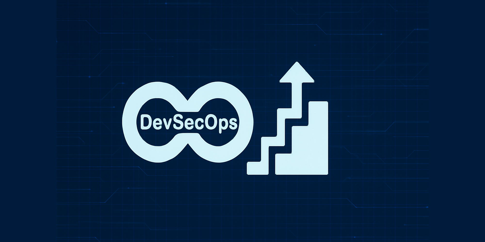
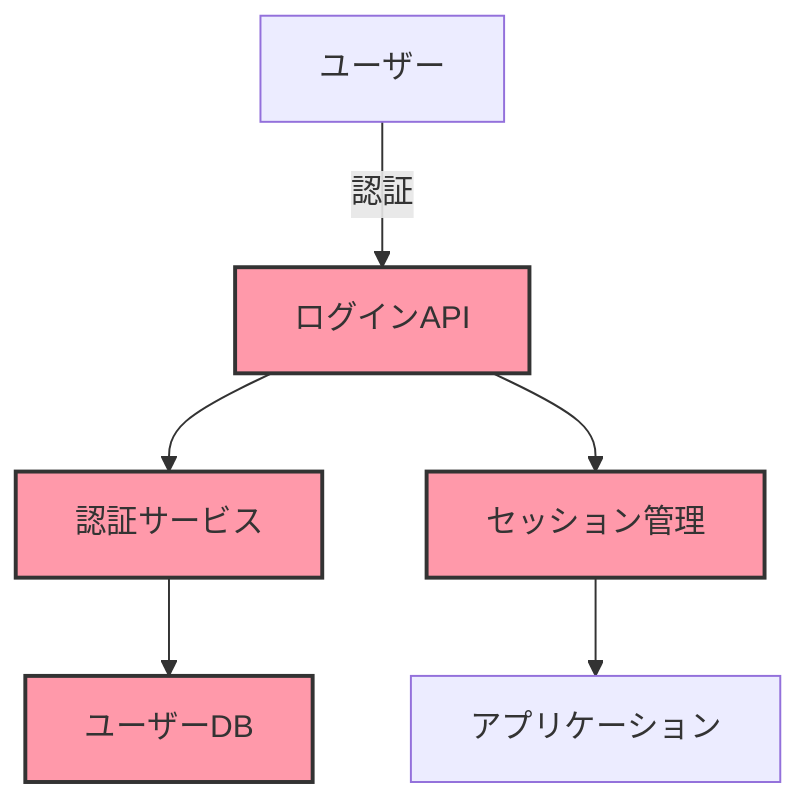

従来のウォーターフォール型開発では、セキュリティチェックはプロセスの最終段階で行われることが多く、問題が発見された場合には大幅な手戻りが必要でした。DevOps文化の普及により開発とリリースサイクルが短縮される中、セキュリティが後回しにされるリスクが高まっています。

DevSecOpsは、「セキュリティを後付けではなく、設計段階から組み込む」という思想に基づいたアプローチです。セキュリティを開発ライフサイクル全体に統合することで、以下のような課題に対応します：

- **脆弱性の早期発見と低コストでの修正**：設計・開発段階での問題発見は、本番環境での発見と比較して修正コストが1/30程度に抑えられるとされています
- **継続的なセキュリティの確保**：頻繁な変更とリリースにおいてもセキュリティ品質を維持
- **開発速度とセキュリティのバランス**：セキュリティを理由とした開発遅延の最小化
- **規制要件への継続的準拠**：GDPR、PCI DSS、個人情報保護法などへの遵守を効率化
- **セキュリティに対する責任共有**：開発・運用・セキュリティチーム間の連携強化

本記事では、DevSecOpsの効果的な実装方法について、組織文化の構築から具体的なツールとプラクティスまで、実践的なアプローチを解説します。

## DevSecOpsとは：DevOpsとの違いと実装の全体像

### DevOpsからDevSecOpsへの進化

DevOpsは「開発（Development）」と「運用（Operations）」の統合を目指し、継続的インテグレーション（CI）と継続的デリバリー（CD）により、迅速かつ高品質なソフトウェア提供を実現するアプローチです。DevSecOpsはこれを拡張し、「セキュリティ（Security）」を加えた概念となります。

**DevOpsとDevSecOpsの主な違い**:

| 観点 | DevOps | DevSecOps |
|------|--------|-----------|
| 焦点 | 速度と品質 | 速度、品質、セキュリティの均衡 |
| セキュリティの位置付け | しばしば開発後の検証工程 | すべての段階に組み込まれた活動 |
| 責任 | 開発と運用の共同責任 | 開発、運用、セキュリティの共同責任 |
| ツールチェーン | CI/CDが中心 | セキュリティツールが統合されたCI/CD |
| テスト重点 | 機能性と信頼性 | 機能性、信頼性、セキュリティ |

### DevSecOps実装の全体像

DevSecOpsを効果的に実装するには、以下の要素を総合的に考慮する必要があります：

1. **文化とマインドセット**:
   - セキュリティは全員の責任という認識
   - コラボレーションと透明性の文化
   - 「シフトレフト」思考（早期のセキュリティ対策）

2. **プロセスとプラクティス**:
   - 脅威モデリング
   - セキュアコーディング規約
   - 継続的なセキュリティテスト
   - インシデント対応と復旧プロセス

3. **ツールと自動化**:
   - コード分析ツール
   - 構成の脆弱性スキャン
   - シークレット検出
   - コンプライアンス検証

4. **測定と改善**:
   - セキュリティメトリクスの定義
   - 継続的なフィードバックループ
   - 成熟度モデルに基づく進化

これらの要素を開発ライフサイクルの各段階に適切に組み込むことで、セキュリティを犠牲にすることなく開発速度を維持できます。

## DevSecOps文化の構築：組織的アプローチ

### 1. セキュリティマインドセットの醸成

DevSecOpsの成功には、技術的な実装以前に組織文化とマインドセットの変革が不可欠です。以下のアプローチが効果的です：

**エグゼクティブスポンサーシップの確立**:
- 経営層によるDevSecOps取り組みへの明確な支持
- セキュリティをビジネス価値として位置づけ
- 必要なリソースと時間の確保

**セキュリティチャンピオンプログラム**:
開発チーム内からセキュリティに関心と知識を持つ「チャンピオン」を選出し、以下の役割を担ってもらいます：
- チーム内でのセキュリティプラクティスの推進
- 簡易的なコードレビューやセキュリティアドバイス
- セキュリティチームとの橋渡し

**「脅威を知る」文化の醸成**:
脅威やリスクに対する理解を深めるための活動：
- 月次のセキュリティ事例共有会
- 脆弱性の検出と対応に関する表彰制度
- バグバウンティイベント（社内ハッカソン）

### 2. クロスファンクショナルな連携モデル

DevSecOpsでは、従来の「サイロ化」されたチーム構造から、協働型の連携モデルへの移行が必要です：

**「トースト組織」から「ピザチーム」へ**:
- 縦割り構造ではなく、機能横断的な少人数チーム
- セキュリティスペシャリストを開発チームに組み込む
- 「セキュリティギルド」の形成（複数チームにまたがるコミュニティ）

**共同責任モデルの確立**:
```
開発者の責任:
- セキュアコーディング
- 基本的な脆弱性スキャン実行
- 依存関係の管理

セキュリティチームの責任:
- セキュリティ要件の定義
- 高度な脆弱性評価
- セキュリティツールの提供と維持

運用チームの責任:
- セキュアな環境構成
- パッチ管理
- インシデント対応の自動化
```

**コミュニケーションチャネルの最適化**:
- 日次スタンドアップミーティングにセキュリティ項目を追加
- セキュリティ関連情報の共有プラットフォーム（Slackチャンネルなど）
- 自動化されたセキュリティアラートのワークフロー統合

### 3. トレーニングと啓発プログラム

継続的なスキル向上とセキュリティ意識の醸成のためのプログラム：

**多層的なトレーニングアプローチ**:
- 基本：全従業員向けのセキュリティ意識研修（年2回）
- 中級：開発者向けのセキュアコーディング研修（四半期ごと）
- 上級：セキュリティチャンピオン向けの専門トレーニング（月次）

**ハンズオン学習の重視**:
- 脆弱なアプリケーションを使った実践的なトレーニング
- CTF（Capture The Flag）形式の社内セキュリティコンテスト
- バグを意図的に含むコードのレビュー演習

**マイクロラーニングの活用**:
- 5分で学べるセキュリティTipsの定期配信
- コードレビュー時のセキュリティチェックリスト
- 実際のインシデントから学ぶケーススタディ

## 開発ライフサイクル各段階でのDevSecOps実践

DevSecOpsは開発ライフサイクルの全段階においてセキュリティを統合します。各段階での具体的なプラクティスを見ていきましょう。

### 1. 計画・要件定義段階

この段階でセキュリティを考慮することで、設計段階での対応が可能となります。

**セキュリティ要件の明確化**:
- ユーザーストーリーにセキュリティ要件を追加
  ```
  従来: 「ユーザーはパスワードでログインできる」
  改善: 「ユーザーは強度要件を満たすパスワードで安全にログインできる」
  ```
- アクセプタンス基準にセキュリティ条件を含める
- コンプライアンス要件のマッピング（PCI DSS、GDPR等）

**脅威モデリング**:
重要なコンポーネントやデータフローに対して、STRIDE（Spoofing、Tampering、Repudiation、Information disclosure、Denial of service、Elevation of privilege）などのフレームワークを使った脅威分析を実施します。



**セキュリティ設計レビュー**:
- アーキテクチャレビューにセキュリティ専門家を含める
- 「最小権限の原則」の適用確認
- データ分類と保護メカニズムの検証

### 2. 開発段階

コーディング中にセキュリティを組み込むためのプラクティス：

**セキュアコーディングガイドライン**:
言語やフレームワーク固有のセキュリティベストプラクティスを文書化し、遵守を促します。

```java
// 悪い例: SQL Injection脆弱性
String query = "SELECT * FROM users WHERE username = '" + username + "'";

// 良い例: パラメータ化クエリ
PreparedStatement stmt = connection.prepareStatement("SELECT * FROM users WHERE username = ?");
stmt.setString(1, username);
```

**プリコミットフック**:
コードをコミットする前に自動的にセキュリティチェックを行うローカル環境の設定：

```bash
#!/bin/sh
# .git/hooks/pre-commit

# シークレット検出
detect-secrets scan .
if [ $? -ne 0 ]; then
  echo "エラー: コミットにシークレットが含まれています"
  exit 1
fi

# 基本的な静的解析
eslint .
if [ $? -ne 0 ]; then
  echo "エラー: ESLintのルール違反があります"
  exit 1
fi

exit 0
```

**セキュアなコードレビュー**:
- セキュリティフォーカスのレビューセッション（週1回）
- コードレビュー時のセキュリティチェックリスト
- 自動コードスキャン結果のレビュープロセス統合

### 3. ビルド・CI段階

継続的インテグレーションパイプラインにセキュリティチェックを組み込みます：

**静的アプリケーションセキュリティテスト（SAST）**:
ソースコードを分析して、セキュリティ脆弱性を検出するツールを統合します。

```yaml
# GitLab CI/CD パイプラインの例
stages:
  - build
  - test
  - security
  - deploy

sast:
  stage: security
  script:
    - sonarqube-scanner
  only:
    - main
    - merge_requests
  artifacts:
    paths:
      - gl-sast-report.json
```

**ソフトウェアコンポジション分析（SCA）**:
オープンソースライブラリの脆弱性を検出します。

```json
// package.json に npm audit を統合
{
  "name": "my-app",
  "scripts": {
    "test": "jest",
    "security-check": "npm audit --audit-level=high",
    "prepush": "npm run security-check"
  }
}
```

**シークレットスキャン**:
APIキーやパスワードなどの機密情報が誤ってコミットされていないか検出します。

```yaml
# GitHub Actions ワークフローの例
name: Secret Scanning

on: [push, pull_request]

jobs:
  secret-scan:
    runs-on: ubuntu-latest
    steps:
      - uses: actions/checkout@v3
      - name: TruffleHog OSS
        uses: trufflesecurity/trufflehog-actions-scanning@master
        with:
          path: ./
          base: ${{ github.event.repository.default_branch }}
          head: HEAD
```

**コンテナイメージスキャン**:
コンテナイメージの脆弱性をビルド時に検出します。

```yaml
# Docker Build & Scan Workflow
name: Docker Build and Scan

on:
  push:
    branches: [ main ]

jobs:
  build-and-scan:
    runs-on: ubuntu-latest
    steps:
      - uses: actions/checkout@v3
      
      - name: Build Docker image
        run: docker build -t myapp:${{ github.sha }} .
      
      - name: Scan Docker image
        uses: aquasecurity/trivy-action@master
        with:
          image-ref: 'myapp:${{ github.sha }}'
          format: 'sarif'
          output: 'trivy-results.sarif'
          severity: 'CRITICAL,HIGH'
          
      - name: Upload scan results
        uses: github/codeql-action/upload-sarif@v2
        with:
          sarif_file: 'trivy-results.sarif'
```

### 4. テスト・検証段階

コードがビルドされた後、より詳細なセキュリティテストを実施します：

**動的アプリケーションセキュリティテスト（DAST）**:
実行中のアプリケーションに対して、実際の攻撃シミュレーションを行います。

```yaml
# Jenkins パイプラインの例
pipeline {
    agent any
    stages {
        // ... 他のステージ ...
        stage('DAST') {
            steps {
                sh 'docker run --rm -v $(pwd):/zap/wrk owasp/zap2docker-stable zap-baseline.py -t https://staging-app.dx-media.example -g gen.conf -r dast-report.html'
                publishHTML([
                    allowMissing: false,
                    alwaysLinkToLastBuild: true,
                    keepAll: true,
                    reportDir: '',
                    reportFiles: 'dast-report.html',
                    reportName: 'DAST Report'
                ])
            }
        }
    }
}
```

**インタラクティブアプリケーションセキュリティテスト（IAST）**:
テスト実行中にアプリケーション内部で脆弱性を検出します。エージェントをアプリケーションに組み込み、実行時の動作を監視します。

**API セキュリティテスト**:
RESTful APIやGraphQL APIなどに特化したセキュリティテストを実施します。

```bash
# APIセキュリティテストの例（DreddとAPIキオスクの組み合わせ）
dredd api-spec.yaml https://api-staging.dx-media.example --hookfiles=./hooks/security-checks.js
```

**クラウド構成セキュリティテスト**:
インフラストラクチャのセキュリティを検証します。

```terraform
# Terraform プロジェクトにTerraform Sentinel Policy as Codeを適用
policy "require-private-acl-and-kms-for-s3-buckets" {
    enforcement_level = "hard-mandatory"
}

policy "restrict-ingress-sg-rule-ssh-all" {
    enforcement_level = "hard-mandatory"
}
```

### 5. デプロイ段階

デプロイメントパイプラインにおけるセキュリティ対策：

**不変インフラストラクチャ**:
環境の変更をデプロイ時にのみ行い、実行中の変更を制限します。

```yaml
# AWS CloudFormation テンプレートの例
Resources:
  EC2Instance:
    Type: AWS::EC2::Instance
    Properties:
      ImageId: ami-0123456789abcdef0
      InstanceType: t3.micro
      SecurityGroups:
        - !Ref InstanceSecurityGroup
      UserData:
        Fn::Base64: !Sub |
          #!/bin/bash -xe
          # ランタイム構成変更を無効化
          chattr +i /etc/ssh/sshd_config
          systemctl mask systemd-resolved
```

**ブルー/グリーンデプロイメントのセキュリティ検証**:
新環境のセキュリティを検証した後に切り替えを行います。

```bash
# 新環境のセキュリティ検証後のトラフィック切り替え
if [ "$(curl -s https://security-scan.dx-media.example/verify/$GREEN_ENV | jq -r '.status')" == "pass" ]; then
  aws elbv2 modify-listener \
    --listener-arn $LISTENER_ARN \
    --default-actions Type=forward,TargetGroupArn=$GREEN_TARGET_GROUP
  echo "トラフィックを新環境に切り替えました"
else
  echo "セキュリティ検証に失敗したため、切り替えを中止します"
  exit 1
fi
```

**シークレット管理の自動化**:
デプロイ時のシークレット注入を安全に行います。

```yaml
# Kubernetes Secretのポッド注入 (HashiCorp Vault統合)
apiVersion: v1
kind: Pod
metadata:
  name: app
  annotations:
    vault.hashicorp.com/agent-inject: 'true'
    vault.hashicorp.com/agent-inject-secret-database-config.json: 'database/creds/app-role'
    vault.hashicorp.com/role: 'app-role'
spec:
  containers:
    - name: app
      image: app:1.0.0
```

### 6. 運用・監視段階

本番環境でのセキュリティ監視と対応：

**セキュリティ情報イベント管理（SIEM）**:
セキュリティイベントの集中管理と分析を行います。

```yaml
# Elasticsearch/Kibanaを使ったSIEM設定例（Filebeat）
filebeat.inputs:
- type: log
  paths:
    - /var/log/auth.log
    - /var/log/application/*.log
  fields:
    security_relevant: true
    
processors:
  - add_host_metadata: ~
  - add_cloud_metadata: ~
  
output.elasticsearch:
  hosts: ["elasticsearch:9200"]
  index: "security-events-%{+yyyy.MM.dd}"
```

**ランタイムアプリケーション自己保護（RASP）**:
アプリケーション実行時の攻撃を検知・ブロックします。

```java
// Spring BootアプリケーションへのRASP統合例
@Configuration
public class SecurityConfig {
    
    @Bean
    public FilterRegistrationBean<RASPFilter> raspFilter() {
        FilterRegistrationBean<RASPFilter> registrationBean = new FilterRegistrationBean<>();
        registrationBean.setFilter(new RASPFilter());
        registrationBean.addUrlPatterns("/*");
        registrationBean.setOrder(Ordered.HIGHEST_PRECEDENCE);
        return registrationBean;
    }
}
```

**自動インシデント対応**:
セキュリティインシデントの自動検出と対応を行います。

```python
# AWS Lambdaを使った自動インシデント対応の例
import boto3
import json

def lambda_handler(event, context):
    # GuardDutyからの異常検知イベントを処理
    if event['detail']['type'] == 'UnauthorizedAccess:IAMUser/InstanceCredentialExfiltration':
        # 該当インスタンスを隔離するセキュリティグループを適用
        ec2 = boto3.client('ec2')
        instance_id = event['detail']['resource']['instanceDetails']['instanceId']
        
        response = ec2.modify_instance_attribute(
            InstanceId=instance_id,
            Groups=['sg-quarantine']
        )
        
        # インシデント対応チームに通知
        sns = boto3.client('sns')
        sns.publish(
            TopicArn='arn:aws:sns:region:account-id:security-incidents',
            Message=json.dumps(event),
            Subject='[重要] 認証情報漏洩の可能性があります'
        )
        
        return {
            'statusCode': 200,
            'body': '対応アクション完了：インスタンス隔離と通知'
        }
```

**コンプライアンスモニタリング**:
継続的なコンプライアンス状況の確認を自動化します。

```yaml
# AWS Config ルールの例
Resources:
  S3BucketPublicReadProhibited:
    Type: AWS::Config::ConfigRule
    Properties:
      ConfigRuleName: s3-bucket-public-read-prohibited
      Description: 'S3バケットの公開読み取りアクセスを禁止するルール'
      Source:
        Owner: AWS
        SourceIdentifier: S3_BUCKET_PUBLIC_READ_PROHIBITED
      Scope:
        ComplianceResourceTypes:
          - AWS::S3::Bucket
```

## DevSecOpsの実装事例：ツールとテクニック

主要なDevSecOpsツールとそれらを実装する際のベストプラクティスを紹介します。

### 1. ツールチェーンの構築

効果的なDevSecOpsを実現するためのツールチェーンの構成例：

**統合ツールチェーンの例**:

| フェーズ | カテゴリ | オープンソースツール | 商用ツール |
|---------|---------|-------------------|----------|
| 計画 | 脅威モデリング | OWASP Threat Dragon | Microsoft Threat Modeling Tool |
| 開発 | コード分析 | SonarQube, ESLint | Veracode, Checkmarx |
| 開発 | シークレット検出 | git-secrets, TruffleHog | GitGuardian |
| ビルド | SCA | OWASP Dependency Check | Snyk, WhiteSource |
| ビルド | コンテナスキャン | Trivy, Clair | Aqua Security, Prisma Cloud |
| テスト | DAST | OWASP ZAP | Burp Suite Pro |
| テスト | インフラ検証 | Terratest, tfsec | Prisma Cloud |
| デプロイ | シークレット管理 | HashiCorp Vault | AWS Secrets Manager |
| 運用 | SIEM | ELK Stack | Splunk, QRadar |
| 運用 | 脆弱性管理 | DefectDojo | Qualys |

**ツール統合のためのDevSecOpsプラットフォーム**:
複数のツールを統合して管理するプラットフォームも登場しています：

- **GitLab Ultimate** - 単一プラットフォームでのセキュリティスキャン統合
- **GitHub Advanced Security** - コードスキャン、シークレットスキャン、依存関係解析
- **JFrog Xray** - アーティファクトの脆弱性分析
- **Snyk** - コード、オープンソース、コンテナ、インフラのセキュリティプラットフォーム

### 2. 実装パターンとベストプラクティス

DevSecOpsを成功させるための具体的な実装パターン：

**段階的なツール導入**:
一度にすべてのツールを導入するのではなく、段階的に実装することが重要です：

1. **基盤構築フェーズ**:
   - 基本的なSAST導入（主要な脆弱性のみ検出）
   - シークレット検出
   - 依存関係チェック

2. **最適化フェーズ**:
   - DASTの追加
   - コンテナスキャンの導入
   - インフラスキャンの設定

3. **高度化フェーズ**:
   - IaSTの採用
   - 自動修復機能の導入
   - AIベースの脅威検出

**失敗に強いパイプライン設計**:
セキュリティ検査がビルドを止めすぎないよう配慮します：

```yaml
# Jenkins パイプラインの例
pipeline {
    agent any
    stages {
        stage('Build') {
            // ...
        }
        stage('Security Checks') {
            parallel {
                stage('SAST') {
                    steps {
                        catchError(buildResult: 'UNSTABLE', stageResult: 'FAILURE') {
                            sh 'run-sast-tool'
                        }
                    }
                }
                stage('SCA') {
                    steps {
                        catchError(buildResult: 'UNSTABLE', stageResult: 'FAILURE') {
                            sh 'run-dependency-check'
                        }
                    }
                }
                // その他のセキュリティチェック
            }
            post {
                always {
                    // 結果の収集と評価
                    script {
                        def critical = scanResults.countCritical()
                        if (critical > 0) {
                            currentBuild.result = 'FAILURE'
                        }
                    }
                }
            }
        }
        // 残りのパイプライン
    }
}
```

**Policy as Code**:
セキュリティポリシーをコードとして管理し、一貫した適用を実現します：

```yaml
# OPAポリシーの例（Kubernetes admission control）
package kubernetes.admission

deny[msg] {
    input.request.kind.kind == "Pod"
    container := input.request.object.spec.containers[_]
    not container.securityContext.runAsNonRoot
    
    msg := sprintf("コンテナ '%v' はルートとして実行できません", [container.name])
}

deny[msg] {
    input.request.kind.kind == "Pod"
    container := input.request.object.spec.containers[_]
    not container.resources.limits.cpu
    
    msg := sprintf("コンテナ '%v' はCPUリミットを設定する必要があります", [container.name])
}
```

### 3. デベロッパーエクスペリエンスの最適化

DevSecOpsの導入において、開発者体験を損なわないことは非常に重要です：

**セキュリティフィードバックの効率化**:
開発者が直感的に理解できるフィードバックを提供します：

- **IDEプラグインの活用**:
  ```json
  // VS Code settings.json
  {
    "sonarlint.connectedMode.project": {
      "projectKey": "my-project"
    },
    "sonarlint.connectedMode.servers": [
      {
        "serverId": "sonarqube",
        "serverUrl": "https://sonarqube.dx-media.example",
        "token": "${env:SONAR_TOKEN}"
      }
    ]
  }
  ```

- **プルリクエスト時のセキュリティレビュー自動化**:
  チェックツールからの指摘をPRコメントとして自動表示します。

- **セキュリティダッシュボードの提供**:
  チーム全体の状況をリアルタイムで把握できるようにします。

**「セキュリティ左シフト」の実用的アプローチ**:
開発者に過度な負担をかけずにセキュリティを前倒しする方法：

- コード生成テンプレートに安全な実装パターンを組み込む
- 再利用可能なセキュアコンポーネントのライブラリ提供
- 最小限のセキュリティチェックからスタートし、徐々に拡張
- 自動修正オプションの提供

## DevSecOpsの効果測定と継続的改善

### 1. 主要なセキュリティメトリクス

DevSecOpsの効果を測定するための指標：

**リスク関連メトリクス**:
- 脆弱性の平均修正時間（MTTR）
- 本番環境の高リスク脆弱性数
- リスクカバレッジ率（識別されたリスクのうち対応済みの割合）

**プロセス関連メトリクス**:
- 自動化されたセキュリティチェックの合格率
- セキュリティ要件の実装率
- 手動vs自動セキュリティレビューの比率

**ビジネス関連メトリクス**:
- セキュリティインシデントによるダウンタイム
- 修正にかかるコスト削減率
- コンプライアンス状況の改善度

**ダッシュボード例**:
```python
# Grafanaダッシュボード構成（Python/JSONの例）
dashboard = {
    "title": "DevSecOps Metrics",
    "panels": [
        {
            "title": "脆弱性修正時間推移",
            "type": "graph",
            "datasource": "Prometheus",
            "targets": [
                {"expr": "avg(vulnerability_fix_time_days) by (severity)", "legendFormat": "{{severity}}"}
            ]
        },
        {
            "title": "本番環境の未修正脆弱性数",
            "type": "gauge",
            "datasource": "Prometheus",
            "targets": [
                {"expr": "sum(production_vulnerabilities) by (severity)", "legendFormat": "{{severity}}"}
            ]
        },
        # 他のパネル...
    ]
}
```

### 2. DevSecOps成熟度モデル

組織のDevSecOps成熟度を段階的に向上させる指針：

**5段階成熟度モデル**:

1. **初期段階（Ad-hoc）**:
   - 手動セキュリティテスト中心
   - インシデント対応型
   - 一貫性のないプロセス

2. **反復段階（Repeatable）**:
   - 基本的なSASTとSCAの導入
   - プロジェクト単位のセキュリティレビュー
   - セキュリティ要件の標準化

3. **定義段階（Defined）**:
   - CI/CDパイプラインへのセキュリティ統合
   - 組織全体のセキュリティポリシー
   - 標準化されたツールチェーン

4. **管理段階（Managed）**:
   - 自動化されたセキュリティゲート
   - リスクベースの意思決定
   - セキュリティメトリクスの追跡と報告

5. **最適化段階（Optimized）**:
   - 継続的なセキュリティ自動化
   - 予測的セキュリティ対策
   - DevSecOpsの文化が完全に定着

**成熟度評価チェックリスト**:

```markdown
# DevSecOps成熟度自己評価シート

## プロセス
- [ ] セキュリティ要件が開発初期から定義されている
- [ ] 脅威モデリングが標準プラクティスとなっている
- [ ] セキュリティテストが完全に自動化されている
- [ ] インシデント対応が標準化され文書化されている

## ツール
- [ ] SAST、DAST、SCAが統合されている
- [ ] セキュリティフィードバックが即時提供される
- [ ] インフラセキュリティが自動化されている
- [ ] セキュリティツールの結果が一元管理されている

## 人材
- [ ] 開発者がセキュリティトレーニングを受けている
- [ ] セキュリティチームがDevOpsスキルを持っている
- [ ] セキュリティチャンピオンがチーム内に存在する
- [ ] セキュリティについての定期的な知識共有がある

## 文化
- [ ] セキュリティが「あとからの考慮事項」ではない
- [ ] 脆弱性報告に対するブレイム文化がない
- [ ] 継続的改善の文化がある
- [ ] セキュリティの成功が認識・祝福される
```

## DevSecOps導入の課題と対応策

### 1. 一般的な課題と解決アプローチ

DevSecOps導入時によく遭遇する問題とその対応：

**組織的課題**:
- **課題**: セキュリティと開発チーム間の文化的対立
- **対応**: 共通目標の設定、共同ワークショップ、相互理解促進活動

**技術的課題**:
- **課題**: 過剰な誤検知（false positives）
- **対応**: 検出ルールの調整、優先度設定、段階的な導入、コンテキスト考慮型スキャン

**プロセス的課題**:
- **課題**: パイプライン速度の低下
- **対応**: 並列テスト実行、増分スキャン、差分分析による効率化

**例：誤検知管理のためのコード**:
```yaml
# SonarQubeでの誤検知管理の例
# sonar-project.properties
sonar.issue.ignore.multicriteria=e1,e2

# SQL Injectionルールを特定のテストファイルで無視
sonar.issue.ignore.multicriteria.e1.ruleKey=squid:S3649
sonar.issue.ignore.multicriteria.e1.resourceKey=src/test/**/*.java

# パスワードハードコーディングルールを特定のクラスで無視
sonar.issue.ignore.multicriteria.e2.ruleKey=squid:S2068
sonar.issue.ignore.multicriteria.e2.resourceKey=**/TestCredentials.java
```

### 2. レガシーシステムへのDevSecOps適用

既存のレガシーシステムへのDevSecOpsプラクティス適用方法：

**段階的アプローチ**:
1. リスク評価と優先順位付け
2. 外部からの保護強化（WAF、APIゲートウェイなど）
3. 継続的な監視の実装
4. 段階的なリファクタリングとテスト自動化

**レガシーコードのセキュリティラッピング**:
```java
// レガシーコードを安全にラップする例
public class SecureUserService {
    private LegacyUserSystem legacySystem;
    
    public UserData getUserData(String userId) {
        // 入力検証を追加
        if (!isValidUserId(userId)) {
            throw new SecurityException("Invalid user ID format");
        }
        
        try {
            // レガシーシステム呼び出し
            UserData data = legacySystem.getUserData(userId);
            
            // 出力サニタイズと監査ログ
            auditLog("User data accessed", userId);
            return sanitizeUserData(data);
        } catch (Exception e) {
            // 例外処理とログ
            securityLog.error("Error accessing user data", e);
            throw new ServiceException("Error retrieving user data");
        }
    }
    
    // バリデーション、サニタイズ、ログ記録用のヘルパーメソッド
    // ...
}
```

## 終わりに：DevSecOpsの未来と進化の方向性

DevSecOpsは単なるツールやプロセスの集合ではなく、組織文化とマインドセットの変革を伴う継続的な取り組みです。技術の進化とともに、DevSecOpsも以下の方向性で発展していくでしょう：

- **AIとMLの活用**: 脅威検出と対応の自動化、コンテキスト理解型のセキュリティスキャン
- **シフトレフトからシフトエブリウェアへ**: 開発ライフサイクル全体にセキュリティを分散
- **セキュリティメッシュアーキテクチャ**: 分散型セキュリティ対策の連携と統合
- **ポリシーアズコード**: セキュリティポリシーのコード化とバージョン管理

企業がDX推進を加速させる中、DevSecOpsはビジネス価値を守り、持続可能なイノベーションを支える基盤となります。今日から小さな一歩を踏み出し、継続的に進化させることで、セキュアな開発文化を育み、市場での競争優位性を確立していきましょう。

---

## 参考リソース

- [OWASP DevSecOps Guideline](https://owasp.org/www-project-devsecops-guideline/)
- [NIST SP 800-218: Secure Software Development Framework](https://csrc.nist.gov/publications/detail/sp/800-218/final)
- [DevSecOps - SANS Institute](https://www.sans.org/security-resources/posters/secure-devops-practices/60/download)
- [AWS DevSecOps ガイド](https://docs.aws.amazon.com/prescriptive-guidance/latest/patterns/devsecops-on-aws.html)
- [Gitlab DevSecOps Survey](https://about.gitlab.com/developer-survey/)