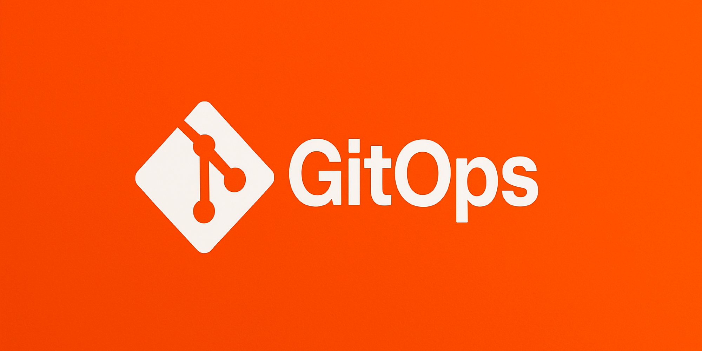

## はじめに：DX時代のインフラとアプリケーション管理の課題

デジタルトランスフォーメーション（DX）の推進において、企業はより迅速かつ安全なソフトウェアデリバリーを求められています。しかし、インフラストラクチャとアプリケーションの管理は依然として多くの組織で以下のような課題に直面しています：

- 環境間の不整合（開発・テスト・本番環境の差異）
- 構成管理の複雑さと属人化
- 変更履歴の不透明さ
- 変更適用の手動プロセスによるミス
- スケーラビリティと一貫性の確保の難しさ

これらの課題に対するソリューションとして、「GitOps」というアプローチが急速に普及しています。本記事では、GitOpsの概念、実装方法、そしてDX時代の運用自動化における役割について詳しく解説します。

## GitOpsとは何か：原則と概念

GitOpsは、2018年にWeaveWorksのAlexis Richardsonによって提唱された運用モデルで、Gitをシステム構成の「単一の信頼できる情報源（Single Source of Truth）」として活用するアプローチです。

### GitOpsの4つの基本原則

1. **宣言的アプローチ**
   - システムの望ましい状態を宣言的に記述
   - 「どのように」ではなく「何を」実現したいかに焦点

2. **バージョン管理されたイミュータブルな状態**
   - すべてのシステム構成をGitリポジトリで管理
   - 変更は新しいバージョンとして記録

3. **自動的な変更の検出と適用**
   - Gitリポジトリとシステムの実際の状態の差分を検出
   - 継続的に調整して望ましい状態に収束

4. **継続的な検証と調整**
   - システムの現在の状態を継続的に監視
   - 期待される状態との不一致を自動的に修正

### 従来のCI/CDとGitOpsの違い

従来のCI/CDパイプラインでは、コード変更のたびに以下のようなプロセスが実行されます：

1. 開発者がコードを変更
2. CIシステムがビルド・テスト
3. CIシステムが**プッシュベース**でデプロイ（CD）
4. 環境に直接変更が適用

対してGitOpsでは：

1. 開発者が望ましいシステム状態を記述したマニフェストを変更
2. CIシステムがビルド・テスト
3. マニフェストの変更をGitリポジトリにコミット
4. **プルベース**のオペレーターがGitとシステム状態の差分を検出
5. オペレーターが自動的に差分を解消するよう変更を適用

## GitOpsを支える技術スタック

GitOpsを実現するためには、以下のようなテクノロジースタックが必要です：

### 1. Kubernetes（またはその他の宣言的プラットフォーム）

GitOpsは宣言的なインフラストラクチャで最も効果を発揮します。特にKubernetesは以下の特性からGitOpsとの親和性が高いです：

- 宣言的なAPIとYAMLベースの構成
- 望ましい状態の記述とその収束メカニズム
- コントローラーパターンによる自動調整

### 2. GitOpsオペレーター

システム状態とGitリポジトリの差分を検出し、調整するためのオペレーターが必要です。代表的なツールとして：

- **Flux CD**
  - WeaveWorksによって開発された最初のGitOpsツール
  - シンプルな構成と軽量なアーキテクチャ
  - CNCF（Cloud Native Computing Foundation）のインキュベーションプロジェクト

- **Argo CD**
  - リッチなUI、マルチクラスタサポート
  - より直感的な視覚化と管理機能
  - 複雑な組織での採用が進んでいる

### 3. インフラストラクチャ・アズ・コード（IaC）ツール

環境全体を宣言的に記述するためのツール：

- **Terraform**：クラウドリソースのプロビジョニング
- **Helm**：Kubernetesアプリケーション管理
- **Kustomize**：Kubernetesマニフェストのカスタマイズ

### 4. コンテナレジストリとイメージ管理

コンテナイメージのバージョン管理と配布：

- **Harbor**：エンタープライズグレードのレジストリ
- **Docker Hub**：パブリックレジストリ
- **AWS ECR/Google GCR/Azure ACR**：クラウドプロバイダー提供のレジストリ

## GitOpsの実装パターン：実践的アプローチ

GitOpsを実際に導入するためのパターンと実装例を見ていきましょう。

### 基本的なリポジトリ構造

GitOps実践の基本は、適切なリポジトリ構造の設計です：

```
├── clusters/
│   ├── production/
│   │   ├── apps/
│   │   │   ├── frontend.yaml
│   │   │   └── backend.yaml
│   │   └── infrastructure/
│   │       ├── database.yaml
│   │       └── monitoring.yaml
│   └── staging/
│       ├── apps/
│       └── infrastructure/
├── base/
│   ├── frontend/
│   │   ├── deployment.yaml
│   │   └── service.yaml
│   └── backend/
│       ├── deployment.yaml
│       └── service.yaml
└── README.md
```

このように、ベース設定と環境ごとの具体的な設定を分離することで、再利用性と柔軟性を高めます。

### Flux CDによる実装例

Flux CDを使った基本的な実装例を見てみましょう：

```yaml
# flux-system/gotk-components.yaml (一部抜粋)
apiVersion: apps/v1
kind: Deployment
metadata:
  name: source-controller
  namespace: flux-system
spec:
  replicas: 1
  selector:
    matchLabels:
      app: source-controller
  template:
    metadata:
      labels:
        app: source-controller
    spec:
      containers:
      - name: manager
        image: fluxcd/source-controller:v0.24.4
        args:
        - --watch-all-namespaces
        - --log-level=info
        - --log-encoding=json
        - --enable-leader-election
        # ... その他の設定 ...

---
# Gitリポジトリの設定
apiVersion: source.toolkit.fluxcd.io/v1beta1
kind: GitRepository
metadata:
  name: app-manifests
  namespace: flux-system
spec:
  interval: 1m
  url: https://github.com/your-org/app-manifests
  ref:
    branch: main
  secretRef:
    name: github-credentials

---
# Kustomizationの設定
apiVersion: kustomize.toolkit.fluxcd.io/v1beta1
kind: Kustomization
metadata:
  name: apps
  namespace: flux-system
spec:
  interval: 10m
  path: "./clusters/production"
  prune: true
  sourceRef:
    kind: GitRepository
    name: app-manifests
  validation: client
```

### Argo CDによる実装例

同様の機能をArgo CDで実装する例：

```yaml
# Applicationの定義
apiVersion: argoproj.io/v1alpha1
kind: Application
metadata:
  name: production-apps
  namespace: argocd
spec:
  project: default
  source:
    repoURL: https://github.com/your-org/app-manifests
    targetRevision: HEAD
    path: clusters/production
  destination:
    server: https://kubernetes.default.svc
    namespace: production
  syncPolicy:
    automated:
      prune: true
      selfHeal: true
```

### マルチクラスタ戦略

大規模な組織では、複数のクラスタを一元管理するアプローチが重要です：

```yaml
# クラスタフリートの管理（Flux Multi-tenancy）
apiVersion: source.toolkit.fluxcd.io/v1beta1
kind: GitRepository
metadata:
  name: fleet-infra
  namespace: flux-system
spec:
  interval: 1m
  url: https://github.com/your-org/fleet-infra
  ref:
    branch: main

---
# クラスタごとの設定
apiVersion: kustomize.toolkit.fluxcd.io/v1beta1
kind: Kustomization
metadata:
  name: apps-tokyo-cluster
  namespace: flux-system
spec:
  interval: 10m
  path: "./clusters/tokyo"
  prune: true
  sourceRef:
    kind: GitRepository
    name: fleet-infra
```

## GitOpsのユースケースと成功事例

GitOpsアプローチの有効性を実証する具体的なユースケースを見ていきましょう。

### ユースケース1：マイクロサービスのデプロイ自動化

**課題**：30以上のマイクロサービスを持つEコマースサイトのデプロイプロセスが複雑で時間がかかる

**GitOpsによる解決策**：
- 各マイクロサービスのマニフェストを独立したリポジトリで管理
- カナリアデプロイメントをGitOpsで自動化
- イメージのタグ更新を自動検出して適用

**結果**：
- デプロイ時間が数時間から数分に短縮
- リリース頻度が週1回から日次に向上
- デプロイ関連インシデントが80%減少

### ユースケース2：複数環境間の一貫性確保

**課題**：開発、テスト、ステージング、本番環境間の構成の不一致によるバグ

**GitOpsによる解決策**：
- 環境ごとの差分を明示的にオーバーレイとして管理
- プロモーションプロセスをGitブランチとマージで表現
- 環境間の差異を自動的に検出するバリデーション

**結果**：
- 「開発環境では動くが本番では動かない」問題が95%減少
- 環境セットアップ時間が90%削減
- インフラの再現性と信頼性が大幅に向上

### ユースケース3：コンプライアンスと監査対応

**課題**：金融機関における厳格なコンプライアンス要件と監査証跡の確保

**GitOpsによる解決策**：
- すべてのインフラ変更をGitで追跡可能に
- 承認プロセスをプルリクエストとコードレビューで実現
- ポリシーをコードとして管理（Policy as Code）

**結果**：
- 監査対応工数が60%減少
- コンプライアンス違反が75%減少
- システム変更の透明性が大幅に向上

## GitOps導入のベストプラクティス

GitOpsを効果的に導入するためのベストプラクティスを紹介します。

### 1. リポジトリ設計戦略

**モノレポ vs マルチレポ**

- **モノレポアプローチ**：
  - すべてのマニフェストを単一のリポジトリで管理
  - 利点：一貫性の確保、変更の原子性
  - 欠点：大規模になると管理が複雑化

- **マルチレポアプローチ**：
  - アプリケーションごと、またはチームごとに分割
  - 利点：責任範囲の明確化、スケーラビリティ
  - 欠点：統合テストの複雑さ

**推奨戦略**：
組織の規模や成熟度に応じて選択。小規模チームはモノレポから始め、必要に応じて分割するのが理想的です。

```
# モノレポ例
gitops-mono-repo/
├── apps/
│   ├── team-a/
│   ├── team-b/
│   └── shared/
└── infrastructure/
    ├── production/
    └── staging/

# マルチレポ例
team-a-apps/ - チームAのアプリケーション
team-b-apps/ - チームBのアプリケーション
shared-infra/ - 共有インフラ
platform-config/ - プラットフォーム設定
```

### 2. シークレット管理

GitOpsの大きな課題の一つはシークレット管理です。以下の選択肢があります：

- **シールドシークレット**：
  - SealedSecrets、BitnamisのMozillaSOPS等のツール
  - 公開鍵で暗号化し、クラスタ内の秘密鍵でのみ復号可能

```yaml
# SealedSecrets例
apiVersion: bitnami.com/v1alpha1
kind: SealedSecret
metadata:
  name: database-credentials
  namespace: app
spec:
  encryptedData:
    username: AgBy3i4OJSWK+PiTySYZZA9rO43cGDEq...
    password: AgBy3i4OJSWK+PiTySYZZA9rO43cGDEq...
```

- **外部シークレットオペレーター**：
  - AWS Secrets Manager、HashiCorp Vault等と連携
  - 実際のシークレットは外部システムに保存

```yaml
# External Secrets例
apiVersion: external-secrets.io/v1alpha1
kind: ExternalSecret
metadata:
  name: database-credentials
spec:
  refreshInterval: 1h
  secretStoreRef:
    name: vault-backend
    kind: ClusterSecretStore
  target:
    name: database-credentials
  data:
  - secretKey: username
    remoteRef:
      key: production/database/credentials
      property: username
  - secretKey: password
    remoteRef:
      key: production/database/credentials
      property: password
```

### 3. 環境間のプロモーション戦略

コードを開発環境から本番環境に安全に移行する戦略：

- **Gitフロー戦略**：
  - 環境ごとに異なるブランチを使用
  - 例：`dev` → `staging` → `production`
  - プルリクエストとマージでプロモーション

- **環境固有の設定オーバーレイ**：
  - 基本設定と環境固有のオーバーレイを分離
  - Kustomizeや他のツールでオーバーレイを適用

```yaml
# 基本設定（base/deployment.yaml）
apiVersion: apps/v1
kind: Deployment
metadata:
  name: webapp
spec:
  replicas: 1
  template:
    spec:
      containers:
      - name: webapp
        image: webapp:latest
        resources:
          requests:
            memory: "256Mi"
            cpu: "100m"

# 本番オーバーレイ（overlays/production/kustomization.yaml）
apiVersion: kustomize.config.k8s.io/v1beta1
kind: Kustomization
resources:
- ../../base
patchesStrategicMerge:
- deployment-patch.yaml

# 本番固有の設定（overlays/production/deployment-patch.yaml）
apiVersion: apps/v1
kind: Deployment
metadata:
  name: webapp
spec:
  replicas: 5
  template:
    spec:
      containers:
      - name: webapp
        resources:
          requests:
            memory: "1Gi"
            cpu: "500m"
```

### 4. イメージ更新自動化

GitOpsにおけるコンテナイメージの更新方法：

- **自動イメージ更新**：
  - Flux Image Automation Controllersなどのツール
  - 新しいイメージタグを自動検出して適用

```yaml
# Flux Image Update Automation
apiVersion: image.toolkit.fluxcd.io/v1beta1
kind: ImageRepository
metadata:
  name: webapp
  namespace: flux-system
spec:
  image: docker.io/myorg/webapp
  interval: 1m0s

---
apiVersion: image.toolkit.fluxcd.io/v1beta1
kind: ImagePolicy
metadata:
  name: webapp
  namespace: flux-system
spec:
  imageRepositoryRef:
    name: webapp
  policy:
    semver:
      range: '>=1.0.0'

---
apiVersion: image.toolkit.fluxcd.io/v1beta1
kind: ImageUpdateAutomation
metadata:
  name: webapp-image-update
  namespace: flux-system
spec:
  interval: 1m0s
  sourceRef:
    kind: GitRepository
    name: flux-system
  git:
    checkout:
      ref:
        branch: main
    commit:
      author:
        email: fluxcdbot@users.noreply.github.com
        name: fluxcdbot
      messageTemplate: 'Update image to {{.NewTag}}'
    push:
      branch: main
  update:
    strategy: Setters
```

## GitOpsとDXの関係：変革を加速する運用モデル

GitOpsはデジタルトランスフォーメーションを以下の点で加速します：

### 1. ビジネス俊敏性の向上

- **変更サイクルの短縮**：
  - コードとしてのインフラにより、変更の適用が迅速化
  - 自動化された検証と適用で手作業を削減

- **実験文化の促進**：
  - 変更の容易さにより、新機能の試行錯誤が容易に
  - ロールバックの信頼性向上で実験のリスクを低減

### 2. チームの自律性と責任の明確化

- **DevOpsの真の実現**：
  - 開発チームがインフラとアプリケーションを一緒に管理
  - 「自分たちが作ったものは自分たちが運用する」原則の実践

- **セルフサービスインフラ**：
  - 開発チームが運用チームに依存せず環境を管理
  - 標準化されたテンプレートによる一貫性確保

### 3. 組織のスケーラビリティ向上

- **知識の民主化**：
  - インフラとデプロイの知識がコードとして共有
  - ドキュメントとコードの一致による学習曲線の緩和

- **標準化と再利用**：
  - 組織全体での設定の標準化
  - ベストプラクティスの自然な普及

### 4. 信頼性とセキュリティの強化

- **変更履歴の透明性**：
  - すべての変更がGitで追跡可能
  - 「いつ、誰が、何を、なぜ」変更したかを明確に

- **ドリフト検出と自動修復**：
  - システムの実際の状態と望ましい状態の乖離を検出
  - 不正な変更や構成ドリフトを自動的に修正

## GitOps導入のためのロードマップ

組織にGitOpsを導入するための段階的なアプローチを紹介します。

### フェーズ1：基盤整備とパイロット（1-3ヶ月）

1. **GitOpsの理解と目標設定**
   - チームのトレーニングとワークショップ
   - 具体的なメトリクスと成功基準の設定

2. **基盤技術の整備**
   - Kubernetesクラスタの設定
   - CI/CDパイプラインの整備
   - コードリポジトリの設計

3. **パイロットプロジェクトの選定と実装**
   - 小規模かつビジネス価値の高いアプリケーション
   - GitOpsツール（Flux/Argo）の導入
   - 初期の成功事例の記録と共有

### フェーズ2：組織的展開と標準化（3-6ヶ月）

1. **GitOpsプラクティスの標準化**
   - リポジトリ構造のテンプレート
   - 環境管理のベストプラクティス
   - CIとGitOpsの連携パターン

2. **主要アプリケーションへの展開**
   - 段階的なマイグレーション計画
   - 既存CI/CDパイプラインとの統合
   - チーム間のナレッジ共有

3. **モニタリングと測定の強化**
   - GitOpsメトリクスのダッシュボード
   - デプロイ頻度と安定性の測定
   - レポーティングと可視化

### フェーズ3：高度化と最適化（6ヶ月以降）

1. **高度なGitOpsパターンの導入**
   - マルチクラスタ/マルチテナント戦略
   - カナリアリリースやブルーグリーンデプロイ
   - ポリシーアズコード（OPA/Kyverno）との統合

2. **セキュリティとコンプライアンスの強化**
   - シークレット管理の高度化
   - 監査とコンプライアンスレポーティング
   - サプライチェーンセキュリティの組み込み

3. **継続的改善と文化の定着**
   - チーム間のベストプラクティス共有
   - GitOpsコミュニティの形成
   - 新たな技術やツールの評価と導入

## 導入事例：GitOpsで実現したDX成功例

### 事例1：大手Eコマース企業

**ビジネス課題**：
- 季節のキャンペーンやセールに対応するための迅速なスケーリング
- 多数のマイクロサービスの一貫したデプロイ
- デプロイ失敗によるダウンタイムの削減

**GitOps導入アプローチ**：
- Argo CDによるマルチクラスタ管理
- 環境ごとのKustomizeオーバーレイ
- カナリアデプロイメントの自動化

**成果**：
- デプロイ頻度が日次から時間単位に（400%向上）
- ダウンタイムが年間で85%減少
- インフラコスト削減（自動スケーリング最適化）で年間約2,000万円の節約

### 事例2：金融サービス企業

**ビジネス課題**：
- 厳格なコンプライアンス要件への対応
- リリースプロセスの長さ（平均4週間）
- システム変更の透明性と監査対応

**GitOps導入アプローチ**：
- Flux CDとOPA（Open Policy Agent）の統合
- プルリクエストベースの承認ワークフロー
- 自動検証と監査ログ

**成果**：
- リリースサイクルが4週間から1週間に短縮
- 監査対応工数が70%削減
- セキュリティインシデントの30%減少

### 事例3：製造業のDX変革

**ビジネス課題**：
- レガシーシステムからの段階的なモダナイゼーション
- グローバル拠点間のシステム一貫性確保
- スキル不足と知識の属人化

**GitOps導入アプローチ**：
- ハイブリッド環境（オンプレミスとクラウド）でのGitOps
- インフラのコード化による標準化
- セルフサービスプラットフォームの構築

**成果**：
- 新規環境のプロビジョニング時間が数週間から数時間に短縮
- グローバル拠点間の構成不一致が95%減少
- 新規エンジニアの立ち上げ期間が平均60%短縮

## 結論：GitOpsはDX時代の運用自動化スタンダードへ

GitOpsは単なる技術的なアプローチを超え、組織のデジタルトランスフォーメーションを加速する重要な要素です。その核心にある「コードとしてのインフラ」「宣言的設定」「自動化されたプロセス」という概念は、現代のソフトウェア開発と運用において不可欠なものになりつつあります。

GitOpsの導入により、組織は以下のような恩恵を受けることができます：

1. **変更管理の確実性と透明性**：すべての変更がバージョン管理され、追跡可能
2. **運用効率の大幅な向上**：自動化による手作業の削減と標準化
3. **ビジネス俊敏性の強化**：迅速かつ安全な変更適用による市場対応力の向上
4. **チームの協働とスキル向上**：共通言語としてのコードによるコミュニケーション改善

DX時代において、競争力を維持するためには、システムの信頼性を確保しながらも変化に迅速に対応する能力が求められます。GitOpsはまさにこのバランスを実現するための運用モデルであり、今後ますます多くの組織における標準的なアプローチとなることでしょう。

変化の激しい現代において、「コードなきインフラは幻想であり、人間による直接操作は例外であるべき」という考え方が、GitOpsを通じて現実のものとなっています。

## 参考資料

- [GitOps: What You Need to Know](https://www.weave.works/technologies/gitops/)
- [Flux CD Documentation](https://fluxcd.io/docs/)
- [Argo CD - Declarative GitOps CD for Kubernetes](https://argoproj.github.io/argo-cd/)
- [The Path to GitOps](https://www.gitops.tech/)
- [Kustomize Documentation](https://kustomize.io/)
- [CNCF GitOps Working Group](https://github.com/cncf/tag-app-delivery)
