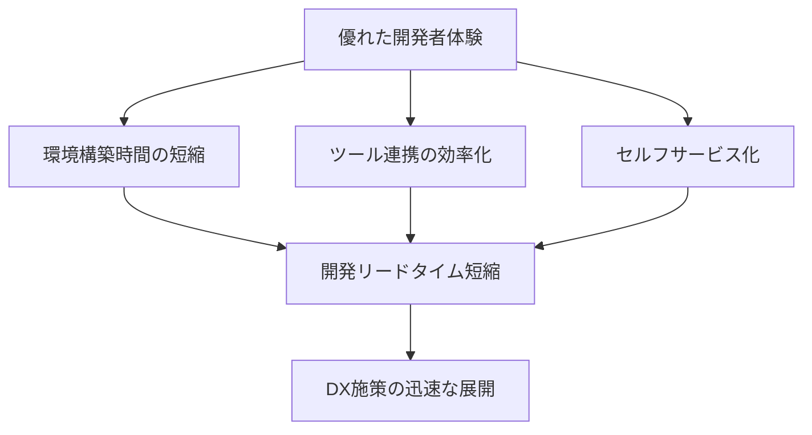
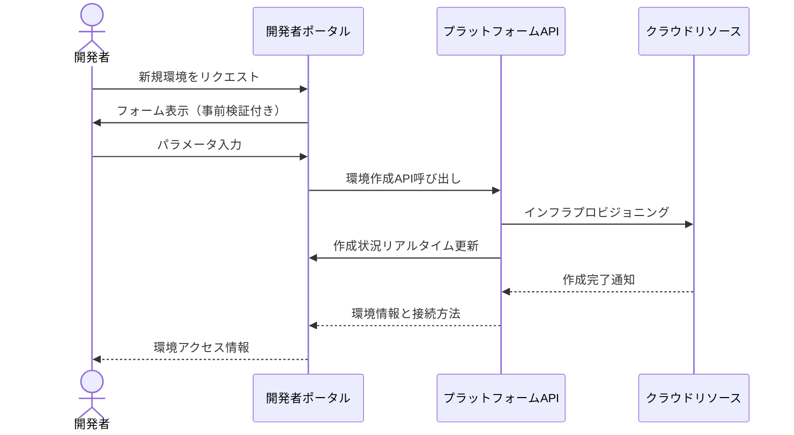
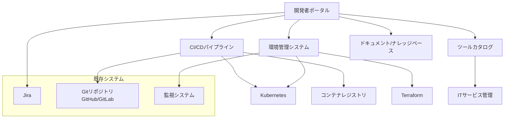

## はじめに：プラットフォームエンジニアリングの台頭

デジタルトランスフォーメーション（DX）を推進する企業にとって、ソフトウェア開発の効率と品質は競争力の源泉となっています。しかし、多くの組織では複雑な開発環境、断片化したツールチェーン、一貫性のないワークフローにより、開発者は本来の価値創出活動よりも環境構築やインフラ管理などの「摩擦」に多くの時間を費やしています。

プラットフォームエンジニアリングは、こうした課題を解決するための新たなアプローチとして注目を集めています。Gartnerの予測によれば、2026年までに80%の企業が内部開発者プラットフォームチームを設立し、セルフサービス機能を提供するとされています。

本記事では、プラットフォームエンジニアリングの本質と、それがもたらす開発者体験（Developer Experience）の向上、そしてDX推進への具体的な効果について解説します。技術的な側面だけでなく、組織変革や事業価値の観点からも、プラットフォームエンジニアリングの可能性と実践方法を探ります。

## プラットフォームエンジニアリングとは：定義と従来のDevOpsとの違い

### プラットフォームエンジニアリングの定義

プラットフォームエンジニアリングとは、開発者が直面する複雑さを抽象化・自動化し、セルフサービス機能を提供するための専門分野です。具体的には、以下の要素で構成されます：

- **内部開発者プラットフォーム（IDP）の構築**：開発者が必要とするツール、環境、サービスを統合的に提供
- **セルフサービス機能の実現**：開発者が運用チームに依頼せずに必要なリソースを調達できる仕組み
- **標準化と自動化**：一貫性のあるワークフローと環境を組織全体で実現
- **適切な抽象化**：不要な複雑さを隠蔽しつつ、必要な柔軟性は確保

プラットフォームエンジニアリングの目標は、「ゴールデンパス」と呼ばれる、最適化された開発者体験を提供することです。これにより、開発者は技術的な摩擦に悩まされることなく、ビジネス価値の創出に集中できるようになります。

### DevOpsとの違い

プラットフォームエンジニアリングは、DevOpsの進化形と捉えることができますが、いくつかの重要な違いがあります：

| 観点 | DevOps | プラットフォームエンジニアリング |
|------|--------|--------------------------------|
| 主な目的 | 開発と運用の統合、デリバリー高速化 | 開発者の生産性と体験の最適化 |
| チーム構造 | 開発者が運用スキルを習得（「T字型」スキル） | 専門プラットフォームチームがサービスを提供 |
| 自動化の範囲 | CI/CDパイプラインが中心 | 開発ライフサイクル全体をカバー |
| 提供価値 | インフラ構築・デプロイメントの自動化 | セルフサービス開発環境とツールチェーン |
| 知識要件 | 開発者にインフラ知識が必要 | 抽象化により複雑な知識を隠蔽 |

DevOpsが「開発者にもっと運用を理解させよう」というアプローチだったのに対し、プラットフォームエンジニアリングは「運用の複雑さを開発者から隠蔽し、価値創出に集中させよう」という発想に基づいています。

> 「DevOpsはみんなでインフラを学ぶことを求めましたが、プラットフォームエンジニアリングはインフラを気にせずに済む環境を提供します」
> — Team Topologies著者 Matthew Skelton

## 開発者体験（Developer Experience）の重要性

### 開発者体験とは

開発者体験（Developer Experience、略してDevX）とは、開発者がソフトウェア開発に使用するツール、プロセス、環境との相互作用から生まれる総合的な経験を指します。優れた開発者体験は以下の要素で構成されます：

- **生産性と効率**：タスク完了までの時間短縮、繰り返し作業の自動化
- **学習容易性**：新しいツールや環境の理解・習得の容易さ
- **ドキュメンテーション**：包括的で最新かつ実用的な情報へのアクセス
- **一貫性**：異なるプロジェクト間での環境・ツールの一貫性
- **フィードバックループ**：迅速なフィードバックと問題解決
- **自律性とオーナーシップ**：必要なリソースに依存せず自律的に進行できる能力

### 開発者体験がDXに与える影響

優れた開発者体験がDX（デジタルトランスフォーメーション）に与える影響は、直接的かつ多面的です：

**1. 開発速度の向上**



**2. 人材確保と定着**

開発者不足が深刻化する中、優れた開発環境は人材獲得と定着の鍵となります：
- トップクラスの開発者ほど開発体験を重視する傾向
- 開発体験が悪い企業からの転職理由として最も多く挙げられる
- 採用コスト削減と知識流出防止に貢献

**3. イノベーションの促進**

```java
// 悪い開発者体験の例
// 環境構築に一日かかるケース
developer.time.spent = {
  environmentSetup: 8h,
  toolConfiguration: 4h,
  actualDevelopment: 4h,
  innovation: 0h
}

// 優れた開発者体験の例
// プラットフォームが提供する自動化環境
developer.time.spent = {
  environmentSetup: 0.5h,
  toolConfiguration: 0.5h,
  actualDevelopment: 10h,
  innovation: 5h
}
```

開発者が環境構築やツール連携などの「雑務」から解放されることで、創造的思考や実験的な取り組みに時間を割くことができ、イノベーションが促進されます。

### 開発者体験の測定

開発者体験を改善するには、まず現状を客観的に把握する必要があります：

**主要なメトリクス**：
- **DORA指標**：デプロイ頻度、リードタイム、変更失敗率、復旧時間
- **開発者満足度調査**：NPS（Net Promoter Score）やCES（Customer Effort Score）を応用
- **開発環境待ち時間**：ビルド時間、テスト実行時間、環境プロビジョニング時間
- **ナレッジ検索時間**：情報探索に費やす時間の割合

**測定手法の例**：
```json
// 開発者体験サーベイの例（四半期ごとに実施）
{
  "questions": [
    {
      "type": "scale",
      "question": "新しいプロジェクトの開発環境をセットアップする時間に満足していますか？",
      "scale": [1, 2, 3, 4, 5],
      "benchmark": 4.0
    },
    {
      "type": "time",
      "question": "新機能の実装からデプロイまで平均どのくらいかかりますか？",
      "unit": "hours",
      "benchmark": 8
    },
    {
      "type": "nps",
      "question": "プラットフォームを同僚に勧める可能性はどのくらいですか？",
      "scale": [0, 10],
      "benchmark": 8
    }
  ]
}
```

## プラットフォームエンジニアリングの主要コンポーネント

効果的なプラットフォームエンジニアリングを実現するためには、以下の主要コンポーネントを整備する必要があります。

### 1. 内部開発者ポータル

内部開発者ポータルは、開発者にとっての「ワンストップショップ」として機能します：

**主な機能**：
- プロジェクトの作成と管理
- サービスカタログ（利用可能なリソースの一覧）
- ドキュメントとナレッジベース
- チーム・環境・リソースの可視化
- セルフサービス機能へのアクセス

**実装例**：
```yaml
# Backstage（オープンソース開発者ポータル）の設定例
apiVersion: backstage.io/v1alpha1
kind: Component
metadata:
  name: payment-service
  description: 決済処理サービス
  annotations:
    github.com/project-slug: example-org/payment-service
    backstage.io/techdocs-ref: dir:.
    jenkins.io/job-full-name: payment-service/main
spec:
  type: service
  lifecycle: production
  owner: team-payments
  system: billing-system
  dependsOn:
    - component:user-service
    - component:notification-service
  providesApis:
    - payment-api
```

### 2. 統合CI/CDパイプライン

開発者体験を向上させるCI/CDパイプラインは、以下の特徴を持ちます：

**主な特徴**：
- 言語・フレームワーク固有の最適化
- 標準化されたセキュリティチェック
- 統一されたデプロイメント手順
- インフラのコード化（IaC）との統合
- フィードバックの可視化

**実装例**：
```yaml
# 標準化されたGitHub Actionsワークフローの例
name: 標準Javaアプリケーションパイプライン
on:
  push:
    branches: [ main ]
  pull_request:
    branches: [ main ]

jobs:
  build:
    runs-on: ubuntu-latest
    steps:
    - uses: actions/checkout@v3
    - name: JDKセットアップ
      uses: actions/setup-java@v3
      with:
        java-version: '17'
        distribution: 'temurin'
        
    - name: 依存関係キャッシュ
      uses: actions/cache@v3
      with:
        path: ~/.m2
        key: ${{ runner.os }}-m2-${{ hashFiles('**/pom.xml') }}
        
    - name: ビルドとテスト
      run: ./mvnw verify
      
    - name: コードカバレッジ
      run: ./mvnw jacoco:report
      
    - name: 静的解析
      run: ./mvnw sonar:sonar

    - name: イメージビルド
      run: |
        docker build -t ${{ secrets.DOCKER_REGISTRY }}/${{ github.repository }}:${{ github.sha }} .
        docker push ${{ secrets.DOCKER_REGISTRY }}/${{ github.repository }}:${{ github.sha }}

    - name: デプロイメントマニフェスト更新
      uses: our-internal/deployment-updater@v1
      with:
        environment: dev
        image: ${{ secrets.DOCKER_REGISTRY }}/${{ github.repository }}:${{ github.sha }}
```

### 3. 環境管理システム

開発からステージング、本番まで、一貫した環境管理を提供します：

**主な特徴**：
- オンデマンド環境プロビジョニング
- 環境間の一貫性確保
- コンフィグレーション管理
- 複数環境の並行運用
- 環境の使用状況モニタリング

**実装例**：
```terraform
# 環境テンプレートのTerraformモジュール例
module "app_environment" {
  source = "./modules/standard-environment"

  name           = var.environment_name
  project_id     = var.project_id
  region         = "asia-northeast1"
  vpc_network    = module.network.vpc_self_link
  db_tier        = var.environment_type == "production" ? "db-custom-8-32768" : "db-custom-2-8192"
  instance_count = var.environment_type == "production" ? 3 : 1
  
  backup_enabled = var.environment_type == "production" ? true : false
  logging_level  = var.environment_type == "production" ? "INFO" : "DEBUG"
  
  allowed_ips    = var.environment_type == "production" ? ["0.0.0.0/0"] : ["社内IPレンジ"]
  
  labels = {
    environment = var.environment_type
    team        = var.team_name
    cost_center = var.cost_center
  }
}
```

### 4. セルフサービスツールカタログ

開発者が必要なツールやサービスを自分で選択・プロビジョニングできる仕組みです：

**主な機能**：
- 承認済みツールとサービスのカタログ
- ワンクリックプロビジョニング
- ガバナンスとポリシー適用
- 使用状況のトラッキング
- コスト管理

**カタログの例**：
```json
// ツールカタログのJSONスキーマ例
{
  "categories": [
    {
      "name": "データベース",
      "tools": [
        {
          "id": "postgres",
          "name": "PostgreSQL",
          "description": "リレーショナルデータベース",
          "versions": ["13", "14", "15"],
          "tiers": ["開発用", "テスト用", "本番用"],
          "provisioningTime": "5分",
          "approvalRequired": false,
          "costEstimate": {
            "dev": "無料（社内共有インスタンス）",
            "test": "1,000円/月",
            "prod": "10,000円/月〜"
          }
        },
        {
          "id": "mongodb",
          "name": "MongoDB",
          "description": "ドキュメント指向データベース",
          "versions": ["5.0", "6.0"],
          "tiers": ["開発用", "テスト用", "本番用"],
          "provisioningTime": "5分",
          "approvalRequired": false,
          "costEstimate": {
            "dev": "無料（社内共有インスタンス）",
            "test": "2,000円/月",
            "prod": "15,000円/月〜"
          }
        }
      ]
    },
    {
      "name": "監視ツール",
      "tools": [
        {
          "id": "prometheus",
          "name": "Prometheus",
          "description": "メトリクス監視ツール",
          "versions": ["2.40"],
          "provisioningTime": "10分",
          "approvalRequired": false
        }
      ]
    }
  ]
}
```

### 5. 標準化された開発環境

開発環境の標準化により、「自分のPCでは動くのに」問題を解消します：

**主な特徴**：
- コンテナ化開発環境
- IDE標準設定の提供
- リモート開発環境オプション
- コード品質・スタイルの標準適用
- 依存関係の一元管理

**実装例**：
```dockerfile
# 標準化された開発環境のDockerfile例
FROM mcr.microsoft.com/vscode/devcontainers/java:17

# 標準ツールのインストール
RUN apt-get update && export DEBIAN_FRONTEND=noninteractive \
    && apt-get -y install --no-install-recommends \
    curl jq git vim unzip \
    && apt-get clean -y

# Mavenセットアップ
COPY settings.xml /home/vscode/.m2/settings.xml

# 開発ツールのインストール
RUN curl -fsSL https://deb.nodesource.com/setup_18.x | bash - \
    && apt-get -y install nodejs \
    && npm install -g npm@latest

# プロジェクト固有の依存関係プリインストール
WORKDIR /tmp/dependencies
COPY pom.xml ./
RUN mvn dependency:go-offline

# 開発環境変数
ENV JAVA_TOOL_OPTIONS="-Xmx2g -XX:+UseG1GC"
ENV MAVEN_CONFIG="/home/vscode/.m2"

# 標準エイリアスとツール設定
COPY .devcontainer/aliases.sh /home/vscode/.aliases
RUN echo "source ~/.aliases" >> /home/vscode/.bashrc
```

### 6. 知識管理システム

プラットフォームの効果的な利用を促進するナレッジベースです：

**主な特徴**：
- 自動生成ドキュメント
- コードと同期したAPI仕様
- インタラクティブなチュートリアル
- Q&Aプラットフォーム統合
- アーキテクチャ可視化

**実装例**：
```yaml
# TechDocsの設定例（Backstage内でのドキュメント管理）
apiVersion: backstage.io/v1alpha1
kind: Component
metadata:
  name: payment-service
  annotations:
    backstage.io/techdocs-ref: dir:.
spec:
  type: service
  lifecycle: production
  owner: team-payments
---
# mkdocs.yml（ドキュメント生成設定）
site_name: 'Payment Service'
nav:
  - Home: index.md
  - 'API仕様': api.md
  - 'アーキテクチャ': architecture.md
  - 'ユーザーガイド':
    - '認証方法': guides/authentication.md
    - 'トランザクション処理': guides/transactions.md
  - '運用ガイド':
    - 'モニタリング': operations/monitoring.md
    - 'バックアップ': operations/backup.md
plugins:
  - techdocs-core
  - mermaid-diagrams
```

### 7. フィードバックループメカニズム

開発者の声を継続的に収集し、プラットフォームを改善する仕組みです：

**主な特徴**：
- 使用統計と分析
- 定期的な満足度調査
- 機能リクエスト管理
- A/Bテスト機能
- 開発者コミュニティ

**実装例**：
```python
# プラットフォーム使用分析のPythonコード例
import pandas as pd
import matplotlib.pyplot as plt
from datetime import datetime, timedelta

# プラットフォーム使用ログの分析
def analyze_platform_usage(days=30):
    # ログデータ取得（実際は通常、データベースやログ分析ツールから取得）
    logs_df = get_platform_logs(days)
    
    # 日次アクティブユーザー
    dau = logs_df.groupby(pd.Grouper(key='timestamp', freq='D'))['user_id'].nunique()
    
    # 機能別使用頻度
    feature_usage = logs_df['feature'].value_counts()
    
    # エラー頻度
    errors = logs_df[logs_df['status'] == 'error'].groupby('error_type').size()
    
    # 平均タスク完了時間
    task_times = logs_df.groupby('task_type')['duration'].mean()
    
    # レポート生成
    fig, axs = plt.subplots(2, 2, figsize=(15, 10))
    dau.plot(ax=axs[0, 0], title='日次アクティブユーザー')
    feature_usage.head(10).plot.bar(ax=axs[0, 1], title='トップ10機能')
    errors.head(10).plot.bar(ax=axs[1, 0], title='エラー頻度')
    task_times.head(10).plot.bar(ax=axs[1, 1], title='タスク完了時間(秒)')
    
    plt.tight_layout()
    plt.savefig('platform_usage_report.png')
    
    # 推奨改善点の抽出
    improvements = []
    if errors.sum() > 100:
        improvements.append(f"最も多いエラー '{errors.index[0]}' の解決を優先")
    
    slow_tasks = task_times[task_times > task_times.mean() * 1.5]
    if not slow_tasks.empty:
        improvements.append(f"遅いタスク '{slow_tasks.index[0]}' のパフォーマンス改善")
    
    unused_features = set(feature_usage.index[feature_usage < 10])
    if unused_features:
        improvements.append(f"使用頻度の低い機能の見直し: {', '.join(list(unused_features)[:3])}")
    
    return {
        'daily_active_users': dau.mean(),
        'top_feature': feature_usage.index[0],
        'error_rate': len(logs_df[logs_df['status'] == 'error']) / len(logs_df),
        'recommended_improvements': improvements
    }
```

これらの主要コンポーネントを適切に組み合わせることで、開発者にとって利便性が高く、生産性を最大化するプラットフォームを構築することができます。次のセクションでは、効果的なプラットフォーム設計の原則について詳しく見ていきます。

## 効果的なプラットフォーム設計の原則

効果的なプラットフォームを設計するには、以下の原則を念頭に置く必要があります。

### 1. 開発者中心設計

プラットフォームエンジニアリングの最も重要な原則は、常に開発者を中心に考えることです：

- **ユーザーリサーチ**：開発者の実際のワークフローと課題を深く理解する
- **継続的フィードバック**：プラットフォームの改善に開発者の声を反映させる
- **使いやすさの優先**：複雑な技術よりも使いやすさを重視する

```
「優れたプラットフォームの指標は、使用マニュアルの厚さではなく、利用者の笑顔の数である」
```

### 2. 段階的な抽象化

効果的な抽象化は、複雑さと柔軟性のバランスをとる必要があります：

- **階層的な抽象化**：初心者には単純なインターフェース、上級者には詳細な制御を提供
- **エスケープハッチ**：必要に応じて抽象化をバイパスできる仕組み
- **合理的なデフォルト値**：大多数のユースケースをカバーするデフォルト設定

**抽象化レベルの例**：

```yaml
# 抽象化レベル1（シンプル）：ワンクリックデプロイ
apiVersion: platform.dx-media.example/v1
kind: QuickDeploy
metadata:
  name: my-web-app
spec:
  sourceRepo: https://github.com/org/my-app
  environment: production

# 抽象化レベル2（中間）：基本的なカスタマイズ
apiVersion: platform.dx-media.example/v1
kind: AppDeployment
metadata:
  name: my-web-app
spec:
  sourceRepo: https://github.com/org/my-app
  environment: production
  resources:
    cpu: 2
    memory: 4Gi
  replicas: 3
  autoscaling:
    enabled: true
    maxReplicas: 10

# 抽象化レベル3（詳細）：完全なカスタマイズ
# Kubernetesマニフェストやテラフォームコードを直接編集
```

### 3. セルフサービスの徹底

セルフサービスは、プラットフォームエンジニアリングの中核的な価値です：

- **ノーチケット原則**：運用チームへのチケット発行なしで実行できるタスクを最大化
- **即時プロビジョニング**：リソース申請から取得までの時間を最小化
- **ガイド付き自己修復**：問題発生時に開発者自身が解決できるガイダンスを提供

**セルフサービスの導入フロー例**：



### 4. ゴールデンパスの構築

「ゴールデンパス」とは、組織が推奨する標準的な開発・デプロイフローのことです：

- **摩擦のない体験**：標準パスに従うと最も簡単に進められる設計
- **自動化と標準化**：ベストプラクティスを自動的に適用
- **カスタマイズの余地**：標準から外れる必要がある場合の選択肢も提供

**ゴールデンパスの例**：

```
【新規マイクロサービス開発のゴールデンパス】

1. 開発者ポータルから「新規サービス作成」ボタンをクリック
2. テンプレート選択（Spring Boot, Node.js, Goなど）
3. 基本情報入力（名前、チーム、依存サービスなど）
4. 自動生成されたボイラープレートコードをクローン
5. ローカル開発環境をワンコマンドで起動
6. コードをプッシュするとCI/CDパイプラインが自動実行
7. プルリクエストをマージすると開発環境に自動デプロイ
8. 開発者ポータルからステージング・本番環境へのプロモーション

→ 各ステップにおいて、セキュリティ、可観測性、パフォーマンスのベストプラクティスが自動適用される
```

### 5. 内部製品としての設計

プラットフォームは「内部製品」であり、外部向け製品と同じ考え方で設計する必要があります：

- **明確な価値提案**：プラットフォームが解決する問題と提供する価値を明示
- **継続的な改善**：ユーザーフィードバックに基づく定期的な機能追加と改善
- **プロモーションと教育**：内部マーケティングと教育資料の提供

**内部製品ロードマップの例**：

```markdown
# プラットフォームロードマップ 2024年Q1-Q4

## Q1: 基盤強化
- 開発者ポータルv1.0リリース
- 標準CI/CDパイプラインの整備
- 基本的なセルフサービス機能の提供

## Q2: 開発者体験向上
- ローカル開発環境の標準化と自動化
- エフェメラル環境のオンデマンド作成
- フィードバックシステムの導入

## Q3: 高度な機能
- サービスメッシュ統合
- 高度なモニタリングとアラート
- コスト最適化ダッシュボード

## Q4: エコシステム拡大
- サードパーティツール統合API
- 組織全体へのロールアウト完了
- プラットフォーム使用状況分析
```

## 成功事例と導入効果の測定

### 先進企業の成功事例

プラットフォームエンジニアリングの導入によって大きな効果を得ている企業の事例を見てみましょう。

#### 1. メルカリ：開発者体験向上による生産性革命

メルカリでは、独自の内部開発者プラットフォーム「Mercari Microservices Platform (MMP)」を構築し、以下のような成果を挙げています：

- **環境構築時間の短縮**：新規サービス構築が数日から15分に短縮
- **開発者満足度向上**：内部NPS（推奨度）が40ポイント向上
- **デプロイ頻度の増加**：一日あたりのデプロイ回数が5倍に増加

> 「プラットフォームチームの設立によって、各チームがインフラについて悩む必要がなくなり、ビジネス価値の創出に集中できるようになりました」
> — メルカリプラットフォームチーム

#### 2. ヤフージャパン：全社的なDXの加速

ヤフージャパンでは、複数の開発体験向上施策を実施し、以下の効果を得ています：

- **デプロイリードタイムの短縮**：平均2日から2時間へ92%削減
- **運用負荷の軽減**：運用チケット数が年間5000件から500件に削減
- **開発チームの自律性向上**：セルフサービス率が30%から95%に向上

#### 3. 楽天：グローバル開発の効率化

複数の国と地域にまたがる開発チームを抱える楽天では、プラットフォームエンジニアリングによって：

- **開発環境の統一**：10種類の異なる環境から単一の標準環境に集約
- **コラボレーションの強化**：チーム間のコード共有と再利用が35%向上
- **トレーニング時間の短縮**：新入社員の生産性到達が3ヶ月から1ヶ月に短縮

### 成功の測定：重要なメトリクス

プラットフォームエンジニアリングの成功を測定するための主要なメトリクスには以下のものがあります：

#### 1. 開発者生産性メトリクス

| メトリクス | 説明 | 目標値 |
|---------|------|-------|
| 環境構築リードタイム | 新規開発環境のセットアップにかかる時間 | < 30分 |
| コードからデプロイまでの時間 | コード変更からデプロイ完了までの時間 | < 1時間 |
| デプロイ頻度 | 1チームあたりの週間デプロイ回数 | > 10回/週 |
| 運用チケット数 | 運用チームへの依頼チケット数 | 年間50%削減 |

#### 2. 開発者満足度メトリクス

- **プラットフォームNPS**：「このプラットフォームを同僚に勧めますか？」（目標: +50以上）
- **Developer Experience Index**：開発体験に関する複合指標（目標: 80/100以上）
- **トレーニング効率**：新機能習得に必要な時間（目標: 50%削減）

#### 3. ビジネスインパクトメトリクス

- **タイムトゥマーケット**：アイデアから本番リリースまでの時間（目標: 30%削減）
- **イノベーション時間比率**：革新的な取り組みに費やせる時間の割合（目標: 20%以上）
- **エンジニア定着率**：エンジニアの年間離職率（目標: 業界平均-5%）

#### 測定ダッシュボードの例

```javascript
// プラットフォーム効果測定ダッシュボードのデータモデル例
const dashboardData = {
  deploymentMetrics: {
    deploymentsPerDay: {
      before: 5.2,
      after: 27.8,
      improvement: "+434%"
    },
    deploymentLeadTime: {
      before: "8時間12分",
      after: "42分",
      improvement: "-91%"
    },
    deploymentSuccess: {
      before: "78%",
      after: "99.2%",
      improvement: "+27%"
    }
  },
  developerExperience: {
    platformNPS: {
      current: 62,
      trend: "+8 (過去3ヶ月)",
      target: 70
    },
    onboardingTime: {
      before: "4.5日",
      after: "0.5日",
      improvement: "-89%"
    },
    selfServiceRate: {
      before: "35%",
      after: "92%",
      improvement: "+163%"
    }
  },
  businessImpact: {
    timeToMarket: {
      before: "45日",
      after: "12日",
      improvement: "-73%"
    },
    developerRetention: {
      before: "82%",
      after: "94%",
      improvement: "+15%"
    },
    costSavings: {
      annual: "1.2億円",
      breakdown: {
        infrastructureCosts: "3500万円",
        operationalCosts: "5500万円",
        opportunityCosts: "3000万円"
      }
    }
  }
};
```

## プラットフォームエンジニアリングの実装ステップ

プラットフォームエンジニアリングを組織に導入するためのステップバイステップのアプローチを紹介します。

### ステップ1: 現状分析と戦略策定

**アクション**:
- 開発者へのインタビューと調査を実施
- 現在のワークフローと痛点を特定
- 優先順位付けされた改善リストを作成
- 明確な目標と成功指標の設定

**実施例**:
```
【開発者インタビューガイド】

1. 現在の開発サイクルで最も時間がかかるタスクは何ですか？
2. 理想的な開発環境があれば、どのような機能が欲しいですか？
3. 繰り返し行っている手作業のタスクはありますか？
4. 現在のツールチェーンで最も不満な点は何ですか？
5. 他社や過去の勤務先で「これは良かった」と思う開発体験はありますか？

※各チームから最低3名、合計20名以上にインタビューを実施
```

### ステップ2: プラットフォームチームの編成

**アクション**:
- 適切なスキルセットを持つメンバーでチームを編成
- チームの責任範囲と権限を明確に定義
- 開発チームとの協力モデルを確立
- 内部製品としてのマインドセットを醸成

**チーム構成例**:
```
【プラットフォームチーム構成】

- プラットフォームリード (1名)
  └ 全体戦略とロードマップの責任者

- 開発者体験専門家 (1-2名)
  └ ユーザーリサーチと使いやすさの向上

- インフラストラクチャエンジニア (2-3名)
  └ クラウド、コンテナ、CI/CDパイプラインの設計

- ツール開発エンジニア (2-3名)
  └ 開発者ポータルや自動化ツールの開発

- セキュリティ専門家 (1名)
  └ セキュリティベストプラクティスの組み込み

- ドキュメントとエバンジェリスト (1名)
  └ 教育資料作成と社内啓蒙活動
```

### ステップ3: MVPの構築と早期価値の実証

**アクション**:
- 最大の痛点に対応する最小機能製品(MVP)を設計
- 限定的なユーザーグループでパイロット実施
- フィードバックの収集と迅速な改善
- 初期成功を文書化し、組織内で共有

**MVPの例**:
```bash
# 開発環境セットアップスクリプトの例（複雑な手順を自動化）
#!/bin/bash
set -e

# パラメータ
PROJECT_NAME=$1
TEMPLATE=$2
TEAM=$3

echo "🚀 $PROJECT_NAME プロジェクトのセットアップを開始します..."

# 1. リポジトリ作成
echo "📁 テンプレート $TEMPLATE からリポジトリを作成しています..."
repo_url=$(create_repository --name $PROJECT_NAME --template $TEMPLATE --team $TEAM)
git clone $repo_url
cd $PROJECT_NAME

# 2. 依存関係のインストール
echo "📦 依存関係をインストールしています..."
if [ -f "package.json" ]; then
  npm install
elif [ -f "pom.xml" ]; then
  ./mvnw dependency:resolve
fi

# 3. ローカル開発環境のセットアップ
echo "🛠️ 開発環境を準備しています..."
docker-compose up -d

# 4. CI/CDパイプラインの設定
echo "🔄 CI/CDパイプラインを設定しています..."
setup_pipeline --project $PROJECT_NAME --team $TEAM

# 5. 開発者ポータルへの登録
echo "📊 開発者ポータルに登録しています..."
register_in_portal --project $PROJECT_NAME --repo $repo_url --team $TEAM

echo "✅ セットアップ完了！開発を始めることができます"
echo "📌 開発者ポータル: https://dev-portal.dx-media.example/projects/$PROJECT_NAME"
```

### ステップ4: プラットフォームの拡張と統合

**アクション**:
- 主要コンポーネントの段階的な開発と統合
- 組織全体のツールチェーンとの連携
- ガバナンス要件との調和
- プラットフォームの使用方法に関する教育実施

**統合アーキテクチャの例**:


### ステップ5: 拡張と継続的改善

**アクション**:
- 使用データと開発者フィードバックの分析
- 定期的な機能強化とバグ修正の実施
- プラットフォームの利用拡大と成功事例の展開
- コミュニティとプラットフォーム擁護者の育成

**継続的改善サイクルの例**:
```yaml
# プラットフォーム改善サイクル（2週間スプリント）
改善サイクル:
  - フェーズ: "データ収集"
    活動:
      - 使用状況メトリクスの分析
      - ユーザーインタビュー（毎スプリント3名）
      - サポートチケットの傾向分析
      - 自動フィードバックの集計
  
  - フェーズ: "計画と優先順位付け"
    活動:
      - 課題の影響度とユーザー数に基づく優先順位付け
      - ロードマップの更新
      - 次スプリントの作業項目決定
  
  - フェーズ: "実装"
    活動:
      - 優先度の高い機能改善とバグ修正
      - ドキュメントの更新
      - 変更のテスト
  
  - フェーズ: "リリースと教育"
    活動:
      - 段階的なロールアウト
      - リリースノートの作成と配布
      - 必要に応じてハンズオントレーニングの実施
  
  - フェーズ: "結果測定"
    活動:
      - 変更前後のメトリクス比較
      - ユーザー満足度の追跡
      - 次サイクルへのフィードバック
```

## 課題と対応策

プラットフォームエンジニアリングの導入には、いくつかの一般的な課題があります。以下に主な課題と効果的な対応策を示します。

### 1. 組織文化と変化への抵抗

**課題**:
- 従来の作業方法への執着
- 「自分たちで構築」するマインドセット
- 標準化への反発

**対応策**:
- 成功事例と具体的なメリットの共有
- 段階的な導入と適切な移行期間の設定
- エグゼクティブスポンサーの確保
- プラットフォーム擁護者プログラムの実施

**導入戦略例**:
```
【プラットフォーム擁護者プログラム】

1. 各チームから影響力のあるエンジニアを「プラットフォーム擁護者」として任命
2. 擁護者に対する特別なトレーニングと早期アクセス権の提供
3. 定期的な擁護者ミーティングでフィードバックを収集
4. 擁護者がチーム内での導入を支援し、疑問に回答
5. 擁護者の貢献を表彰し、キャリアパスに組み込む
```

### 2. 柔軟性とガバナンスのバランス

**課題**:
- 過度に制限的なプラットフォームはイノベーションを阻害
- ガバナンス不足はセキュリティとコンプライアンスリスクを生む
- チームごとに異なる要件への対応

**対応策**:
- 段階的な制御レベルの提供
- 制約よりもガイドラインと推奨事項を重視
- 例外処理プロセスの確立
- セキュリティとコンプライアンスをデフォルトで組み込む

**実装例**:
```typescript
// ポリシーエンフォースメントの例（柔軟性と制御のバランス）
interface PolicyEnforcement {
  level: 'block' | 'warn' | 'log';
  message: string;
  documentation: string;
  exceptionProcess?: string;
}

const securityPolicies = {
  'open-egress-ports': {
    level: 'block',
    message: '無制限の外向き通信は許可されていません',
    documentation: 'https://internal-docs/security/network-policies',
    exceptionProcess: 'セキュリティチームにレビューを依頼してください'
  },
  'latest-image-tags': {
    level: 'warn',
    message: 'コンテナイメージには固定バージョンタグを使用してください',
    documentation: 'https://internal-docs/best-practices/containers'
  },
  'resource-limits': {
    level: 'log',
    message: 'リソース制限が設定されていません',
    documentation: 'https://internal-docs/best-practices/resource-management'
  }
};

// ポリシーチェックの実装
function checkPolicies(resource: any): PolicyViolation[] {
  // 実装省略
}
```

### 3. スキルとリソースの制約

**課題**:
- 専門知識を持つ人材の不足
- プラットフォーム開発とサポートに必要なリソースの確保
- 既存業務との並行実施の難しさ

**対応策**:
- 段階的なアプローチでリソース要件を分散
- 外部コンサルタントと専門知識の活用
- 自動化によるサポート負荷の軽減
- コミュニティと外部の成功事例からの学習

**リソース計画の例**:
```
【フェーズ別リソース計画】

フェーズ1: 基盤構築（3-6ヶ月）
- フルタイム: 2-3名（プラットフォームリード、インフラエンジニア）
- パートタイム: 1-2名（開発者体験専門家、セキュリティ専門家）
- 外部支援: クラウドネイティブアーキテクチャコンサルタント（必要に応じて）

フェーズ2: 初期展開（3-6ヶ月）
- フルタイム: 3-5名（チーム拡大、ツール開発エンジニア追加）
- パートタイム: 2-3名（各部門からの代表者）
- 外部支援: 開発者体験デザインコンサルタント（短期）

フェーズ3: 組織全体展開（6-12ヶ月）
- フルタイム: 4-8名（機能拡張とサポート体制の強化）
- パートタイム: プラットフォーム擁護者（各チーム1名）
- 外部支援: 必要に応じて特定領域の専門家
```

### 4. ROIの実証と長期的サポート

**課題**:
- プラットフォーム投資の価値を経営層に示す難しさ
- 短期的なプロジェクト納期と長期的な改善のバランス
- 初期投資と長期的な価値創出のギャップ

**対応策**:
- 明確なメトリクスと測定方法の確立
- 早期の「クイックウィン」を特定して実装
- 定期的なROIレポートの作成と共有
- ストーリーテリングと成功事例の可視化

**ROI計算例**:
```javascript
// プラットフォームROI計算モデル

// コスト要素
const costs = {
  development: {
    year1: 5000, // 人時（時間）
    year2: 3000,
    year3: 2500
  },
  infrastructure: {
    year1: 1200, // 万円
    year2: 1500,
    year3: 1800
  },
  training: {
    year1: 800, // 人時（時間）
    year2: 400,
    year3: 300
  }
};

// 効果要素
const benefits = {
  developerProductivity: {
    improvementPercentage: 0.20, // 20%改善
    developersAffected: 50, // 影響を受ける開発者数
    hoursPerDeveloperPerYear: 1920, // 年間労働時間
    hourlyRate: 5000 // 1時間あたりのコスト（円）
  },
  timeToMarket: {
    projectsPerYear: 24, // 年間プロジェクト数
    weeksSaved: 3, // 1プロジェクトあたりの短縮週数
    valuePerWeek: 200 // 1週間あたりの価値（万円）
  },
  operationalEfficiency: {
    incidentsReduction: 0.30, // インシデント30%削減
    annualIncidents: 120, // 年間インシデント数
    costPerIncident: 50 // 1インシデントあたりのコスト（万円）
  },
  retention: {
    turnoverReduction: 0.05, // 離職率5%削減
    developersTotal: 50, // 総開発者数
    costPerReplacement: 1000 // 1人あたりの採用コスト（万円）
  }
};

// 3年間のROI計算
function calculateROI() {
  // コスト計算
  const totalCosts = {
    year1: costs.development.year1 * (5000/60) + costs.infrastructure.year1 + costs.training.year1 * (5000/60),
    year2: costs.development.year2 * (5000/60) + costs.infrastructure.year2 + costs.training.year2 * (5000/60),
    year3: costs.development.year3 * (5000/60) + costs.infrastructure.year3 + costs.training.year3 * (5000/60)
  };
  
  // 効果計算
  const devProductivitySavings = benefits.developerProductivity.improvementPercentage * 
                                benefits.developerProductivity.developersAffected *
                                benefits.developerProductivity.hoursPerDeveloperPerYear *
                                benefits.developerProductivity.hourlyRate / 10000; // 万円に変換
  
  const timeToMarketValue = benefits.timeToMarket.projectsPerYear *
                           benefits.timeToMarket.weeksSaved *
                           benefits.timeToMarket.valuePerWeek;
  
  const operationalSavings = benefits.operationalEfficiency.incidentsReduction *
                            benefits.operationalEfficiency.annualIncidents *
                            benefits.operationalEfficiency.costPerIncident;
  
  const retentionSavings = benefits.retention.turnoverReduction *
                          benefits.retention.developersTotal *
                          benefits.retention.costPerReplacement;
  
  const totalBenefits = {
    year1: (devProductivitySavings + timeToMarketValue + operationalSavings + retentionSavings) * 0.5, // 初年度は50%の効果
    year2: (devProductivitySavings + timeToMarketValue + operationalSavings + retentionSavings) * 0.8, // 2年目は80%の効果
    year3: (devProductivitySavings + timeToMarketValue + operationalSavings + retentionSavings) // 3年目は100%の効果
  };
  
  // ROI計算
  const cumulativeCosts = totalCosts.year1 + totalCosts.year2 + totalCosts.year3;
  const cumulativeBenefits = totalBenefits.year1 + totalBenefits.year2 + totalBenefits.year3;
  const netBenefit = cumulativeBenefits - cumulativeCosts;
  const roi = (netBenefit / cumulativeCosts) * 100;
  
  return {
    costs: totalCosts,
    benefits: totalBenefits,
    cumulativeCosts,
    cumulativeBenefits,
    netBenefit,
    roi: `${roi.toFixed(1)}%`,
    paybackPeriod: calculatePaybackPeriod(totalCosts, totalBenefits)
  };
}

// 投資回収期間の計算
function calculatePaybackPeriod(costs, benefits) {
  // 実装省略
}
```

## まとめ：DX時代におけるプラットフォームエンジニアリングの価値

プラットフォームエンジニアリングは、単なる技術的なアプローチを超えて、組織の開発文化とDX推進能力を根本から変革する戦略です。本記事のポイントを振り返ってみましょう：

1. **開発者体験が競争力の源泉に**：優れた開発者体験は、開発速度、人材獲得・定着、イノベーションを促進し、DX時代の競争優位性を生み出します。

2. **プラットフォームは内部製品**：プラットフォームチームは「内部顧客」である開発者のために価値を提供する製品チームであり、同じ製品開発の原則が適用されます。

3. **適切なバランスの重要性**：抽象化と柔軟性、標準化と自由度、セルフサービスとガバナンスのバランスが、プラットフォームの成功を左右します。

4. **段階的アプローチの有効性**：大規模な一括導入よりも、痛点に焦点を当てた段階的な改善の積み重ねが、持続可能な成功につながります。

5. **文化と技術の両輪**：プラットフォームエンジニアリングの成功には、技術的な優秀さだけでなく、組織文化の変革と継続的な価値実証が不可欠です。

デジタルトランスフォーメーションを本気で推進する企業にとって、プラットフォームエンジニアリングとそれがもたらす開発者体験の向上は、もはや「あると良い」オプションではなく、競争力維持のための「必須」要素となっています。開発者が複雑なインフラや運用の詳細に煩わされることなく、イノベーションと価値創出に集中できる環境を整えることで、企業はDXの波に乗り、変化の激しいデジタル時代で成功を収めることができるでしょう。

> 「最高のツールは、存在を忘れられるほどシームレスに機能するものである」
