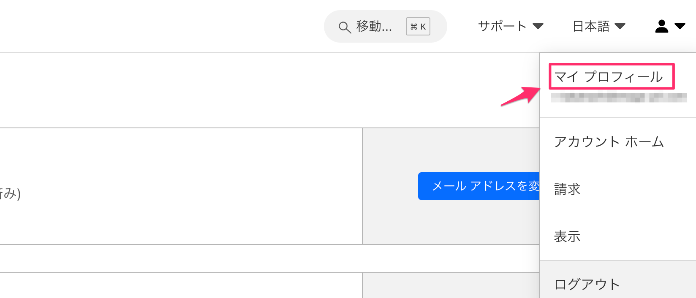
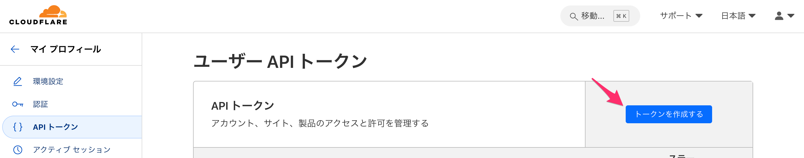
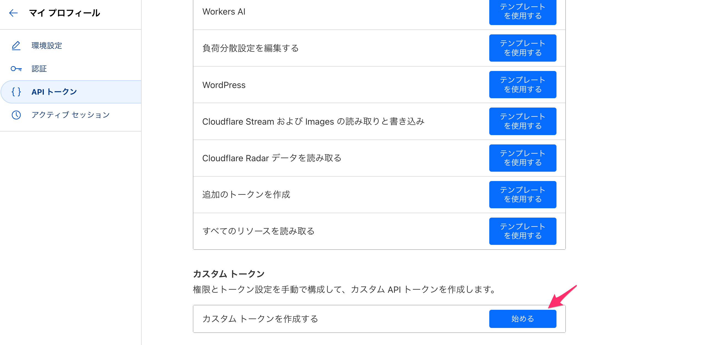
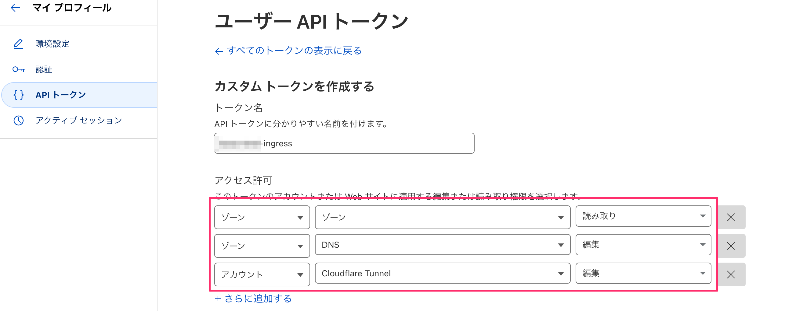
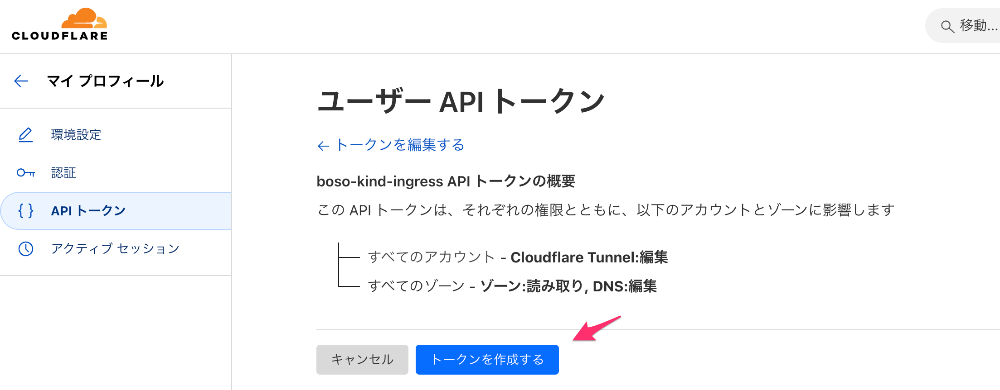
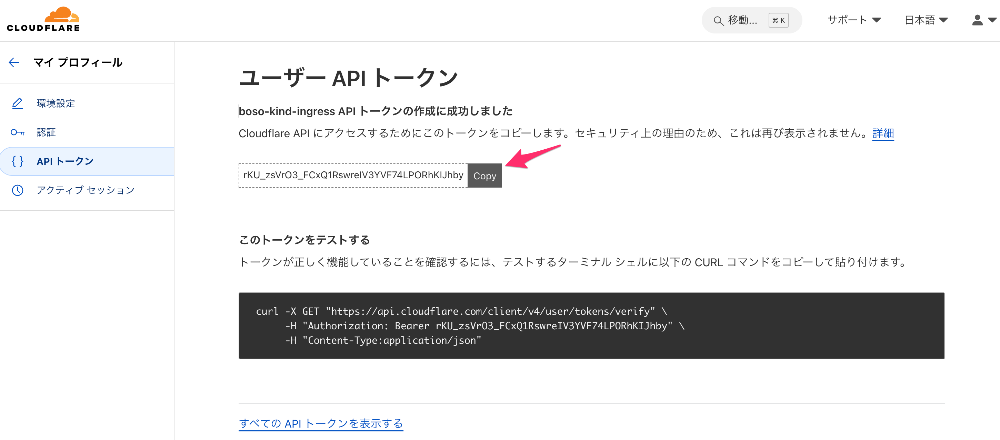
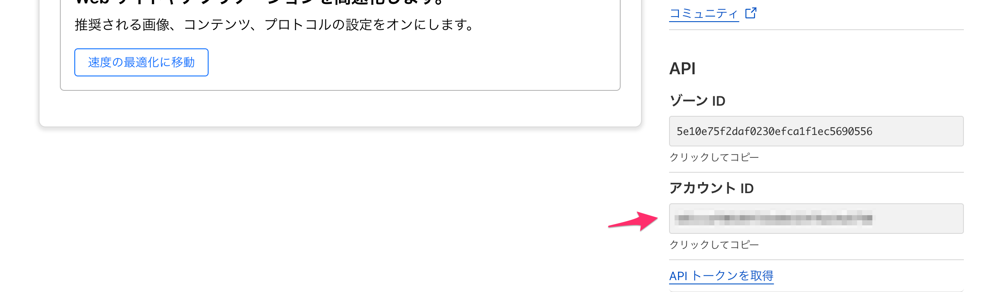

# KubernetesでGitLabをCloudflare Tunnelで公開する

KubernetesでGitLabを構築し、Cloudflare Tunnelで公開する手順を紹介します。

## 環境

今回は次の環境でGitlabを構築しています。

環境|バージョン|備考
---|---|---
Ubuntu|24.04 LTS|WSL2で構築
Docker|24.0.6|`https://get.docker.com/`でインストール
KinD|0.11.1|`https://kind.sigs.k8s.io/`でインストール
Gitlab|17.7.0|Helmで構築
Gitlab Runner|17.6.1|Helmで構築

## Kubernetesの構築

次の手順で構築します。

1. kubectlのインストール
2. Helmのインストール
3. KinDのインストール

### kubectlのインストール

kubectl（Kubernetes CLI）をインストールします。次の手順でインストールします。

:::step

1. kubectlのインストール

次のコマンドを実行して、kubectlをインストールします。

_コマンド実行_
```bash
curl -LO "https://dl.k8s.io/release/$(curl -LS https://dl.k8s.io/release/stable.txt)/bin/linux/amd64/kubectl"
chmod +x ./kubectl
sudo mv ./kubectl /usr/local/bin/kubectl
```

正しくインストールされているかを確認します。次のコマンドを実行して、バージョンが表示されれば正しくインストールされています。

_コマンド実行_
```bash
kubectl version
```

:::

### Helmのインストール

Helm（Kubernetesパッケージマネージャ）をインストールします。次の手順でインストールします。

:::step

1. Helmのインストール

次のコマンドを実行して、Helmをインストールします。

_コマンド実行_
```bash
curl https://raw.githubusercontent.com/helm/helm/main/scripts/get-helm-3 | bash
```

正しくインストールされているかを確認します。次のコマンドを実行して、バージョンが表示されれば正しくインストールされています。

_コマンド実行_
```bash
helm version
```

:::

### KinDのインストール

:::step

1. KinDのインストール

KinDをインストールします。次のコマンドを実行してください。

_コマンド実行_
```bash
[ $(uname -m) = x86_64 ] && curl -Lo ./kind https://kind.sigs.k8s.io/dl/v0.26.0/kind-linux-amd64
chmod +x ./kind
sudo mv ./kind /usr/local/bin/kind
```

:::

### KinDの設定

KinDの設定を行います。cluster.yamlを作成し、Kubernetesクラスタの設定を記述します。

:::step

1. cluster.yamlの作成

次に`cluster.yaml`を作成します。

_cluster.yaml_
```yaml
//addstart
kind: Cluster
apiVersion: kind.x-k8s.io/v1alpha4
networking:
  apiServerAddress: 0.0.0.0
  apiServerPort: 6443
nodes:
- role: control-plane
  extraMounts:
    - hostPath: ./data
      containerPath: /var/local-path-provisioner
- role: worker
  extraMounts:
    - hostPath: ./data
      containerPath: /var/local-path-provisioner
- role: worker
  extraMounts:
    - hostPath: ./data
      containerPath: /var/local-path-provisioner
kubeadmConfigPatches:
- |
    kind: InitConfiguration
    nodeRegistration:
      kubeletExtraArgs:
        node-labels: "ingress-ready=true"
        authorization-mode: "AlwaysAllow"
//addend
```

:::

### KinDの起動

KinDコマンドを使ってKubernetesクラスタを起動します。

:::step

1. KinDの起動

次のコマンドを実行してKinDを起動します。

_コマンド実行_
```bash
kind create cluster --config cluster.yaml
```

:::

これでKubernetesクラスタが起動しました。

## cloudflare-tunnel-ingress-controllerの構築

Kubernetesクラスタにcloudflare-tunnel-ingress-controllerを構築します。cloudflare-tunnel-ingress-controllerはCloudflare TunnelをKubernetesクラスタに統合するためのIngress Controllerです。


### Cloudflare API Tokenの取得

:::step

1. Cloudflareにログイン

Cloudflareにログインします。

1. マイプロフィールにアクセス

画面右上のアイコンをクリックし、`マイプロフィール`をクリックします。



「トークンを作成」をクリックします。



「カスタムトークン」のボタンをクリックします。



トークン名を任意に入力し、アクセス許可を次のように設定します。



「トークンを作成する」をクリックします。



トークンが表示されます。このトークンをコピーして保存してください。
rKU_zsVrO3_FCxQ1RswreIV3YVF74LPORhKIJhby



um773: 9Txp3OU1e2OKc5WrRpP50253zpVo9AxWSPaGwBkN

:::

### Cloudflare Account IDの取得

:::step

1. Cloudflare Account IDの取得

Account IDはCloudflareの管理画面から管理しているドメインのいずれかを選択し、画面右下のに表示されています。
b81ccaf90189f31bdbb32476a14a5750



:::

### cloudflare-tunnel-ingress-controllerのインストール

:::step

1. cloudflare-tunnel-ingress-controllerのインストール

cloudflare-tunnel-ingress-controllerをインストールします。次のコマンドを実行してください。先ほど取得したCloudflareのAPIトークンとアカウントID、トンネル名を指定してインストールします。

_コマンド実行（南房総）_
```bash
helm repo add strrl.dev https://helm.strrl.dev
helm repo update
helm upgrade --install --wait \
  -n cloudflare-tunnel-ingress --create-namespace \
  cloudflare-tunnel-ingress-controller \
  strrl.dev/cloudflare-tunnel-ingress-controller \
  --set=cloudflare.apiToken="rKU_zsVrO3_FCxQ1RswreIV3YVF74LPORhKIJhby",cloudflare.accountId="b81ccaf90189f31bdbb32476a14a5750",cloudflare.tunnelName="macbookpro16-kind-ingress" 
```

_コマンド実行（御宿）_
```bash
helm repo add strrl.dev https://helm.strrl.dev
helm repo update
helm upgrade --install --wait \
  -n cloudflare-tunnel-ingress --create-namespace \
  cloudflare-tunnel-ingress-controller \
  strrl.dev/cloudflare-tunnel-ingress-controller \
  --set=cloudflare.apiToken="gjgwYbE1eFxU27xs45YAFBsKNEHo0QQ0FDTxRhjI",cloudflare.accountId="b81ccaf90189f31bdbb32476a14a5750",cloudflare.tunnelName="hm90-k3-ingress" 
```

_コマンド実行（um773）_
```bash
helm repo add strrl.dev https://helm.strrl.dev
helm repo update
helm upgrade --install --wait \
  -n cloudflare-tunnel-ingress --create-namespace \
  cloudflare-tunnel-ingress-controller \
  strrl.dev/cloudflare-tunnel-ingress-controller \
  --set=cloudflare.apiToken="9Txp3OU1e2OKc5WrRpP50253zpVo9AxWSPaGwBkN",cloudflare.accountId="b81ccaf90189f31bdbb32476a14a5750",cloudflare.tunnelName="um773-kind-ingress" 
```

_コマンド実行（um773）_
```bash
helm repo add strrl.dev https://helm.strrl.dev
helm repo update
helm upgrade --install --wait \
  -n cloudflare-tunnel-ingress --create-namespace \
  cloudflare-tunnel-ingress-controller \
  strrl.dev/cloudflare-tunnel-ingress-controller \
  --set=cloudflare.apiToken="9Txp3OU1e2OKc5WrRpP50253zpVo9AxWSPaGwBkN",cloudflare.accountId="b81ccaf90189f31bdbb32476a14a5750",cloudflare.tunnelName="mbp16-kind-ingress" 
```

:::

### cloudflare-tunnel-ingress-controllerの確認

cloudflare-tunnel-ingress-controllerが正常にインストールされていることを確認します。

:::step

1. 動作確認用のマニフェストの作成

次のマニフェストを作成します。

_echoserver.yaml_
```yaml
apiVersion: apps/v1
kind: Deployment
metadata:
  labels:
    app.kubernetes.io/name: echoserver
  name: echoserver
spec:
  replicas: 1
  selector:
    matchLabels:
      app.kubernetes.io/name: echoserver
  template:
    metadata:
      labels:
        app.kubernetes.io/name: echoserver
    spec:
      containers:
      - image: gcr.io/google-containers/echoserver:1.10
        name: echoserver
---
apiVersion: v1
kind: Service
metadata:
  labels:
    app.kubernetes.io/name: echoserver
  name: echoserver
  annotations:
    loadbalancer.openstack.org/x-forwarded-for: "true"
spec:
  ports:
  - port: 80
    protocol: TCP
    targetPort: 8080
    name: http
  selector:
    app.kubernetes.io/name: echoserver
  type: ClusterIP
---
apiVersion: networking.k8s.io/v1
kind: Ingress
metadata:
  name: echoserver-ingress
spec:
  ingressClassName: "cloudflare-tunnel"
  rules:
  - host: test.dx-io.net
    http:
      paths:
      - pathType: Prefix
        path: "/"
        backend:
          service:
            name: echoserver
            port:
              number: 80
```

2. マニフェストの適用

次のコマンドを実行してマニフェストを適用します。

_コマンド実行_
```bash
kubectl apply -f echoserver.yaml
```

3. Ingressの確認

次のコマンドを実行してIngressの状態を確認します。

_コマンド実行_
```bash
kubectl get ingress echoserver-ingress
```

次のようにAddressにCloudflare TunnelのURLが表示されれば正常にインストールされています。

_コマンド実行結果_
```bash
kubectl describe ingress echoserver-ingress
Name:             echoserver-ingress
Labels:           <none>
Namespace:        default
Address:          0fb9a01b-a868-4c30-9e0e-a08157987c78.cfargotunnel.com
Ingress Class:    cloudflare-tunnel
Default backend:  <default>
Rules:
  Host            Path  Backends
  ----            ----  --------
  test.dx-io.net  
                  /   echoserver:80 (10.244.1.63:8080,10.244.1.64:8080,10.244.2.23:8080)
Annotations:      <none>
Events:           <none>
```

4. アクセス確認

ブラウザで`https://test.dx-io.net`にアクセスして、echoserverが表示されれば正常にインストールされています。


:::

## Gitlabの構築

KubernetesクラスタにGitlabを構築します。GitlabはGitリポジトリの管理やCI/CDの機能を提供するツールです。今回はHelmを使ってGitlabを構築します。

```bash
kubectl create ns gitlab
```

### PVの作成


### Gitlabのインストール

:::step

1. value.yamlの作成

次に`value.yaml`を作成します。

_value.yaml_
```yaml
//addstart
global:
  edition: ce
  gitlabVersion: "17.7.0"
  hosts:
    domain: itpit.net
    https: true
    externalIP:
    ssh: gitlab.itpit.net
    gitlab:
      name: gitlab.itpit.net
      https: true
    minio:
      name: minio.itpit.net
      https: true
    registry:
      name: registry.itpit.net
      https: true
    tls: {}
    smartcard:
      name: smartcard.itpit.net
      https: true
    kas:
      name: kas.itpit.net
      https: true
    pages:
      name: dx-page.net
      https: true
  ingress:
    class: cloudflare-tunnel
  pages:
    enabled: true
    accessControl: true
    path: 
    host: dx-page.net
    port: 
    https: # default true
    externalHttp: []
    externalHttps: []
    artifactsServer: true
    localStore:
      enabled: false
    objectStore:
      enabled: true
      bucket: gitlab-pages
      connection: {}
    apiSecret: {}
    authSecret: {}
    namespaceInPath: false
  time_zone: "Asia/Tokyo"
certmanager-issuer:
  email: r-takahashi@image-pit.com
certmanager:
  install: false
  installCRDs: false
nginx-ingress: &nginx-ingress
  enabled: false
prometheus:
  install: false
postgresql:
  install: true
  auth:
    password: bogus-satisfy-upgrade
    postgresPassword: bogus-satisfy-upgrade
    usePasswordFiles: false
    existingSecret: '{{ include "gitlab.psql.password.secret" . }}'
    secretKeys:
      adminPasswordKey: postgresql-postgres-password
      userPasswordKey: '{{ include "gitlab.psql.password.key" $ }}'
  image:
    tag: 16.4.0
  primary:
    initdb:
      scriptsConfigMap: '{{ include "gitlab.psql.initdbscripts" $}}'
    extraVolumeMounts:
      - name: custom-init-scripts
        mountPath: /docker-entrypoint-preinitdb.d/init_revision.sh
        subPath: init_revision.sh
    podAnnotations:
      postgresql.gitlab/init-revision: "1"
  metrics:
    enabled: true
    service:
      annotations:
        prometheus.io/scrape: "true"
        prometheus.io/port: "9187"
        gitlab.com/prometheus_scrape: "true"
        gitlab.com/prometheus_port: "9187"
gitlab-runner:
  install: false
//addend
```

1. Gitlabのインストール

Gitlabをインストールします。次のコマンドを実行してください。

_コマンド実行_
```bash
helm repo add gitlab https://charts.gitlab.io
helm repo update
helm install -f value.yaml my-gitlab gitlab/gitlab -n gitlab --create-namespace --version 9.5.1
```

:::

これでGitlabがインストールされました。

## Gitlab Runnerの構築

KubernetesクラスタにGitlab Runnerを構築します。Gitlab RunnerはGitlabのCI/CDジョブを実行するツールです。今回はHelmを使ってGitlab Runnerを構築します。

### Gitlab Runner authentication tokenの取得

:::step

1. Gitlab Runner authentication tokenの取得

Gitlab Runner authentication tokenを取得します。次のコマンドを実行してください。


:::

### Gitlab Runnerのインストール

:::step

1. role.yamlの作成

次に`role.yaml`を作成します。GitLab構築時に作成されたdefaultサービスアカウントにClusterRoleを付与します。

_role.yaml_
```yaml
//addstart
apiVersion: rbac.authorization.k8s.io/v1
kind: "ClusterRole"
metadata:
  name: gitlab-runner-admin
  namespace: gitlab
rules:
- apiGroups: ["*"]
  resources: ["*"]
  verbs: ["*"]
---
apiVersion: rbac.authorization.k8s.io/v1
kind: "ClusterRoleBinding"
metadata:
  name: gitlab-runner-admin
  namespace: gitlab
roleRef:
  apiGroup: rbac.authorization.k8s.io
  kind: "ClusterRole"
  name: gitlab-runner-admin
subjects:
- kind: ServiceAccount
  name: default
  namespace: gitlab
//addend
```

1. role.yamlの適用

次に`role.yaml`を適用します。

_コマンド実行_
```bash
kubectl apply -f role.yaml
```

1. values.yamlの作成

次に`values.yaml`を作成します。

_values.yaml_
```yaml
//addstart
replicas: 3
gitlabUrl: https://gitlab.itpit.net/
runnerToken: "glrt-cf6RFim7VK-3ZyzBtCLn"
rbac:
  create: true
  rules:
    - apiGroups: [""]
      resources: ["pods"]
      verbs: ["list", "get", "watch", "create", "delete"]
    - apiGroups: [""]
      resources: ["pods/exec"]
      verbs: ["create"]
    - apiGroups: [""]
      resources: ["pods/log"]
      verbs: ["get"]
    - apiGroups: [""]
      resources: ["pods/attach"]
      verbs: ["list", "get", "create", "delete", "update"]
    - apiGroups: [""]
      resources: ["secrets"]
      verbs: ["list", "get", "create", "delete", "update"]      
    - apiGroups: [""]
      resources: ["configmaps"]
      verbs: ["list", "get", "create", "delete", "update"]
serviceAccount:
  create: false
  name: "default"
runners:
  config: |
    [[runners]]
      [runners.kubernetes]
        image = "ubuntu:22.04"
        privileged = true
        pre_build_script = "until docker info; do sleep 1; done"
        pull_policy = "if-not-present"
      [runners.cache]
      [[runners.kubernetes.volumes.empty_dir]]
        name = "docker-certs"
        mount_path = "/certs/client"
        medium = "Memory"
  tags: "k8s, docker"
  name: "runner-on-k8s"
  env:
    DOCKER_HOST: tcp://docker:2376
    DOCKER_TLS_CERTDIR: "/certs"
    DOCKER_TLS_VERIFY: 1
    DOCKER_CERT_PATH: "/certs/client"
  cache: {}
//addend
```

1. Gitlab Runnerのインストール

Gitlab Runnerをインストールします。次のコマンドを実行してください。

_コマンド実行_
```bash
helm repo add gitlab https://charts.gitlab.io
helm repo update
helm install -f value.yaml my-gitlab-runner gitlab/gitlab-runner -n gitlab --version 0.82.0
```

_更新する場合_
```bash
helm upgrade -f value.yaml my-gitlab-runner gitlab/gitlab-runner -n gitlab --version 0.72.0
```

:::