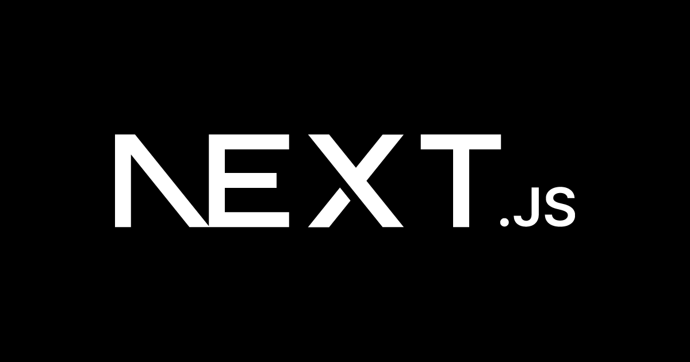

## はじめに

Next.js実践開発マスターガイドへようこそ！このサイトは、Next.jsを基礎から実践まで体系的に学習できるトレージングWebサイトです。

React開発者からNext.js初心者、さらにはエンタープライズレベルのアーキテクチャ設計まで、あなたのレベルに応じた最適な学習パスを提供します。

Next.jsは、Reactアプリケーションを本格的なWebアプリケーションに発展させるための強力なフレームワークです。SSR（サーバーサイドレンダリング）、SSG（静的サイト生成）、App Router、React Server Componentsなど、現代のWeb開発に必要な機能を統合的に提供しています。

### このページで学べる事

このページでは、Next.js学習の全体像を把握し、あなたに最適な学習パスを見つけることができます。

:::note

- Next.js学習の全体像とロードマップ
- あなたのレベルに応じた学習パスの選択方法
- 各学習段階で習得できるスキルの概要
- 実践プロジェクトを通じた学習の進め方
- 研修プラットフォームへの導線

:::

## Next.js学習ロードマップ

Next.jsの学習は、段階的にスキルを積み上げていくことが重要です。以下のロードマップに沿って学習を進めることで、効率的にNext.js開発者としてのスキルを身につけることができます。

### 基礎編（Getting Started）

**対象者**: React初心者〜中級者、Next.js未経験者

この段階では、Next.jsの基本的な概念と環境構築から始めます。

:::note Next.jsとは

Next.jsは、Reactアプリケーションを本格的なWebアプリケーションに発展させるためのフレームワークです。SSR、SSG、ルーティング、API Routesなどの機能を統合的に提供し、開発者が複雑な設定を行うことなく、高パフォーマンスなWebアプリケーションを構築できます。

:::

- 環境構築とプロジェクト作成
- 基本的なルーティングの理解
- ページコンポーネントの作成
- スタイリングの基礎

**習得時間の目安**: 2-3週間

### コア機能編（Core Concepts）

**対象者**: Next.js基礎を理解した方

Next.jsの核となる機能を深く理解し、実践的なアプリケーション開発の基礎を身につけます。

**学習内容**:
- App RouterとPages Routerの使い分け
- データフェッチング（SSR、SSG、ISR）
- 画像最適化とパフォーマンス
- API Routesの実装
- 認証の基礎

**習得時間の目安**: 4-6週間

### 上級編（Advanced Topics）

**対象者**: Next.js中級者、実践的なアプリケーション開発を目指す方

パフォーマンス最適化、セキュリティ、エンタープライズレベルのアーキテクチャ設計を学習します。

**学習内容**:
- React Server Componentsの実装
- パフォーマンス最適化テクニック
- セキュリティの実装
- エラーハンドリングとデバッグ
- テスト戦略

**習得時間の目安**: 6-8週間

### 実践プロジェクト編（Practical Projects）

**対象者**: Next.js上級者、実際のプロジェクト経験を積みたい方

実際のビジネス要件に基づいたプロジェクトを通じて、実践的な開発スキルを身につけます。

**学習内容**:
- Eコマースサイトの構築
- SaaSダッシュボードの開発
- ブログ/CMSシステムの実装
- エンタープライズアーキテクチャ設計

**習得時間の目安**: 8-12週間

## あなたに最適な学習パスを見つけよう

Next.jsの学習を効率的に進めるために、あなたの現在のスキルレベルに応じた学習パスを選択しましょう。

### React初心者の方

**推奨パス**: レベル1（基礎編）から開始

Reactの基本的な概念（コンポーネント、props、state）を理解してから、Next.jsの学習を始めることをお勧めします。

**学習のポイント**:
- React基礎の復習から始める
- Next.jsの環境構築を丁寧に行う
- 小さなプロジェクトから始めて徐々に規模を拡大する

### React中級者の方

**推奨パス**: レベル2（コア機能編）から開始

Reactの基礎知識がある方は、Next.jsの特徴的な機能（SSR、SSG、ルーティング）に焦点を当てて学習を進めましょう。

**学習のポイント**:
- Next.jsとReactの違いを明確に理解する
- データフェッチングの方法を重点的に学習する
- パフォーマンス最適化の基礎を身につける

### Next.js経験者の方

**推奨パス**: レベル3（上級編）またはレベル4（実践プロジェクト編）から開始

既にNext.jsの基礎を理解している方は、より高度な機能や実践的なプロジェクトに挑戦しましょう。

- App RouterとReact Server Componentsの最新機能を学習する
- パフォーマンス最適化の高度なテクニックを習得する
- エンタープライズレベルのアーキテクチャ設計を理解する

## 実践プロジェクトでスキルを磨く

理論的な学習だけでなく、実際のプロジェクトを通じてスキルを身につけることが重要です。以下の実践プロジェクトに挑戦して、Next.js開発者としての実践力を高めましょう。

### プロジェクト1: ポートフォリオサイト

**難易度**: 初級
**学習内容**: 基本的なルーティング、スタイリング、画像最適化

### プロジェクト2: ブログサイト

**難易度**: 中級
**学習内容**: SSG、MDX、動的ルーティング、SEO最適化

### プロジェクト3: Eコマースサイト

**難易度**: 上級
**学習内容**: 認証、決済統合、データベース連携、パフォーマンス最適化

### プロジェクト4: SaaSダッシュボード

**難易度**: 最上級
**学習内容**: エンタープライズアーキテクチャ、セキュリティ、スケーラビリティ

## 学習を効率的に進めるためのコツ

### 1. 段階的な学習

一度にすべてを覚えようとせず、段階的にスキルを積み上げていきましょう。基礎が固まってから次のレベルに進むことが重要です。

### 2. 実践的なアプローチ

理論だけでなく、実際にコードを書きながら学習を進めましょう。小さなプロジェクトから始めて、徐々に規模を拡大していきます。

### 3. コミュニティの活用

Next.jsの公式ドキュメントやコミュニティを活用して、最新の情報やベストプラクティスを学びましょう。

### 4. 継続的な学習

Web開発の技術は日々進歩しています。継続的に学習を続けて、最新の技術動向をキャッチアップしましょう。

## まとめ

Next.js実践開発マスターガイドでは、あなたのレベルに応じた最適な学習パスを提供しています。基礎から実践まで段階的にスキルを積み上げることで、Next.js開発者としての実践力を身につけることができます。

:::note 要点のまとめ

- Next.js学習は4つのレベルに分けて段階的に進める
- あなたの現在のスキルレベルに応じた学習パスを選択する
- 理論だけでなく実践プロジェクトを通じてスキルを身につける
- 継続的な学習とコミュニティの活用が重要

:::

次のステップとして、あなたのレベルに応じた学習パスを選択し、具体的な学習を開始しましょう。基礎編から始める場合は、[環境構築ガイド](./getting-started/setup)から始めることをお勧めします。

## 関連リンク

- [Next.js公式ドキュメント](https://nextjs.org/docs)
- [React公式ドキュメント](https://react.dev/)
- [TypeScript公式ドキュメント](https://www.typescriptlang.org/docs/)
- [Vercel公式サイト](https://vercel.com/)

## さらに深く学習したい方へ

Next.jsの実践的なスキルをより深く身につけたい方には、企業研修プログラムの受講をお勧めします。実践的なプロジェクトを通じて、エンタープライズレベルのNext.js開発スキルを習得できます。

**研修プログラムの特徴**:
- 実践的なプロジェクトベースの学習
- 経験豊富な講師による個別指導
- チーム開発の実践経験
- 就職・転職支援

詳細は[研修プラットフォーム](https://example.com/training)をご覧ください。