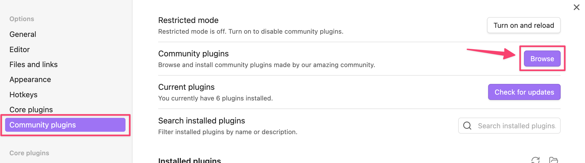
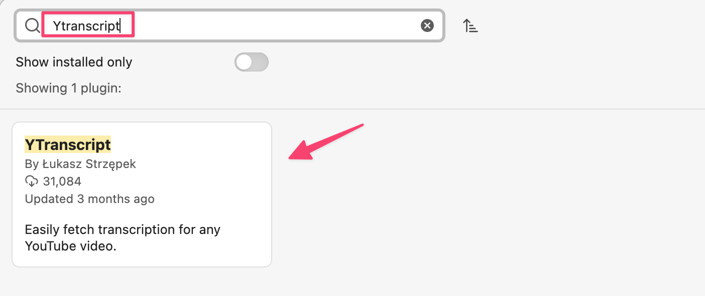
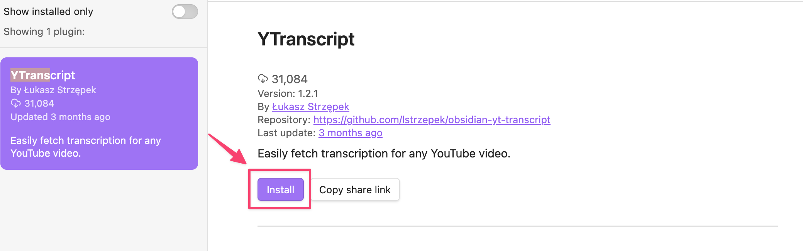
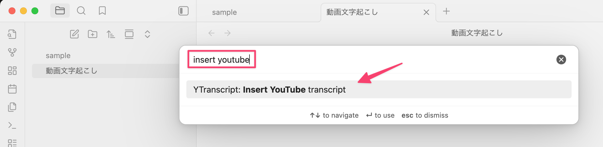
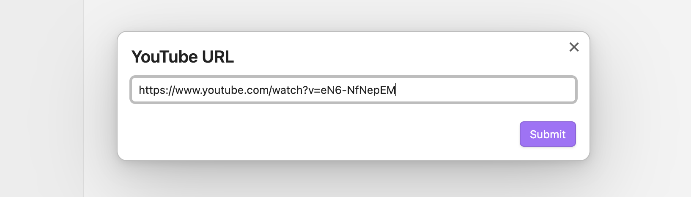
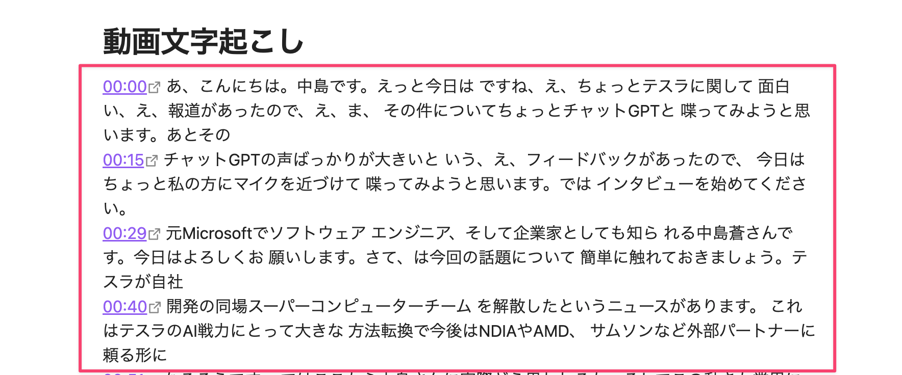
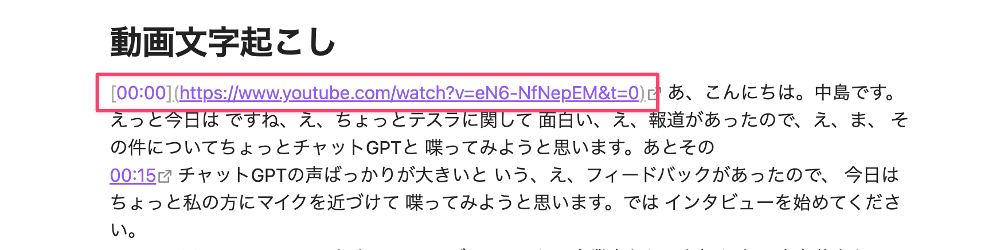

# YTranscriptを使ったYoutubeの文字起こし

YTranscriptを使うことによりYoutubeの動画の文字起こしを簡単に作成できます。

:::note Ytranscriptの特徴

- YoutubeのURLを指定するだけで簡単に文字起こしをObsidianに追加できる
- 文字起こしの内容もタイムスタンプ毎のURL付きなので、見たい箇所だけ動画をみるとかも簡単にできる

:::
## インストール方法

次の手順でObsidianにYTranscriptを利用することができます。

:::step

1. Obsidianの設定を開く

Obsidianの左下にある設定アイコンをクリックします。

2. Community plugins一覧を開く

Community plugins -> Browseをクリックします。

3. Ytranscriptを検索

Ytranscriptを検索してプラグインを見つけてクリックします。

4. YTranscriptのインストール

「Install」ボタンをクリックしてインストールします。

:::
これでYTranscriptがインストールされます。

## 使い方

使い方はとても簡単です。次の手順でYoutube動画の文字起こしが簡単に作れます。

:::step

1. Youtubeの動画URLを取得

Youtubeに行き文字起こししたい動画ページのURLをコピーします。

2. Obsidianでコマンド実行

Obsidianで文字起こししたいページを開いてからCtrl + p（MacはCommand + p）をタイプして「insert youtube」を入力して「YTranscript insert Youtube transcript」を洗濯します。

3. Youtube動画URLをペースト

次のダイアログでURLをペーストしてSubmitボタンをクリックします。

4. 文字起こし生成

しばらくすると文字起こし結果がObsidianページの本文に追加されます。

:::
このように簡単な操作でYoutubeの文字起こしが作成できます。

:::caution タイムスタンプ毎のURLも生成される

次のように実際に生成された文字起こし内容には動画のタイムスタンプ毎のYoutube動画のURLも生成されています。文字起こし内容で気になった部分とかの動画の箇所にすぐジャンプできるようになっています。

:::

