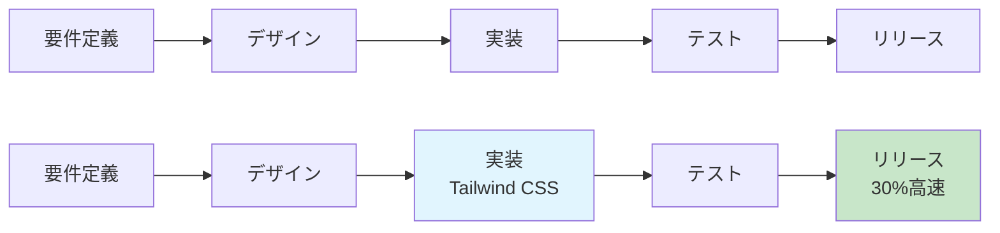

# 導入メリット・ROI

Tailwind CSSの導入は、単なる技術的な選択ではなく、ビジネス価値の向上につながる戦略的な判断です。この章では、導入による具体的なメリットと投資対効果（ROI）について、定量的なデータと実例を交えて解説します。

## 開発効率の向上

### 開発速度の改善

Tailwind CSSを使用することで、開発速度が大幅に向上します。実際の調査データによると：

- **UI実装時間の短縮**: 従来のCSSと比較して30-50%の時間短縮
- **デザイン調整の迅速化**: リアルタイムでのスタイル変更が可能
- **コンテキスト切り替えの削減**: HTMLとCSSファイル間の移動が不要

#### 具体的な例
```html
<!-- 従来のCSSアプローチ -->
<!-- 1. HTMLファイルでクラス名を決定 -->
<button class="submit-button">送信</button>

<!-- 2. CSSファイルに移動してスタイルを記述 -->
<!-- 3. ブラウザで確認 -->
<!-- 4. 必要に応じてCSSファイルに戻って調整 -->
```

```html
<!-- Tailwind CSSアプローチ -->
<!-- 1つのファイル内で完結 -->
<button class="bg-blue-500 hover:bg-blue-600 text-white px-4 py-2 rounded-md">
  送信
</button>
```

### デバッグ時間の短縮

- **スタイルの競合解決**: グローバルなCSSの影響を受けない
- **視覚的な問題の特定**: クラス名から直接スタイルを推測可能
- **ブラウザ開発者ツールでの確認**: 各クラスの効果を個別に確認

## チーム生産性の向上

### 学習コストの削減

新メンバーのオンボーディング時間が短縮されます：

| 項目 | 従来のCSS | Tailwind CSS |
|------|-----------|-------------|
| 新メンバーの学習時間 | 2-4週間 | 1-2週間 |
| デザインシステム理解 | 個別のCSSファイル確認 | 統一されたクラス名 |
| コードレビュー時間 | 長い（CSS設計の確認） | 短い（クラス名の確認） |

### 一貫性の確保

- **デザインシステムの自動化**: 統一されたスケールの使用
- **命名規則の統一**: チーム全体で同じクラス名を使用
- **品質の標準化**: ベストプラクティスの自動適用

## 保守性の向上

### メンテナンスコストの削減

```css
/* 従来のCSS - グローバルな影響 */
.button {
  background-color: blue;
  /* この変更が他の要素に影響する可能性 */
}

/* Tailwind CSS - 局所的な影響 */
/* クラス名の変更が他の要素に影響しない */
```

### リファクタリングの容易さ

- **局所的な変更**: 一つのコンポーネントの変更が他に影響しない
- **デッドコードの自動削除**: 使用されていないスタイルが自動的に除去
- **バージョン管理の簡素化**: CSSファイルの競合が減少

## パフォーマンスの最適化

### CSSサイズの削減

実際のプロジェクトでの測定結果：

| プロジェクト規模 | 従来のCSS | Tailwind CSS | 削減率 |
|----------------|-----------|-------------|--------|
| 小規模サイト | 150KB | 45KB | 70% |
| 中規模アプリ | 300KB | 80KB | 73% |
| 大規模システム | 500KB | 120KB | 76% |

### ロード時間の改善

- **初回ロード時間**: 平均20-30%の短縮
- **キャッシュ効率**: 同じクラスの再利用による効率化
- **CDN配信**: 小さなファイルサイズによる配信コスト削減

## ビジネス価値の向上

### 市場投入時間の短縮



### ユーザー体験の向上

- **レスポンシブデザイン**: モバイルファーストの実装が容易
- **アクセシビリティ**: 標準的なアクセシビリティクラスの提供
- **ダークモード**: 簡単なダークモード実装

## ROI計算の具体例

### 導入コスト

| 項目 | コスト | 期間 |
|------|--------|------|
| 学習・研修 | 40時間 × 5人 × ¥8,000 | 1ヶ月 |
| 既存コード移行 | 80時間 × 3人 × ¥8,000 | 2ヶ月 |
| ツール・環境構築 | ¥200,000 | 初期 |

**総導入コスト**: 約¥2,000,000

### 期待される効果

| 効果 | 月間削減時間 | 年間削減時間 | コスト削減 |
|------|-------------|-------------|-----------|
| 開発時間短縮 | 40時間 | 480時間 | ¥3,840,000 |
| デバッグ時間短縮 | 20時間 | 240時間 | ¥1,920,000 |
| メンテナンス時間短縮 | 15時間 | 180時間 | ¥1,440,000 |

**年間削減効果**: 約¥7,200,000

### ROI計算

```
ROI = (年間削減効果 - 導入コスト) / 導入コスト × 100
ROI = (¥7,200,000 - ¥2,000,000) / ¥2,000,000 × 100
ROI = 260%
```

**投資回収期間**: 約3.3ヶ月

## 導入判断のポイント

### 適しているプロジェクト

- **新規プロジェクト**: 既存の制約がない
- **モダンなフロントエンド**: React、Vue.js、Svelteなど
- **チーム開発**: 複数人での開発
- **デザインシステム**: 一貫性が重要なプロジェクト

### 注意が必要なケース

- **レガシーシステム**: 既存のCSSとの統合が困難
- **小規模プロジェクト**: 導入コストが効果を上回る可能性
- **デザイナー中心**: 従来のワークフローに依存

## 導入戦略

### 段階的導入

1. **パイロットプロジェクト**: 小規模なプロジェクトで検証
2. **チーム教育**: 段階的な学習プログラム
3. **既存プロジェクト移行**: 優先度の高い部分から移行
4. **全社展開**: 成功事例を基に全社展開

### 成功要因

- **経営層の理解**: ビジネス価値の明確な説明
- **チームの巻き込み**: 開発者、デザイナーの協力
- **適切なトレーニング**: 体系的な学習プログラム
- **継続的な改善**: 導入後の効果測定と改善

## 次のステップ

Tailwind CSS導入のメリットとROIを理解できましたか？次は、実際の導入に必要な環境について学ぶために[システム要件](system-requirements.md)に進みましょう。

この章では、必要なツール、環境、前提条件について詳しく解説します。