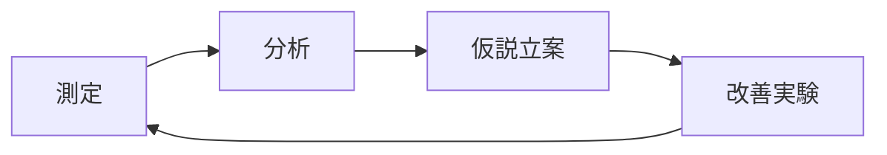

デジタルトランスフォーメーション（DX）が加速する現代において、ビジネスの成功はソフトウェア開発と運用の効率性に大きく左右されます。DevOpsは、開発（Development）と運用（Operations）の壁を取り払い、ソフトウェアの開発からデプロイ、運用までのライフサイクル全体を効率化する文化・手法として、多くの企業に受け入れられてきました。

しかし、DevOpsを単なるツールセットや手法の導入と捉えている組織は少なくありません。実際のところ、DevOpsの本質はツールよりも「カルチャー」にあります。本記事では、組織全体にDevOpsカルチャーを浸透させ、真の変革を実現するための具体的なステップを解説します。

## DevOpsカルチャーとは何か：基本的な考え方

DevOpsカルチャーの核心は、「協働」「自動化」「継続的改善」「責任共有」という価値観にあります。これらは単なる標語ではなく、組織の行動様式や意思決定プロセスに根付いた考え方です。

### DevOpsの3つの柱

1. **人とカルチャー**：チーム間の協働、責任共有、失敗からの学習
2. **プロセスと実践**：継続的インテグレーション/デリバリー、インフラのコード化、自動テスト
3. **ツールと技術**：自動化、モニタリング、コラボレーションツール

この中で最も重要なのは「人とカルチャー」です。適切なツールと実践はDevOps導入に不可欠ですが、それらを効果的に活用するためには、まず組織文化の変革が必要です。

### 従来の組織文化とDevOpsカルチャーの比較

| 従来の組織文化 | DevOpsカルチャー |
|--------------|----------------|
| サイロ化された組織構造 | クロスファンクショナルなチーム編成 |
| 責任の分断 | 責任の共有 |
| リスク回避的 | 実験と学習を奨励 |
| 変更に対する抵抗 | 継続的な改善と変化の受容 |
| 長いフィードバックサイクル | 短いフィードバックループ |
| ブレイム文化（責任追及） | ブレイムレス文化（解決志向） |

## DevOpsカルチャー変革の障壁

DevOpsカルチャーへの移行には、様々な障壁が存在します。代表的なものとして以下が挙げられます：

1. **組織のサイロ化**：部門間の壁、情報共有の欠如
2. **リスク回避文化**：変化を恐れ、安定性を過度に重視
3. **リーダーシップの不足**：トップレベルの理解と支援がない
4. **スキルギャップ**：新しい技術・手法に対する知識不足
5. **レガシーシステムの制約**：技術的負債や古いアーキテクチャの問題

これらの障壁を認識し、それぞれに対処することがDevOps変革の第一歩となります。

## DevOpsカルチャー浸透のためのロードマップ：5つのフェーズ

DevOpsカルチャーを組織全体に浸透させるためには、段階的なアプローチが効果的です。以下、5つのフェーズに分けて具体的なステップを紹介します。

### フェーズ1：評価と準備（1-2ヶ月）

**目標**：現状把握と変革の土台づくり

1. **カルチャー・組織診断**
   - 現状の組織文化やプロセスの評価
   - DORA（DevOps Research and Assessment）の4つのメトリクスを測定
     - デプロイ頻度
     - リードタイム
     - 変更失敗率
     - 障害復旧時間

2. **経営層の支援獲得**
   - DevOps導入のビジネスケース作成
   - 経営層向けワークショップの実施
   - 変革の目的とビジョンの明確化

3. **変革チームの結成**
   - クロスファンクショナルな変革推進チームの編成
   - DevOpsチャンピオンの選定と育成
   - 外部コンサルタントや専門家の活用検討

**実践例**：
```
# DevOps成熟度評価シート
評価項目:
1. 自動化レベル（CI/CD、テスト、インフラ等）
2. コラボレーションの度合い（開発と運用間）
3. フィードバックループの速さ
4. 障害対応プロセスの効率性
5. 学習文化の浸透度

各項目を1-5で評価し、現状のベースラインを確立。
```

### フェーズ2：パイロットプロジェクト（2-3ヶ月）

**目標**：小規模な成功事例の創出と学習

1. **適切なプロジェクト選定**
   - ビジネス価値があり、かつリスクが限定的なプロジェクト
   - DevOpsへの移行が技術的に実現可能なプロジェクト
   - チームのモチベーションが高い領域

2. **クロスファンクショナルチームの編成**
   - 開発者、運用エンジニア、QA、セキュリティ専門家など
   - チームの自律性と決定権限の確保
   - アジャイル開発手法の導入

3. **基本的なDevOps実践の導入**
   - CI/CDパイプラインの構築
   - 自動テストの導入
   - インフラのコード化（IaC）の開始
   - モニタリングとフィードバックの仕組み構築

**実践例**：
```yaml
# CI/CDパイプラインの基本構成（GitHub Actions例）
name: CI/CD Pipeline

on:
  push:
    branches: [ main, develop ]
  pull_request:
    branches: [ main, develop ]

jobs:
  build:
    runs-on: ubuntu-latest
    steps:
    - uses: actions/checkout@v3
    - name: Set up environment
      uses: actions/setup-node@v3
      with:
        node-version: 16
    
    - name: Install dependencies
      run: npm ci
    
    - name: Run linting
      run: npm run lint
    
    - name: Run tests
      run: npm test
    
    - name: Build
      run: npm run build
    
    - name: Deploy to staging
      if: github.ref == 'refs/heads/develop'
      run: ./deploy.sh staging
    
    - name: Deploy to production
      if: github.ref == 'refs/heads/main'
      run: ./deploy.sh production
```

### フェーズ3：拡大と成熟（3-6ヶ月）

**目標**：パイロットの成功を基に他チームへ展開

1. **成功事例の共有**
   - 内部カンファレンスやショーケースの開催
   - 計測可能な成果の可視化と共有
   - チームメンバーによる体験談の発信

2. **DevOps実践の標準化**
   - ツールチェーンの標準化
   - ベストプラクティスとパターンのドキュメント化
   - 内部プラットフォームチームの設立検討

3. **教育・トレーニングプログラムの拡充**
   - トレーニングカリキュラムの整備
   - ペアプログラミングやメンタリングの促進
   - 社内コミュニティの形成と支援

**実践事例**：
```markdown
# DevOps実践ガイド（社内Wiki例）

## 基本原則
- 小さな変更を頻繁にリリース
- 失敗を学びの機会と捉える
- 安全性をコードに組み込む
- フィードバックループを短くする

## 標準ツールセット
- バージョン管理: GitHub
- CI/CD: Jenkins/GitHub Actions
- 構成管理: Terraform
- コンテナ化: Docker, Kubernetes
- モニタリング: Prometheus, Grafana
- コラボレーション: Slack, Jira

## チェックリスト
- [ ] CI/CDパイプライン構築済み
- [ ] 自動テストカバレッジ70%以上
- [ ] インフラのコード化完了
- [ ] セキュリティスキャン組み込み済み
- [ ] インシデント対応プロセス確立済み
```

### フェーズ4：組織全体への展開（6-12ヶ月）

**目標**：DevOpsを組織の標準的な働き方に

1. **カルチャー強化のための制度改革**
   - 評価・報酬制度の見直し（チーム成果重視へ）
   - ハッカソンや社内イノベーションデーの導入
   - 「学習する組織」文化の促進

2. **テクニカルプラクティスの高度化**
   - カオスエンジニアリングの導入
   - セキュリティのシフトレフト（DevSecOps）
   - 高度なモニタリングと可観測性の確立

3. **内部プラットフォームの強化**
   - セルフサービス型インフラプラットフォームの構築
   - 内部デベロッパーポータルの整備
   - ゴールデンパスの提供（標準化された開発パス）

**プラットフォームチーム構成例**：
```
# 内部プラットフォームチーム体制

## ミッション
開発チームが高品質なソフトウェアを迅速に提供できるよう、
標準化されたツール、プラットフォーム、サービスを提供する

## チーム構成
- プラットフォーム製品オーナー (1名)
- プラットフォームエンジニア (4-6名)
  * CI/CD専門家
  * クラウドインフラ専門家
  * セキュリティ専門家
  * 開発者エクスペリエンス担当
- ドキュメンテーションスペシャリスト (1名)

## 主要成果物
- CI/CDテンプレート
- セルフサービスポータル
- クラウドリソースプロビジョニングAPI
- セキュリティスキャン自動化
- モニタリング・アラート標準環境
```

### フェーズ5：継続的な進化（継続的）

**目標**：DevOpsを継続的に改善・発展させる文化の定着

1. **メトリクスによる継続的評価**
   - DevOpsメトリクスの定期的な測定と分析
   - ビジネス成果との相関関係の評価
   - 改善の余地がある領域の特定

2. **改善サイクルの制度化**
   - 定期的なレトロスペクティブの実施
   - 実験文化の促進（小規模な改善の試行）
   - コミュニティオブプラクティスの活性化

3. **外部との連携・知見の取り込み**
   - 外部カンファレンスへの参加
   - オープンソースへの貢献
   - 業界ベストプラクティスの継続的な取り入れ

**改善サイクルの例**：


## DevOpsカルチャー変革のための具体的な施策

ここからは、DevOpsカルチャーを実際に根付かせるための具体的な施策を紹介します。

### 1. チーム構造の再設計

**目標**：コラボレーションを促進するチーム編成の実現

- **プロダクトベースのチーム編成**
  - 機能横断的なフルスタックチームへの移行
  - エンドツーエンドの責任範囲の明確化
  - チームの自律性と決定権限の拡大

- **DevOpsトポロジーの活用**
  - 組織に適したDevOpsチーム構造の選択
  - タイプ1: Dev と Ops の完全統合
  - タイプ2: Dev と Ops の協力体制
  - タイプ3: Ops をインフラサービスとして提供

```
# DevOpsチーム再編計画例

現状：
- 開発チーム (10名) - 機能開発のみ担当
- QAチーム (5名) - テスト専門
- 運用チーム (8名) - インフラ管理と本番運用担当

目標状態：
- プロダクトチームA (7名)
  * 開発者 (4名)
  * QA/テスト自動化 (1名)
  * インフラ/運用 (2名)
  
- プロダクトチームB (7名)
  * 開発者 (4名)
  * QA/テスト自動化 (1名)
  * インフラ/運用 (2名)

- プラットフォームチーム (6名)
  * CI/CD (2名)
  * クラウドインフラ (2名) 
  * セキュリティ (2名)

- 残り3名は他チームへ配置転換またはアップスキル
```

### 2. 心理的安全性の確立

**目標**：失敗から学べる文化の醸成

- **ブレイムレスポストモーテム**
  - 障害は個人の責任ではなくシステムの問題として捉える
  - 責任追及ではなく根本原因の特定に集中
  - 学びと改善策の共有を重視

- **フェイルフォワード文化**
  - 「失敗は成功の母」という認識の浸透
  - 小さく失敗し、早く学ぶサイクルの促進
  - 実験的取り組みの奨励と評価

- **経営層からの率先垂範**
  - 上層部からの失敗事例共有
  - 失敗から学んだ教訓の価値を示す
  - 「知らないことを知らない」ことを認める勇気

**心理的安全性向上施策例**：
```
# 学習の機会としての障害レビュー会議のルール

1. 個人の責任追及禁止
2. 「なぜその判断をしたのか」という状況理解に焦点
3. 予想外の動作や混乱の原因となる「システムの罠」を探す
4. 「もし〜だったら」ではなく「次回どうするか」に集中
5. 全参加者が発言する機会を持つ
6. 議事録は組織全体に共有し、学びを最大化
```

### 3. 小さな成功を積み重ねる戦略

**目標**：モメンタムを生み出し維持する

- **クイックウィンの特定と実行**
  - 既存の痛点に対する迅速な解決策
  - 例: デプロイ自動化、テスト環境の標準化など
  - 明確で計測可能な成果の提示

- **成果の可視化と祝福**
  - ダッシュボードによるDevOpsメトリクスの視覚化
  - 定期的な成功事例の共有セッション
  - 貢献者の表彰と成功の祝福

- **「雪だるま」アプローチ**
  - 小さな成功から始め、徐々に範囲を拡大
  - 各ステップでの学びを次のステップに活かす
  - モメンタムを維持するための適切なペース配分

**クイックウィン例**：
```
# 最初の30日で実施する3つのクイックウィン

1. デプロイ自動化
   目標: 手動デプロイ時間を90%削減
   アクション: CI/CDパイプライン構築（最初は単純な構成から）
   メトリクス: デプロイ所要時間、デプロイ頻度

2. モニタリング改善
   目標: 障害検知時間を50%短縮
   アクション: 基本的なモニタリングダッシュボード構築
   メトリクス: MTTD（平均検知時間）、MTTR（平均復旧時間）

3. 日次スタンドアップ導入
   目標: 開発・運用間のコミュニケーションギャップ解消
   アクション: 15分のデイリーミーティング導入
   メトリクス: チーム間の問題解決時間、情報共有満足度
```

### 4. スキルアップとキャリア開発の支援

**目標**：DevOpsに必要なスキルセットの開発

- **T型人材の育成**
  - 専門性（縦棒）と幅広い知識（横棒）の両方を持つ人材育成
  - ローテーションやシャドーイングによる異分野経験
  - ジェネラリストとスペシャリストのバランス

- **継続的学習の文化醸成**
  - 勉強会や社内技術共有セッションの定期開催
  - 学習時間の業務時間内確保（20%ルールなど）
  - オンライン学習プラットフォームへのサブスクリプション提供

- **キャリアパスの明確化**
  - DevOpsエンジニアのスキルマトリクスと成長ロードマップ
  - 新しいロールの確立（SRE、プラットフォームエンジニアなど）
  - 横断的なスキル習得を評価する人事制度

**スキルマップ例**：
```
# DevOpsエンジニアスキルマトリクス

## 技術スキル
- CI/CD: Jenkins, GitHub Actions, CircleCIなど
- IaC: Terraform, CloudFormation, Ansibleなど
- コンテナ化: Docker, Kubernetes, Helmなど
- クラウド: AWS, Azure, GCPなど
- モニタリング: Prometheus, Grafana, ELKなど
- スクリプト/プログラミング: Bash, Python, Goなど

## ソフトスキル
- コミュニケーション能力
- システム思考
- 問題解決力
- チームワーク
- 変化への適応力
- 継続的な学習姿勢

## レベル
1. 見習い: 基本的な概念理解と指導の下での実践
2. 実践者: 自律的に作業を完了できる
3. 熟練者: 複雑な問題を解決し、他者を指導できる
4. エキスパート: 組織全体のプラクティスを形作る
```

### 5. 経営層の巻き込み戦略

**目標**：持続的なDevOps変革のためのトップダウンサポート確保

- **ビジネス価値の明確化**
  - DevOpsがビジネス目標達成にどう貢献するかを数値で示す
  - 例: タイムトゥマーケット短縮によるビジネス機会の拡大
  - 投資対効果（ROI）の明確な提示

- **リスク低減効果の強調**
  - セキュリティインシデント減少の可能性
  - 運用障害減少によるブランド保護
  - コンプライアンス強化と監査対応の効率化

- **定期的な経営陣向け報告**
  - キービジネスメトリクスとDevOpsメトリクスの相関表示
  - 成功事例とその事業貢献の具体的説明
  - 次のステップに必要なサポート要請

**経営層向けレポート例**：
```
# DevOps導入四半期レビュー

## 主要指標サマリー
| メトリクス | 導入前 | 現在 | 改善率 | 業界平均 |
|----------|-------|-----|-------|---------|
| リリース頻度 | 月1回 | 週3回 | 1200% | 週1回 |
| リードタイム | 45日 | 5日 | 89% | 7日 |
| 変更失敗率 | 15% | 5% | 67% | 8% |
| MTTR | 4時間 | 45分 | 81% | 1時間 |

## ビジネスインパクト
- 新機能リリースの加速による追加収益: 約3000万円/四半期
- 障害対応工数削減による運用コスト削減: 約500万円/四半期
- 顧客満足度向上: NPS 15ポイント向上

## 次四半期の優先事項
1. DevSecOpsプラクティス導入による脆弱性対応時間の80%削減
2. クラウドコスト最適化による運用コスト15%削減
3. 残存レガシーシステム2件のモダナイゼーション
```

## 成功事例：DevOpsカルチャー変革を成し遂げた3社

### 事例1：大手金融機関の変革

**背景**：厳格な規制とレガシーシステムの重圧の中でのDevOps導入

**アプローチ**：
- 「規制対応も含めた」エンドツーエンドの自動化
- コンプライアンス・アズ・コードの導入
- 小さな「規制対象外」システムからの段階的拡大

**成果**：
- リリースサイクルが3ヶ月から2週間に短縮
- 規制対応工数が60%削減
- 運用インシデントが年間45%減少

### 事例2：伝統的製造業のDX

**背景**：100年の歴史を持つ製造業がソフトウェア駆動型企業へ変革

**アプローチ**：
- 若手エンジニアとベテラン現場担当者の混合チーム編成
- 「デジタルツイン」プロジェクトをDevOps実践の場に
- 業務知識とIT知識の相互学習を促進するペアワーク

**成果**：
- 工場の生産性が15%向上
- 新製品開発期間が従来比40%短縮
- 現場主導のソフトウェア改善提案が年間300件に増加

### 事例3：急成長中のEコマースサイト

**背景**：急速な成長に伴うスケーラビリティとリリース速度の課題

**アプローチ**：
- マイクロサービスアーキテクチャへの段階的移行
- プロダクトベースのチーム再編成
- カオスエンジニアリングによる回復力強化

**成果**：
- システム障害による売上機会損失が95%減少
- 新機能のリリーススピードが5倍に向上
- 開発者満足度スコアが67%から92%に上昇

## 結論：組織変革はマラソン、スプリントではない

DevOpsカルチャーの浸透は、単なるツール導入や一時的なプロジェクトではなく、継続的な組織変革の旅です。この旅路において、以下のポイントを常に意識することが重要です：

1. **価値観とプリンシプルを中心に据える**
   - ツールやプロセスよりも、人とカルチャーを優先
   - DevOpsの本質的な価値観（協働、自動化、継続的改善、責任共有）を常に参照

2. **人間中心の変革を心がける**
   - 変革は人々の行動と意識の変化から始まる
   - 心理的安全性と学習文化の確立を最優先する
   - 変化に対する抵抗は自然なものと理解し、共感を持って対応

3. **データドリーブンな改善サイクルを回す**
   - DevOpsメトリクスを継続的に測定・分析
   - 小さな改善を積み重ね、効果を検証
   - 成功事例を組織内で共有・拡大

DevOpsカルチャー変革は終わりのない旅ですが、その過程で組織は継続的に進化し、ビジネス環境の変化に俊敏に対応できる能力を獲得していきます。変革のプロセスそのものが、組織の学習能力と適応力を高める重要な経験となるのです。

## 参考資料

- 『The DevOps Handbook』（Gene Kim他著）
- 『Accelerate: Building and Scaling High Performing Technology Organizations』（Nicole Forsgren他著）
- 『Team Topologies』（Matthew Skelton, Manuel Pais著）
- 『The Phoenix Project』（Gene Kim他著）
- DORAのState of DevOpsレポート（https://www.devops-research.com/research.html）
