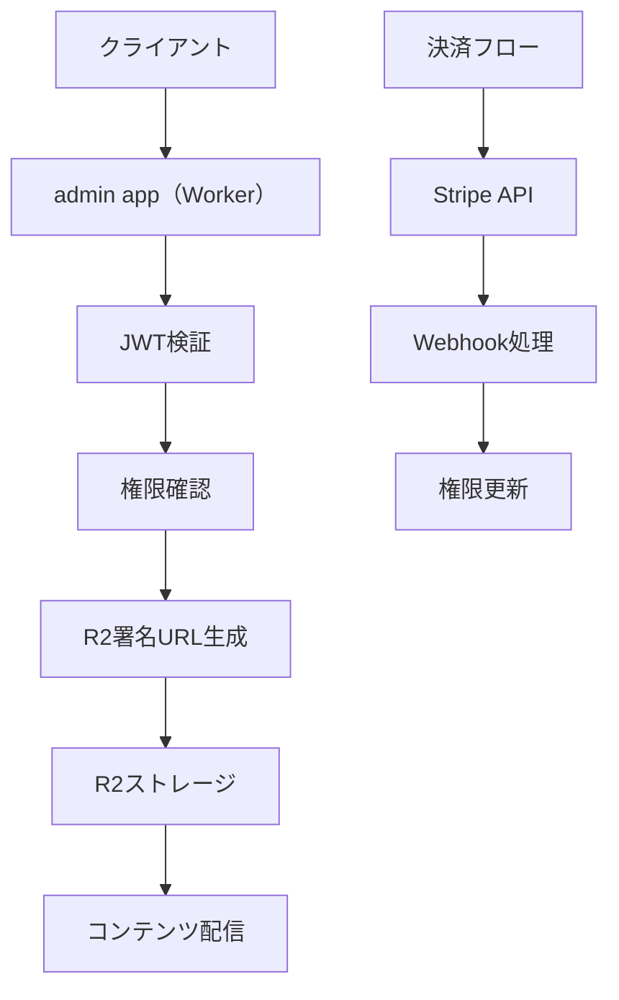

# 新規アーキテクチャ設計書

## 概要

本ドキュメントは、現在の単一テーマ・単一リポジトリ構成から、マルチサイト・マルチテーマ対応のドキュメンテーションプラットフォームへ移行するための技術設計を定義する。

## 目標

- **スケーラビリティ**: 複数サイト・テーマを効率的に管理
- **自動化**: CI/CDによる完全自動デプロイ
- **収益化**: 有料コンテンツ販売機能の実装
- **開発体験**: 現行のシンプルさを維持しつつ機能を拡張

## 用語（本設計書内の呼称）

- **admin app（Worker）**: Cloudflare Workers上で動作する統合管理アプリ。サイト/ページ/テーマ/有料コンテンツ/計測（page_view）等のバックエンド機能を提供する。
- **admin UI（Pages）**: Cloudflare Pages上で配信する管理画面（フロントエンド）。admin app（Worker）のHTTPエンドポイントを呼び出して運用・可視化を行う。

## 新規ディレクトリ構成

```
techdoc/
├── contents/                    # サイトコンテンツ（各サイト独立リポジトリ）
│   ├── v0/                    # v0サイト（GitHubリポジトリとして独立）
│   │   ├── .git/
│   │   ├── index.md
│   │   ├── contents/
│   │   │   ├── getting-started/
│   │   │   ├── components/
│   │   │   └── ...
│   │   ├── specs/
│   │   │   ├── spec.json
│   │   │   └── requirement.md
│   │   ├── docs.config.ts     # サイト固有設定
│   │   └── README.md
│   ├── nextjs/               # Next.jsサイト
│   ├── cloudflare/           # Cloudflareサイト
│   └── [site-id]/            # 各サイト
│
├── themes/                    # 共有テーマライブラリ
│   ├── fumadocs/             # 既存fumadocsテーマ
│   │   ├── src/
│   │   ├── package.json
│   │   └── next.config.mjs
│   ├── dx-media/             # 新規独自テーマ
│   │   ├── src/
│   │   ├── package.json
│   │   └── theme.config.ts
│   ├── nextra/               # Nextraテーマ
│   └── theme-registry/       # テーマ管理と抽象化
│       └── src/
│           ├── index.ts
│           ├── types.ts
│           └── adapters/
│
├── admin/                     # admin app（Worker）：統合管理アプリ（Cloudflare Workers: 1アプリに統合）
│   ├── src/
│   │   ├── http/             # HTTP（管理）エンドポイント（サイト/ページ/テーマ/ユーザー/権限/計測など）
│   │   │   ├── routes/
│   │   │   └── middleware/
│   │   ├── domains/          # ドメイン別ロジック（例: sites/pages/themes/entitlements）
│   │   ├── paid-content/     # 有料コンテンツ（JWT検証→権限確認→R2署名URL/プロキシ）
│   │   ├── analytics/        # page_view等のイベント取り込み・ロールアップ
│   │   ├── queue/            # Queues consumer（イベント集計のワーカー）
│   │   ├── scheduled/        # Cron Triggers（時次/日次集計・メンテナンス）
│   │   └── integrations/     # Stripe webhook等の外部連携
│   ├── package.json
│   └── wrangler.toml
│
├── shared/                    # 共有コンポーネント
│   ├── build-tools/          # ビルドツール群
│   │   ├── ssg-builder.ts
│   │   ├── theme-adapter.ts
│   │   └── cli/
│   ├── types/                # 共有型定義
│   │   ├── site-config.ts
│   │   ├── theme-config.ts
│   │   └── build-config.ts
│   └── utils/                # ユーティリティ
│       ├── file-system.ts
│       ├── logger.ts
│       └── validation.ts
│
├── scripts/                  # 統合CLIツール（TypeScript）
│   ├── src/
│   │   ├── commands/
│   │   │   ├── dev.ts       # 開発サーバー起動
│   │   │   ├── build.ts     # ビルド実行
│   │   │   ├── deploy.ts    # デプロイ処理
│   │   │   └── setup.ts     # サイトセットアップ
│   │   ├── config/
│   │   │   ├── sites.ts
│   │   │   ├── themes.ts
│   │   │   └── build.ts
│   │   └── utils/
│   ├── package.json
│   ├── tsconfig.json
│   └── bin/
│       ├── techdoc-dev
│       ├── techdoc-build
│       └── techdoc-deploy
│
├── package.json              # ワークスペースルート
├── pnpm-workspace.yaml
└── README.md
```

## コアコンポーネント設計

### 1. テーマ抽象化レイヤー

#### ThemeAdapter インターフェース
```typescript
interface ThemeAdapter {
  name: string
  version: string

  // 必須メソッド
  build(config: BuildConfig): Promise<BuildResult>
  dev(config: DevConfig): Promise<void>

  // 機能フラグ
  supportsStaticExport(): boolean
  supportsSearchIndex(): boolean
  supportsPaidContent(): boolean

  // 設定
  defaultConfig: ThemeConfig
}

interface BuildConfig {
  siteId: string
  contentDir: string
  outputPath: string
  themeConfig: Record<string, any>
  env: Record<string, string>
}

interface BuildResult {
  success: boolean
  outputPath: string
  assets: AssetMap[]
  searchIndex?: SearchIndexData
  errors?: string[]
}
```

#### テーマレジストリ
```typescript
// themes/theme-registry/src/index.ts
class ThemeRegistry {
  private themes = new Map<string, ThemeAdapter>()

  register(adapter: ThemeAdapter): void {
    this.themes.set(adapter.name, adapter)
  }

  get(name: string): ThemeAdapter {
    const theme = this.themes.get(name)
    if (!theme) {
      throw new Error(`Theme '${name}' not found. Available: ${Array.from(this.themes.keys()).join(', ')}`)
    }
    return theme
  }

  list(): string[] {
    return Array.from(this.themes.keys())
  }
}
```

### 2. サイト設定管理

#### サイト設定ファイル（docs.config.ts）
```typescript
interface SiteConfig {
  // 基本情報
  siteId: string
  theme: string
  domain: string

  // テーマ設定
  themeConfig: Record<string, any>

  // 有料コンテンツ設定
  paidContent?: {
    enabled: boolean
    r2Bucket: string
    jwtSecret: string
    stripeAccountId?: string
    products: ProductConfig[]
  }

  // ビルド設定
  build: {
    outputPath: string
    staticExport: boolean
    searchIndex: boolean
  }

  // admin app（Worker）設定（統合Worker: techdoc/admin）
  admin: {
    baseUrl: string        // 例: https://admin-api.example.com（Cloudflare Workers）
  }

  // 環境変数
  env: Record<string, string>
}
```

### 3. 統合CLIツール

#### 新しいコマンドインターフェース
```bash
# 開発サーバー起動
npx techdoc dev [site-id] --theme [theme] --port [port]

# ビルド実行
npx techdoc build [site-id] --theme [theme] --output [path]

# デプロイ
npx techdoc deploy [site-id] --production --theme [theme]

# 新規サイトセットアップ
npx techdoc setup [site-id] --template [template] --theme [theme]

# サイト一覧表示
npx techdoc list --type sites

# テーマ一覧表示
npx techdoc list --type themes
```

#### TypeScript実装例
```typescript
// scripts/src/commands/dev.ts
import { startDevServer } from '../utils/dev-server.js'
import { loadSiteConfig, validateTheme } from '../utils/validation.js'
import { logger } from '../utils/logger.js'

export async function devCommand(options: DevCommandOptions): Promise<void> {
  try {
    logger.info(`▶️  Starting development server for: ${options.siteId}`)

    // 設定読み込みと検証
    const config = await loadSiteConfig(options.siteId)
    const theme = options.theme || config.theme
    await validateTheme(theme)

    // 開発サーバー起動
    await startDevServer({
      siteId: options.siteId,
      theme,
      port: options.port || 4000,
      watch: options.watch ?? true
    })

    logger.success(`🎯 Dev server: http://localhost:${options.port || 4000}`)

  } catch (error) {
    logger.error(`❌ Failed to start dev server: ${error.message}`)
    process.exit(1)
  }
}
```

## 有料コンテンツ機能設計

### 技術アーキテクチャ



### MDX拡張仕様

#### 有料セクション構文
```mdx
import { PaidSection } from 'content/paid'

ここは無料の本文。

[premium productId="product:course-v0" id="lesson-1"]

## レッスン1

…ここから有料本文…


...

[/premium]

ここも無料本文。
```

### 処理パイプライン

#### ビルド時処理
1. MDX ASTを解析し、`[premium]~[/premium]`セクションを検出
2. 有料本文を抽出してJSON化
3. 抽出本文はSSG出力に含めず、R2に保存
4. プレースホルダを静的HTMLに出力

#### 配信時処理
1. クライアントが有料セクションにアクセス
2. admin app（Worker）（統合Worker: `techdoc/admin`）でJWTを検証し、権限確認
3. 権限がある場合、R2の署名URLを発行
4. クライアントが署名URLからコンテンツを取得・表示

## CI/CDパイプライン設計

### GitHub Actionsワークフロー

#### .github/workflows/deploy.yml
```yaml
name: Deploy Documentation
on:
  push:
    branches: [main]
  pull_request:
    branches: [main]

jobs:
  detect-changes:
    runs-on: ubuntu-latest
    outputs:
      theme: ${{ steps.config.outputs.theme }}
      has-docs-changes: ${{ steps.changes.outputs.docs }}
    steps:
      - uses: actions/checkout@v4
      - name: Detect theme
        id: config
        run: |
          theme=$(node -e "
            const config = require('./docs.config.json');
            console.log(config.theme || 'fumadocs');
          ")
          echo "theme=$theme" >> $GITHUB_OUTPUT

      - name: Check docs changes
        id: changes
        run: |
          if [[ "${{ github.event_name }}" == "pull_request" ]]; then
            changed=$(git diff --name-only origin/${{ github.base_ref }} HEAD)
          else
            changed=$(git diff --name-only HEAD~1 HEAD)
          fi

          if echo "$changed" | grep -E "^contents/"; then
            echo "docs=true" >> $GITHUB_OUTPUT
          else
            echo "docs=false" >> $GITHUB_OUTPUT
          fi

  build-docs:
    needs: detect-changes
    if: needs.detect-changes.outputs.has-docs-changes == 'true'
    runs-on: ubuntu-latest
    strategy:
      matrix:
        theme: [fumadocs, nextra, docusaurus]
        include:
          - theme: fumadocs
            build-command: "pnpm build:export"
            output-dir: "out"
          - theme: nextra
            build-command: "pnpm build"
            output-dir: "out"
          - theme: docusaurus
            build-command: "pnpm build"
            output-dir: "build"

    steps:
      - uses: actions/checkout@v4

      - name: Setup Node.js
        uses: actions/setup-node@v4
        with:
          node-version: '20'
          cache: 'pnpm'

      - name: Install dependencies
        run: |
          pnpm install --frozen-lockfile
          if [ "${{ matrix.theme }}" == "fumadocs" ]; then
            cd themes/${{ matrix.theme }} && pnpm install --frozen-lockfile
          fi

      - name: Build documentation
        run: |
          export SITE_ID="${{ github.event.repository.name }}"
          export THEME_ID="${{ matrix.theme }}"
          export SSG_EXPORT=1
          cd themes/${{ matrix.theme }}
          ${{ matrix.build-command }}

      - name: Upload build artifacts
        uses: actions/upload-artifact@v4
        with:
          name: docs-${{ matrix.theme }}
          path: ${{ matrix.output-dir }}

  deploy-production:
    needs: [detect-changes, build-docs]
    if: github.ref == 'refs/heads/main' && needs.detect-changes.outputs.has-docs-changes == 'true'
    runs-on: ubuntu-latest
    steps:
      - name: Download artifacts
        uses: actions/download-artifact@v4
        with:
          name: docs-${{ needs.detect-changes.outputs.theme }}
          path: build-output

      - name: Deploy to Cloudflare Pages
        uses: cloudflare/pages-action@v1
        with:
          apiToken: ${{ secrets.CLOUDFLARE_API_TOKEN }}
          accountId: ${{ secrets.CLOUDFLARE_ACCOUNT_ID }}
          projectName: ${{ github.event.repository.name }}
          directory: build-output
          deployment-trigger: push
```

## Cloudflare Pages連携

### プロジェクト設定
- **リポジトリ**: 各サイトのGitHubリポジトリを連携
- **ビルドコマンド**: `pnpm build`（GitHub Actionsで実行）
- **出力ディレクトリ**: `out`（fumadocsの場合）
- **環境変数**:
  - `CLOUDFLARE_API_TOKEN`
  - `SITE_ID`
  - `THEME_ID`
  - `ADMIN_APP_BASE_URL`（admin app（Worker）のベースURL。例: `https://admin-api.example.com`）

### カスタムドメイン設定
- **v0サイト**: `v0.techdoc.dev`
- **nextjsサイト**: `nextjs.techdoc.dev`
- **cloudflareサイト**: `cloudflare.techdoc.dev`

### admin UI（Pages）
- 役割: 管理画面（ダッシュボード/設定画面）。admin app（Worker）を呼び出して運用・可視化を行う
- 配信: Cloudflare Pages（例: `https://admin.example.com`）\n+- 設定: `ADMIN_APP_BASE_URL` を参照してAPI呼び出し先を統一

### admin app（Worker）（Cloudflare Workers: techdoc/admin）
- 役割: サイト/ページ/テーマ/有料コンテンツ/計測（page_view）を **1つのWorkerアプリ**として提供
- データ: D1（メタ/権限/集計ロールアップ）、R2（有料アセット/抽出本文）、Queues（イベントバッファ）
- トリガ: HTTP（adminエンドポイント）、Queue consumer、Cron（時次/日次集計）を同一Workerに統合

## 実装フェーズ

### Phase 1: 基盤整備（1-2週間）
- [ ] テーマ抽象化レイヤーの実装
- [ ] サイト設定の標準化
- [ ] CLIツールのTypeScript化
- [ ] admin app（Worker）（統合Worker）の基本実装

### Phase 2: CI/CD整備（2-4週間）
- [ ] GitHubリポジトリ分割
- [ ] GitHub Actionsパイプライン構築
- [ ] Cloudflare Pages連携
- [ ] マルチサイト管理ダッシュボード（admin UI（Pages））

### Phase 3: 有料コンテンツ機能（4-8週間）
- [ ] MDXパイプライン実装
- [ ] 認証・認可システム
- [ ] Stripe決済連携
- [ ] コンテンツ保護機能

### Phase 4: 運用・監視（並行実施）
- [ ] 本番環境構築
- [ ] 監視・アラート体制
- [ ] 運用ドキュメント整備
- [ ] トレーニング資料作成

## 互換性と移行計画

### コマンド互換性
```bash
# 現行（維持期間中）
./dev.sh v0 fumadocs
./deploy.sh v0 fumadocs

# 新方式（推奨）
npx techdoc dev v0 --theme fumadocs
npx techdoc deploy v0 --theme fumadocs --production
```

### 移行戦略
1. **並行運用期間**: 3ヶ月間、両方の方式をサポート
2. **段階的移行**: サイトごとに新しい方式に移行
3. **ドキュメント整備**: 移行ガイドとチュートリアル作成
4. **サポート体制**: 移行期間中の技術サポート体制

## 成功指標

### 技術指標
- **ビルド時間**: 現行比80%削減
- **デプロイ成功率**: 99%以上
- **サイト追加工数**: 現行比90%削減
- **エラー検出率**: 95%以上

### ビジネス指標
- **有料コンテンツ販売数**: 目標100件/月
- **新規サイト追加数**: 5サイト/四半期
- **開発生産性**: 200%向上
- **運用コスト**: 60%削減

## リスク管理

### 技術的リスク
- **複雑性増大**: 抽象化レイヤーで対応
- **パフォーマンス劣化**: キャッシュ戦略と最適化で対応
- **移行リスク**: 段階的移行とロールバック計画

### 運用リスク
- **学習コスト**: トレーニング計画とドキュメント整備
- **依存関係の複雑化**: 標準化とバージョン管理で対応
- **予算超過**: 段階的投資とROI評価

## 今後の拡張計画

### 短期（6ヶ月）
- 新テーマ（dx-media）の完全実装
- 詳細な分析・レポート機能
- 多言語対応
- APIドキュメント自動生成

### 中期（1年）
- エンタープライズ機能（SSO、権限管理）
- コラボレーション機能（共同編集）
- パフォーマンス最適化
- モバイルアプリ対応

### 長期（2年）
- AI機能統合（コンテンツ生成、要約）
- エコシステム拡充（プラグイン、マーケットプレイス）
- グローバル展開（多言語、リージョン対応）

---

*本設計書は継続的に更新されます。変更や改善提案はRedmine issue #2049で管理します。*

